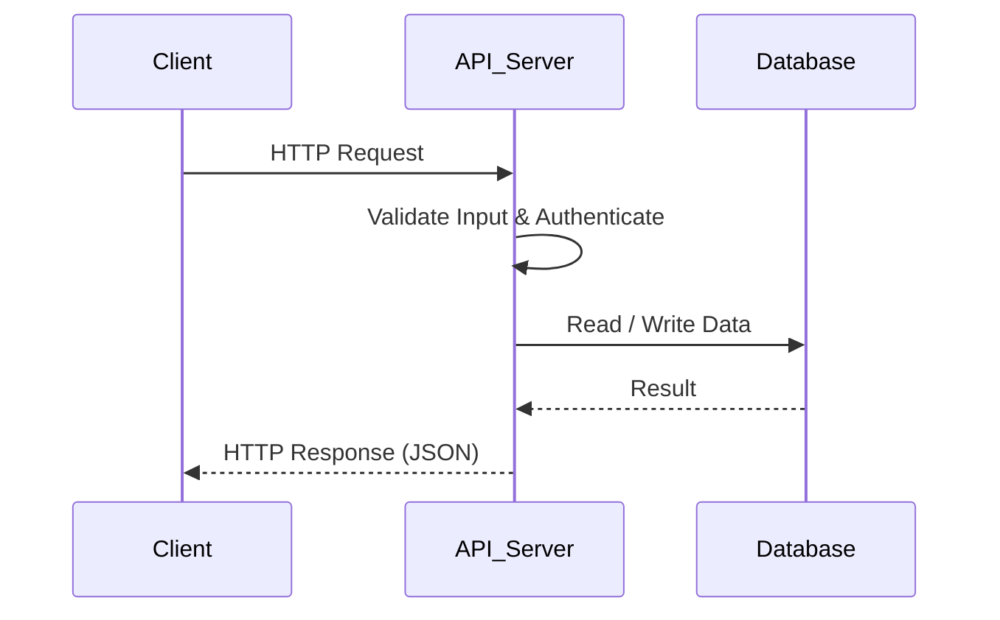
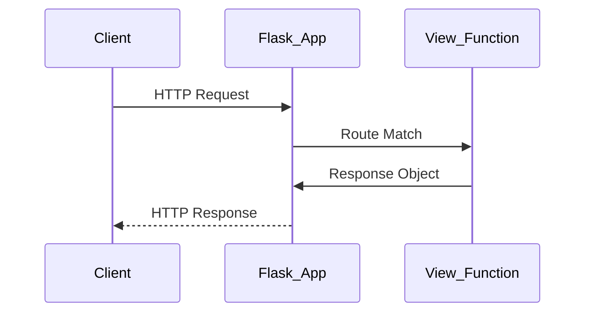
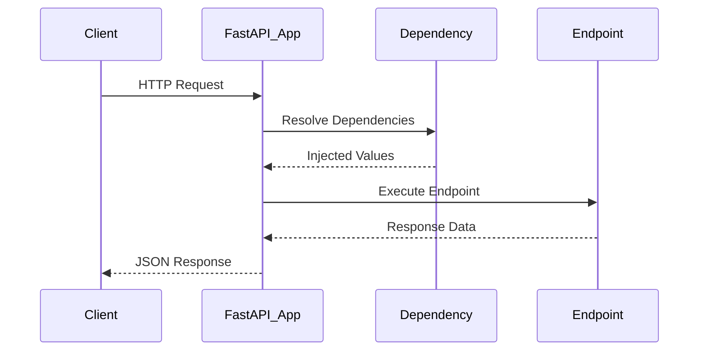
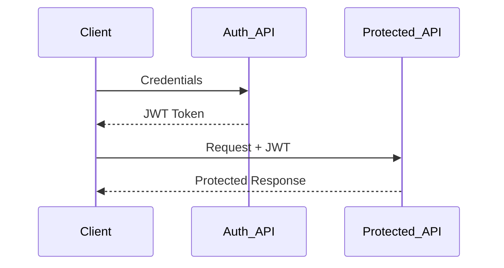
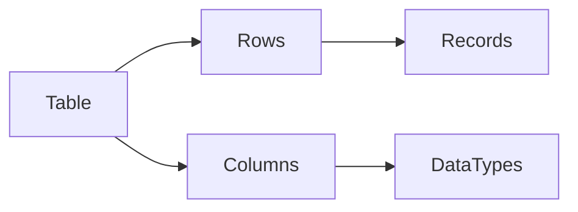
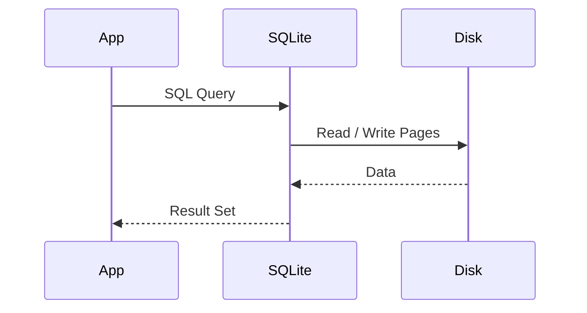
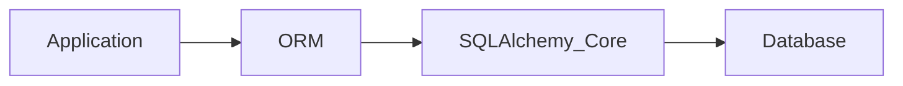

# Python for APIs, Web & Databases: Deep & Professional Course

## Part 5 – HTTP, REST & APIs (FOUNDATIONS)

---

## Slide 1: What APIs Really Are (Not Just Definitions)

* APIs are **contracts between independent systems**, not just URLs
* They exist to manage **change and scale** in large software organizations
* APIs decouple frontend, backend, mobile, and third‑party clients
* A well‑designed API outlives individual implementations
* Modern systems are designed **API‑first**, even when they have UIs

**Speaker Notes:**
Most people learn that API means *Application Programming Interface*. While correct, that definition hides the real purpose. APIs exist because software systems grow large, teams grow independent, and change becomes constant. If every component depended directly on internal code or databases, even a small change would break everything.

An API acts as a **stable contract**. As long as the contract remains the same, the internal implementation can change freely. This is why APIs are central to SaaS platforms, mobile backends, AI services, and microservice architectures. Understanding APIs as contracts is the first mental shift required to think like a backend engineer.

---

## Slide 2: What HTTP Really Is (System-Level View)

* HTTP is a **transport protocol** for distributed systems
* Built on top of TCP/IP
* Designed to work over unreliable networks
* Stateless by default
* Optimized for scalability and fault tolerance

**Speaker Notes:**
HTTP is often taught as “the protocol used by browsers,” but that is an incomplete view. HTTP is a general-purpose protocol for communication between distributed systems. It assumes networks will fail, servers will crash, and requests may need to be retried.

Statelessness is a deliberate design choice. By not storing client state on the server, HTTP enables load balancing, horizontal scaling, retries, and caching. These properties are what allow the internet to function at global scale.

---

## Slide 3: HTTP Request–Response Lifecycle (Mental Model)



**Speaker Notes:**
This lifecycle appears in almost every backend system: web applications, mobile apps, payment gateways, and AI inference APIs. The steps are always the same: receive the request, validate input, authenticate the caller, execute business logic, and return a structured response.

Frameworks change, programming languages change, but this flow remains constant. Mastering this model is more important than learning any specific library.

---

## Slide 4: HTTP Methods Represent Intent

* GET → Retrieve data without changing server state
* POST → Create a new resource
* PUT → Replace an existing resource
* PATCH → Partially update a resource
* DELETE → Remove a resource

**Speaker Notes:**
HTTP methods are not decoration. They express **intent**. A GET request should never modify data. A POST request signals creation. When HTTP methods are misused, caching breaks, security policies fail, and monitoring becomes unreliable.

Professional APIs treat HTTP verbs as first-class design elements, not afterthoughts.

```python
import requests

# Correct usage: GET for retrieval
requests.get("/users/123")

# Correct usage: POST for creation
requests.post("/users", json={"name": "Alice"})
```

---

## Slide 5: REST Is an Architectural Discipline

* REST is not a framework or library
* It enforces consistency and predictability
* Resources are modeled as **nouns**, not actions
* URLs represent entities
* HTTP methods define behavior

**Speaker Notes:**
REST forces you to think in terms of **resources**, not operations. Instead of designing endpoints like `/getUser` or `/createOrder`, REST encourages `/users` and `/orders` with meaningful HTTP verbs.

This discipline enables automatic documentation, API gateways, client SDK generation, and long-term maintainability.

---

## Slide 6: RESTful Resource Modeling

* Resources map to real business concepts
* Each resource has a unique identifier
* Interactions are stateless
* Representations are exchanged using JSON

**Speaker Notes:**
Good REST design starts with correct domain modeling. Users, orders, payments, and subscriptions are resources. When resource modeling is done correctly, APIs become intuitive and self-explanatory.

---

## Slide 7: JSON Is a Contract, Not Just Data

* Language-agnostic format
* Human-readable
* Schema-driven
* Ideal for distributed systems

```python
import json

payload = {
    "user_id": 101,
    "role": "admin",
    "active": True
}

json_string = json.dumps(payload)
parsed = json.loads(json_string)

print(parsed["role"])
```

**Speaker Notes:**
JSON fields form a contract between client and server. Once a field is published and clients depend on it, changing or removing it can break production systems. Backend engineers must treat JSON schemas with the same seriousness as database schemas.

---

## Slide 8: APIs Are External Systems

* APIs are not local function calls
* Network failures are normal
* Latency is unavoidable
* Defensive programming is mandatory

**Speaker Notes:**
When calling an API, always assume failure. Networks can drop packets, services can be slow, and responses can be malformed. Production-ready backend code is defensive by default.

---

## Slide 9: requests – Industry Standard HTTP Client

```python
import requests

response = requests.get(
    "https://api.github.com/users/octocat",
    timeout=5
)

print(response.status_code)
print(response.json())
```

**Speaker Notes:**
The `requests` library is ubiquitous in backend engineering. It is used in automation, microservices, data ingestion pipelines, and AI workflows. Always set timeouts and validate responses explicitly.

---

## Slide 10: POST Requests and Payloads

```python
payload = {
    "username": "saleem",
    "email": "saleem@example.com"
}

response = requests.post(
    "https://httpbin.org/post",
    json=payload
)

print(response.json())
```

**Speaker Notes:**
POST requests represent state changes. In production systems, POST endpoints must validate input carefully, log requests, and consider idempotency to prevent duplicate operations.

---

## Slide 11: API Error Handling Is Mandatory

```python
try:
    r = requests.get("https://api.github.com/invalid")
    r.raise_for_status()
except requests.exceptions.HTTPError as e:
    print("HTTP error:", e)
except requests.exceptions.RequestException as e:
    print("Network error:", e)
```

**Speaker Notes:**
Most production incidents are caused not by logic bugs but by unhandled edge cases. Proper error handling is a core responsibility of backend engineers, not an optional enhancement.

---

## Slide 12: Real-World API Failure Scenarios

* Partial outages
* Slow downstream services
* Expired authentication tokens
* Invalid or missing fields
* Breaking schema changes

**Speaker Notes:**
Design APIs assuming failure is normal. Resilient systems are built by expecting problems and handling them gracefully.

---

## Slide 13: Summary – Core Takeaways

* HTTP enables distributed communication
* REST enforces architectural discipline
* APIs are contracts, not functions
* JSON represents structured agreements
* Defensive design is essential

---

# Python for APIs, Web & Databases: Deep & Professional Course

## Part 5.2 – Web Frameworks (Flask & FastAPI)

---

## Slide 1: Why Web Frameworks Exist

* Raw HTTP handling is repetitive and error‑prone
* Frameworks standardize request–response lifecycles
* They provide routing, parsing, validation, and responses
* Web frameworks enforce architectural discipline
* Production backends are framework-driven, not script-driven

**Speaker Notes:**
Without frameworks, every backend team would repeatedly solve the same problems: parsing requests, routing URLs, handling errors, and formatting responses. Web frameworks exist to **standardize** these concerns and allow engineers to focus on business logic.

A framework is not magic—it is an opinionated structure around the HTTP lifecycle you already understand. Flask and FastAPI simply formalize best practices.

---

## Slide 2: Flask vs FastAPI (High-Level Comparison)

* Flask: minimal, synchronous, flexible
* FastAPI: modern, async-first, high performance
* Flask favors simplicity and control
* FastAPI favors correctness and speed
* Both are widely used in industry

**Speaker Notes:**
Flask and FastAPI represent two generations of Python web frameworks. Flask emerged when simplicity and flexibility were the primary goals. FastAPI emerged later, optimizing for performance, type safety, and developer productivity.

Understanding both helps you choose the right tool for the job—and read legacy codebases confidently.

---

## Slide 3: Flask Request Lifecycle (Mental Model)



**Speaker Notes:**
Flask follows a simple mental model: route a request to a Python function, execute logic, and return a response. This simplicity makes Flask ideal for learning how web frameworks actually work internally.

---

## Slide 4: First Flask Application

```python
from flask import Flask, jsonify

app = Flask(__name__)

@app.route("/health", methods=["GET"])
def health_check():
    return jsonify(status="OK")

if __name__ == "__main__":
    app.run(debug=True)
```

**Speaker Notes:**
This is a complete Flask application. The `@app.route` decorator maps a URL to a Python function. Flask automatically converts the return value into an HTTP response. This pattern is foundational and appears in every Flask-based system.

---

## Slide 5: Handling Request Data in Flask

* Query parameters via `request.args`
* JSON body via `request.json`
* Headers via `request.headers`
* Path parameters via route variables

```python
from flask import request

@app.route("/users/<int:user_id>", methods=["POST"])
def create_user(user_id):
    data = request.json
    role = request.args.get("role", "user")
    return jsonify(user_id=user_id, role=role, payload=data)
```

**Speaker Notes:**
Flask exposes request data through a global `request` object. While convenient, this implicit context can become hard to manage in large applications—one reason newer frameworks prefer explicit dependency injection.

---

## Slide 6: Flask Strengths and Limitations

* Simple mental model
* Flexible architecture
* Large ecosystem
* Limited built-in validation
* Synchronous execution only

**Speaker Notes:**
Flask shines in simplicity but lacks built-in data validation and async support. For high-performance or large-scale systems, engineers often layer additional libraries or migrate to FastAPI.

---

## Slide 7: Why FastAPI Was Created

* Python needed a modern async API framework
* Built on Starlette and Pydantic
* Designed for performance and correctness
* Automatic API documentation
* Type hints as first-class citizens

**Speaker Notes:**
FastAPI was designed to solve Flask’s pain points: validation, performance, and documentation. It embraces modern Python features like type hints and async/await.

---

## Slide 8: FastAPI Request Lifecycle



**Speaker Notes:**
FastAPI’s lifecycle includes dependency resolution and validation before the endpoint logic runs. This upfront correctness dramatically reduces runtime errors.

---

## Slide 9: First FastAPI Application

```python
from fastapi import FastAPI

app = FastAPI()

@app.get("/health")
async def health_check():
    return {"status": "OK"}
```

**Speaker Notes:**
FastAPI endpoints are asynchronous by default. This allows the server to handle thousands of concurrent connections efficiently—critical for modern APIs.

---

## Slide 10: Data Validation with Pydantic

```python
from pydantic import BaseModel

class User(BaseModel):
    name: str
    email: str
    age: int

@app.post("/users")
async def create_user(user: User):
    return user
```

**Speaker Notes:**
FastAPI automatically validates request data using Pydantic models. Invalid input never reaches your business logic—this is a major reliability improvement over manual validation.

---

## Slide 11: Automatic API Documentation

* OpenAPI (Swagger) support
* Interactive API docs at `/docs`
* ReDoc at `/redoc`
* Schema generated from code

**Speaker Notes:**
FastAPI generates API documentation automatically from type hints. This eliminates outdated docs and improves collaboration between teams.

---

## Slide 12: Flask vs FastAPI – When to Use Which

* Use Flask for simple services and prototypes
* Use FastAPI for high-performance APIs
* FastAPI preferred for AI inference services
* Flask still common in legacy systems

**Speaker Notes:**
Choosing a framework is about context, not trends. Many production systems still run Flask successfully. FastAPI is the preferred choice for new, performance-critical services.

---

## Slide 13: Common Mistakes in Web Frameworks

* Mixing business logic with routing
* Ignoring validation
* Overusing global state
* Not handling errors consistently

**Speaker Notes:**
Frameworks provide structure, but discipline is still required. Poor separation of concerns leads to unmaintainable systems regardless of framework choice.

---

## Slide 14: Summary – Web Framework Fundamentals

* Frameworks standardize HTTP handling
* Flask emphasizes simplicity
* FastAPI emphasizes performance and correctness
* Validation and documentation are critical
* Architecture matters more than syntax

---

# Python for APIs, Web & Databases: Deep & Professional Course

## Part 5.3 – Authentication, Authorization & Security (JWT)

---

## Slide 1: Why Authentication Exists

* Systems must identify **who** is making a request
* Not all users should have equal access
* Authentication protects data and operations
* Security is a backend responsibility, not a feature
* Identity is foundational to trust in distributed systems

**Speaker Notes:**
Authentication exists because backend systems cannot trust anonymous requests. Every serious system must answer one core question: *Who is calling me?* Without identity, there is no accountability, no personalization, and no security.

In distributed systems, authentication is even more critical because requests may originate from browsers, mobile apps, backend services, or automated agents. Authentication establishes identity across unreliable networks.

---

## Slide 2: Authentication vs Authorization (Critical Distinction)

* Authentication = verifying identity
* Authorization = verifying permissions
* Authentication answers *who you are*
* Authorization answers *what you can do*
* Mixing the two causes security bugs

**Speaker Notes:**
Many developers confuse authentication and authorization, leading to insecure systems. Authentication verifies identity, while authorization determines access rights. A user can be authenticated but still not authorized to perform certain actions.

Correct separation of these concepts is essential for secure API design.

---

## Slide 3: Common Authentication Models

* Session-based authentication
* Token-based authentication
* API keys
* OAuth (conceptual)
* JWT-based authentication

**Speaker Notes:**
Different systems use different authentication strategies. Session-based auth is common in traditional web apps, while token-based approaches dominate APIs and microservices. JWT has become the most popular choice for stateless authentication in distributed systems.

---

## Slide 4: Why JWT Was Created

* Stateless authentication
* No server-side session storage
* Scales across services
* Works well with microservices
* Ideal for APIs and mobile backends

**Speaker Notes:**
JWT solves a scalability problem. Traditional sessions require server-side storage, which complicates scaling. JWT embeds identity and claims inside a signed token, allowing servers to validate requests without shared session state.

---

## Slide 5: JWT Structure (Mental Model)


* Header: algorithm & token type
* Payload: claims (identity & metadata)
* Signature: integrity verification

**Speaker Notes:**
A JWT consists of three Base64-encoded parts. The header describes how the token is signed. The payload contains claims like user ID and expiration time. The signature ensures the token has not been tampered with.

---

## Slide 6: JWT Authentication Flow



**Speaker Notes:**
The client authenticates once and receives a JWT. Subsequent requests include the token, usually in the Authorization header. The server validates the token and processes the request if it is valid.

---

## Slide 7: JWT Claims Explained

* `sub` – subject (user identifier)
* `exp` – expiration time
* `iat` – issued at
* `iss` – issuer
* Custom claims for roles and scopes

**Speaker Notes:**
JWT claims carry identity and metadata. Expiration (`exp`) is critical to limit token lifetime. Custom claims are often used for roles and permissions but must be designed carefully to avoid privilege escalation.

---

## Slide 8: JWT Security Rules

* JWTs must be signed (never unsigned)
* Secrets must be protected
* Tokens must expire
* HTTPS is mandatory
* Never store sensitive data in JWT payloads

**Speaker Notes:**
JWTs are not encrypted by default—only signed. Anyone can decode the payload. Therefore, sensitive data must never be stored inside a JWT. HTTPS is mandatory to prevent token theft.

---

## Slide 9: Generating JWT in Python (Example)

```python
import jwt
from datetime import datetime, timedelta

SECRET_KEY = "super-secret-key"

payload = {
    "sub": "user_123",
    "exp": datetime.utcnow() + timedelta(minutes=15)
}

token = jwt.encode(payload, SECRET_KEY, algorithm="HS256")
print(token)
```

**Speaker Notes:**
This example demonstrates JWT creation using PyJWT. The expiration claim ensures tokens cannot be used indefinitely. In production, secrets must be stored securely using environment variables.

---

## Slide 10: Validating JWT in APIs

```python
try:
    decoded = jwt.decode(token, SECRET_KEY, algorithms=["HS256"])
    print(decoded)
except jwt.ExpiredSignatureError:
    print("Token expired")
except jwt.InvalidTokenError:
    print("Invalid token")
```

**Speaker Notes:**
Every protected API endpoint must validate the JWT before executing business logic. Token validation failures should return proper HTTP status codes such as 401 Unauthorized.

---

## Slide 11: Common JWT Mistakes

* No expiration time
* Long-lived tokens
* Storing sensitive data in payload
* Not rotating secrets
* Skipping HTTPS

**Speaker Notes:**
Most JWT-related security breaches occur due to poor configuration, not flaws in JWT itself. Expiration, secret management, and HTTPS enforcement are non-negotiable.

---

## Slide 12: Authorization Using JWT Claims

* Roles embedded in token
* Scope-based access control
* Fine-grained permissions
* Server-side enforcement

**Speaker Notes:**
JWTs can carry authorization data, but enforcement must always happen on the server. Never trust the client to enforce permissions.

---

## Slide 13: API Security Best Practices

* Validate all input
* Authenticate every request
* Authorize every action
* Log security events
* Use least privilege principle

**Speaker Notes:**
Security is not a single feature—it is a mindset. Backend engineers must design systems assuming attackers will try to exploit every weakness.

---

## Slide 14: Summary – Security Fundamentals

* Authentication verifies identity
* Authorization controls access
* JWT enables stateless auth
* Security failures are design failures
* Backend engineers own security

---

# Python for APIs, Web & Databases: Deep & Professional Course

## Part 5.4 – Databases, SQL & SQLite Fundamentals

---

## Slide 1: Why Databases Exist

* Applications must persist data beyond process memory
* Files alone do not scale for concurrent access
* Databases provide structure, safety, and performance
* They enforce consistency across reads and writes
* Every serious backend system relies on a database

**Speaker Notes:**
Databases exist because application memory is temporary. When a process crashes or restarts, memory is lost. Files can store data, but they fail quickly under concurrent access, updates, and complex queries.

Databases solve these problems by providing durable storage, structured querying, concurrency control, and consistency guarantees. Any backend engineer must understand databases—not just how to use them, but why they exist.

---

## Slide 2: What a Database Really Is

* A managed system for storing structured data
* Optimized for concurrent access
* Provides querying, indexing, and transactions
* Abstracts disk storage complexity
* Enforces data integrity rules

**Speaker Notes:**
A database is not just “data on disk.” It is a complex system that manages how data is written, read, indexed, locked, and recovered after failure. Databases trade raw simplicity for safety and performance at scale.

---

## Slide 3: Relational Databases (Mental Model)



**Speaker Notes:**
Relational databases organize data into tables. Each table represents a concept, rows represent individual records, and columns define attributes. This structured approach enables powerful querying and data integrity enforcement.

---

## Slide 4: ACID Properties (Critical Concept)

* Atomicity: all or nothing
* Consistency: rules are enforced
* Isolation: concurrent transactions are safe
* Durability: committed data survives crashes

**Speaker Notes:**
ACID properties define the reliability guarantees of relational databases. These properties are what allow banks, payment systems, and enterprise software to trust databases with critical data.

---

## Slide 5: SQLite – Why It Is Special

* Lightweight, file-based database
* Zero configuration
* Embedded directly into applications
* Ideal for learning and prototyping
* Widely used in mobile and desktop apps

**Speaker Notes:**
SQLite is not a toy database. It powers mobile phones, browsers, and embedded systems. It removes operational complexity while preserving relational database guarantees, making it ideal for learning SQL fundamentals.

---

## Slide 6: SQLite Architecture Overview



**Speaker Notes:**
SQLite runs inside your application process. There is no separate database server. SQL queries are translated into file operations on a single database file, making SQLite extremely simple to deploy.

---

## Slide 7: Creating a SQLite Database in Python

```python
import sqlite3

conn = sqlite3.connect("app.db")
cursor = conn.cursor()

cursor.execute("""
CREATE TABLE IF NOT EXISTS users (
    id INTEGER PRIMARY KEY,
    name TEXT NOT NULL,
    email TEXT UNIQUE NOT NULL
)
""")

conn.commit()
conn.close()
```

**Speaker Notes:**
This code creates a SQLite database file and a table. SQLite automatically creates the file if it does not exist. SQL schemas define structure and constraints, which are essential for data integrity.

---

## Slide 8: SQL Fundamentals – SELECT

* SELECT retrieves data
* WHERE filters rows
* ORDER BY sorts results
* LIMIT restricts output size

```python
conn = sqlite3.connect("app.db")
cursor = conn.cursor()

cursor.execute("SELECT id, name FROM users WHERE id > 1")
rows = cursor.fetchall()
print(rows)

conn.close()
```

**Speaker Notes:**
SELECT is the foundation of SQL. Backend engineers must be comfortable reading and writing SELECT queries, as data retrieval dominates most application workloads.

---

## Slide 9: SQL Fundamentals – INSERT

```python
conn = sqlite3.connect("app.db")
cursor = conn.cursor()

cursor.execute(
    "INSERT INTO users (name, email) VALUES (?, ?)",
    ("Saleem", "saleem@example.com")
)

conn.commit()
conn.close()
```

**Speaker Notes:**
INSERT adds new records. Parameterized queries (`?`) prevent SQL injection and must always be used when accepting user input.

---

## Slide 10: SQL Fundamentals – UPDATE & DELETE

```python
conn = sqlite3.connect("app.db")
cursor = conn.cursor()

cursor.execute(
    "UPDATE users SET name = ? WHERE id = ?",
    ("Updated Name", 1)
)

cursor.execute("DELETE FROM users WHERE id = ?", (2,))

conn.commit()
conn.close()
```

**Speaker Notes:**
UPDATE and DELETE modify existing data. These operations should always be executed within transactions to ensure consistency.

---

## Slide 11: Transactions and Consistency

* Group multiple operations together
* Commit on success
* Roll back on failure
* Protect data integrity

**Speaker Notes:**
Transactions ensure that partial updates do not corrupt data. Either all operations succeed, or none do. This guarantee is essential for financial and critical systems.

---

## Slide 12: Common SQL Mistakes

* Not using transactions
* Ignoring indexes
* Writing unbounded SELECT queries
* Storing inconsistent data

**Speaker Notes:**
Most database performance and reliability problems come from poor query design and missing constraints. Understanding SQL fundamentals prevents these issues early.

---

## Slide 13: Databases in Backend Architecture


**Speaker Notes:**
Databases sit behind APIs. Clients never talk to databases directly. This separation enforces security, validation, and business rules.

---

## Slide 14: Summary – Database Fundamentals

* Databases provide durability and consistency
* Relational models structure data
* SQLite is ideal for learning SQL
* SQL is a core backend skill
* Transactions protect data integrity

---

# Python for APIs, Web & Databases: Deep & Professional Course

## Part 5.5 – ORM Concepts & SQLAlchemy (Professional Usage)

---

## Slide 1: Why ORMs Exist

* Raw SQL becomes hard to maintain as systems grow
* Business logic and SQL get tightly coupled
* ORMs provide an abstraction over relational databases
* They map tables to objects and rows to instances
* ORMs optimize for developer productivity and safety

**Speaker Notes:**
As backend systems grow, SQL queries become scattered across the codebase. This makes systems difficult to maintain, refactor, and test. ORMs exist to provide a structured abstraction that allows developers to work with databases using familiar programming language constructs instead of raw SQL everywhere.

ORMs do not eliminate SQL—they organize access to it. Understanding this distinction is critical to using ORMs correctly.

---

## Slide 2: What an ORM Really Is

* ORM = Object Relational Mapping
* Database tables map to classes
* Rows map to objects
* Columns map to attributes
* Relationships map to object references

**Speaker Notes:**
An ORM creates a conceptual bridge between the object-oriented world of application code and the relational world of databases. This bridge allows developers to think in terms of objects while still benefiting from relational data storage.

---

## Slide 3: ORM vs Raw SQL (Trade-offs)

* ORMs reduce boilerplate code
* Raw SQL provides maximum control
* ORMs improve safety and readability
* Raw SQL can be faster for complex queries
* Professional systems often use both

**Speaker Notes:**
ORMs are not replacements for SQL knowledge. In real systems, developers often combine ORM usage for common operations with raw SQL for performance-critical paths. The key is knowing when to use each approach.

---

## Slide 4: Introducing SQLAlchemy

* Industry-standard Python ORM
* Supports Core (SQL expression language)
* Supports ORM (object mapping)
* Database-agnostic
* Widely used in production systems

**Speaker Notes:**
SQLAlchemy is the most widely used ORM in the Python ecosystem. It provides both low-level SQL construction tools and a high-level ORM. This flexibility allows teams to scale from simple applications to complex enterprise systems.

---

## Slide 5: SQLAlchemy Architecture



**Speaker Notes:**
SQLAlchemy separates concerns cleanly. The ORM layer handles object mapping, while the Core layer handles SQL generation. This design allows advanced users to drop down to raw SQL when necessary.

---

## Slide 6: Defining Models with SQLAlchemy ORM

```python
from sqlalchemy import Column, Integer, String
from sqlalchemy.orm import declarative_base

Base = declarative_base()

class User(Base):
    __tablename__ = "users"

    id = Column(Integer, primary_key=True)
    name = Column(String, nullable=False)
    email = Column(String, unique=True, nullable=False)
```

**Speaker Notes:**
This class represents a database table. Each instance of `User` maps to a row. Declarative models centralize schema definition and improve maintainability.

---

## Slide 7: Creating a Database Engine and Session

```python
from sqlalchemy import create_engine
from sqlalchemy.orm import sessionmaker

engine = create_engine("sqlite:///app.db")
SessionLocal = sessionmaker(bind=engine)

session = SessionLocal()
```

**Speaker Notes:**
The engine manages database connections. Sessions represent units of work. Proper session management is essential to avoid connection leaks and inconsistent data.

---

## Slide 8: Creating Tables from Models

```python
Base.metadata.create_all(bind=engine)
```

**Speaker Notes:**
This command creates database tables based on model definitions. In production, schema migrations are typically handled using dedicated tools, but this method is useful for learning and prototyping.

---

## Slide 9: Inserting Data Using ORM

```python
new_user = User(name="Saleem", email="saleem@example.com")
session.add(new_user)
session.commit()
```

**Speaker Notes:**
ORM sessions track object state changes and translate them into SQL statements upon commit. This unit-of-work pattern simplifies transaction management.

---

## Slide 10: Querying Data Using ORM

```python
users = session.query(User).filter(User.name == "Saleem").all()

for user in users:
    print(user.id, user.email)
```

**Speaker Notes:**
ORM queries feel like Python expressions but generate SQL under the hood. Developers must still be mindful of query efficiency and avoid unbounded queries.

---

## Slide 11: Updating and Deleting Records

```python
user = session.query(User).get(1)
user.name = "Updated Name"
session.commit()

session.delete(user)
session.commit()
```

**Speaker Notes:**
Updates and deletes are handled by modifying object state and committing the session. SQLAlchemy ensures transactional safety.

---

## Slide 12: Relationships Between Tables

```python
from sqlalchemy import ForeignKey
from sqlalchemy.orm import relationship

class Order(Base):
    __tablename__ = "orders"

    id = Column(Integer, primary_key=True)
    user_id = Column(Integer, ForeignKey("users.id"))
    user = relationship("User")
```

**Speaker Notes:**
Relationships allow ORM users to navigate between related objects naturally. Correct relationship modeling is essential for maintainable data access patterns.

---

## Slide 13: Common ORM Mistakes

* Loading too much data eagerly
* Ignoring generated SQL
* Mismanaging sessions
* Treating ORM as magic

**Speaker Notes:**
ORMs simplify development but can hide performance issues. Backend engineers must inspect generated SQL and understand query behavior to avoid inefficiencies.

---

## Slide 14: When Not to Use an ORM

* Extremely complex queries
* Performance-critical paths
* Reporting and analytics workloads

**Speaker Notes:**
ORMs are tools, not rules. Professional systems use them where appropriate and fall back to raw SQL where necessary.

---

## Slide 15: Summary – ORM Fundamentals

* ORMs abstract database access
* SQLAlchemy is industry standard
* ORM and raw SQL can coexist
* Understanding internals prevents misuse
* Correct modeling improves maintainability

---

# Python for APIs, Web & Databases: Deep & Professional Course

## Part 5.6 – Backend Best Practices & Production Readiness

---

## Slide 1: Why Best Practices Matter in Backend Systems

* Backend systems outlive individual developers
* Poor practices compound over time
* Most outages are design failures, not bugs
* Best practices protect scalability and security
* Production readiness is an engineering mindset

**Speaker Notes:**
Backend systems are long-lived assets. Unlike scripts or demos, production backends may run for years and be maintained by multiple teams. Poor design decisions accumulate technical debt that eventually manifests as outages, security incidents, or costly rewrites.

Best practices exist not to slow development, but to ensure systems remain reliable, maintainable, and secure as they scale.

---

## Slide 2: API Design Principles

* APIs are contracts, not implementations
* Consistency is more important than creativity
* Predictable naming and behavior
* Backward compatibility matters
* Design APIs before writing code

**Speaker Notes:**
A well-designed API minimizes surprises. Clients should be able to predict how endpoints behave without constantly referring to documentation. Breaking changes must be avoided or versioned carefully, as they impact all consumers.

---

## Slide 3: API Versioning Strategies

* URL-based versioning (`/v1/users`)
* Header-based versioning
* Avoid breaking existing clients
* Deprecate gradually
* Communicate changes clearly

**Speaker Notes:**
Versioning allows APIs to evolve safely. URL-based versioning is the most common and easiest to reason about. Once an API is public, backward compatibility becomes a core responsibility.

---

## Slide 4: Error Handling & Response Design

* Use proper HTTP status codes
* Return consistent error formats
* Do not leak internal details
* Errors are part of the API contract

```python
# Example error response structure
{
    "error": "validation_error",
    "message": "Email field is required"
}
```

**Speaker Notes:**
Error responses should be predictable and informative without exposing sensitive internal details. Consistent error formats simplify client-side handling and debugging.

---

## Slide 5: Input Validation Strategy

* Never trust client input
* Validate at API boundaries
* Fail fast on invalid data
* Centralize validation logic

**Speaker Notes:**
Input validation is one of the most effective security measures. Invalid data should never reach business logic or databases. Framework-level validation reduces bugs and improves reliability.

---

## Slide 6: Logging and Observability

* Logs explain what happened
* Metrics show system health
* Traces reveal request flow
* Observability enables debugging

**Speaker Notes:**
In production, logs are often the only way to understand failures. Logging must be structured, consistent, and meaningful. Observability tools transform logs and metrics into actionable insights.

---

## Slide 7: Security as a Default Assumption

* Assume attackers exist
* Authenticate every request
* Authorize every action
* Protect secrets
* Use HTTPS everywhere

**Speaker Notes:**
Security cannot be added later. It must be built into system design from the beginning. Backend engineers must assume malicious input and design defenses accordingly.

---

## Slide 8: Configuration & Environment Management

* Separate code from configuration
* Use environment variables
* Never hardcode secrets
* Different configs for dev/test/prod

**Speaker Notes:**
Configuration mistakes are a common source of outages. Environment variables allow the same codebase to run safely across multiple environments with different settings.

---

## Slide 9: Performance & Scalability Thinking

* Optimize for correctness first
* Measure before optimizing
* Cache where appropriate
* Design for horizontal scaling

**Speaker Notes:**
Premature optimization creates complexity. Correctness and clarity come first. Performance improvements should be driven by measurement, not assumptions.

---

## Slide 10: Dependency Management

* Keep dependencies minimal
* Understand what you import
* Monitor vulnerabilities
* Update responsibly

**Speaker Notes:**
Every dependency adds risk. Backend engineers must understand and periodically audit dependencies to avoid security and stability issues.

---

## Slide 11: Testing in Backend Systems

* Unit tests for business logic
* Integration tests for APIs
* Test failure scenarios
* Tests protect against regressions

**Speaker Notes:**
Tests are safety nets. They allow systems to evolve without fear. Backend tests should focus on logic correctness and API behavior.

---

## Slide 12: Deployment & Release Discipline

* Automate deployments
* Use staging environments
* Roll out changes gradually
* Be able to roll back quickly

**Speaker Notes:**
Deployment failures are inevitable. What matters is how quickly systems can recover. Automation and rollback strategies are critical for resilience.

---

## Slide 13: Common Backend Anti-Patterns

* Mixing business logic with routing
* Ignoring validation and errors
* Overloading single services
* Tight coupling between components

**Speaker Notes:**
Anti-patterns often emerge from shortcuts taken under pressure. Recognizing and correcting them early prevents long-term damage to system architecture.

---

## Slide 14: Backend Engineering Career Perspective

* Focus on fundamentals
* Learn system design
* Understand trade-offs
* Write boring, reliable code

**Speaker Notes:**
Great backend engineers prioritize reliability over cleverness. Strong fundamentals, clear design thinking, and disciplined execution define long-term success.

---

## Slide 15: Final Summary – Production Readiness

* Best practices protect systems over time
* APIs are long-term contracts
* Security and validation are mandatory
* Observability enables reliability
* Backend engineering is a discipline

---

## End of Part 5


