```mermaid
flowchart TD
    PythonThread1["Python Thread 1"]
    PythonThread2["Python Thread 2"]
    PythonThread3["Python Thread 3"]
    
    subgraph "Global Interpreter Lock (GIL)"
        direction TB
        GIL["GIL: Mutex protecting Python interpreter"]
        Owner["Current Owner: Thread X"]
        WaitQueue["Waiting Threads Queue"]
    end
    
    PythonThread1 -->|"Acquire GIL"| GIL
    PythonThread2 -->|"Wait for GIL"| WaitQueue
    PythonThread3 -->|"Wait for GIL"| WaitQueue
    
    GIL -->|"Only one thread<br/>executes Python bytecode"| BytecodeExec["Python Bytecode Execution"]
    
    BytecodeExec --> IOOps["I/O Operations<br/>(sleep, file read, socket)"]
    IOOps --> ReleaseGIL["Release GIL<br/>(other threads can acquire)"]
    
    ReleaseGIL -->|"After I/O completes"| ReacquireGIL["Reacquire GIL<br/>(may need to wait)"]
    
    ReacquireGIL --> ContinueExec["Continue Execution"]
    
    subgraph "GIL Release Triggers"
        direction LR
        Triggers["• I/O operations<br/>• time.sleep()<br/>• C extension calls<br/>• sys.setswitchinterval()<br/>• Thread yields"]
    end
    
    BytecodeExec --> Triggers
    
    style GIL fill:#e1f5fe
    style BytecodeExec fill:#e8f5e8
    style IOOps fill:#f3e5f5
    style Triggers fill:#fff3e0
```

```mermaid
flowchart TD
    Start["Beginner Python Developer"]
    
    Start --> Fundamentals["Python Fundamentals<br/>Syntax, data structures,<br/>basic OOP"]
    
    Fundamentals --> Intermediate["Intermediate Python<br/>Standard library,<br/>file I/O, exceptions,<br/>basic modules"]
    
    Intermediate --> AdvancedCourse["This Course:<br/>Advanced Python Concepts<br/>& Internals"]
    
    AdvancedCourse --> KnowledgeAreas
    
    subgraph KnowledgeAreas
        direction LR
        Internals["Language Internals<br/>• Functions & bytecode<br/>• Closures & scoping<br/>• Decorators<br/>• Generators<br/>• Iterators"]
        Concurrency["Concurrency<br/>• Async/await<br/>• Event loop<br/>• Threading<br/>• Multiprocessing<br/>• GIL"]
        Patterns["Advanced Patterns<br/>• Context managers<br/>• Descriptors<br/>• Metaclasses<br/>• Performance<br/>• Best practices"]
    end
    
    KnowledgeAreas --> Expert["Python Expert"]
    
    Expert --> CareerPaths
    
    subgraph CareerPaths
        direction LR
        WebDev["Web Development<br/>(FastAPI, Django, Flask)"]
        DataScience["Data Science<br/>(pandas, NumPy, scikit-learn)"]
        DevOps["DevOps & Automation<br/>(Ansible, Docker, CI/CD)"]
        MachineLearning["Machine Learning<br/>(TensorFlow, PyTorch)"]
        Backend["Backend Systems<br/>(microservices, APIs)"]
    end
    
    CareerPaths --> Success["Successful Python Career<br/>Senior/Lead/Architect roles"]
    
    style Start fill:#e1f5fe
    style Fundamentals fill:#e8f5e8
    style AdvancedCourse fill:#f3e5f5
    style Internals fill:#fff3e0
    style Concurrency fill:#ffebee
    style Patterns fill:#e8f5e8
    style Expert fill:#e1f5fe
    style Success fill:#4caf50,stroke:#388e3c,stroke-width:2px,color:white
```

# Advanced Python Concepts & Internals: Complete Expert Course
## Part 4 – Advanced Python Concepts & Internals

---

## Slide 1: Welcome to Python Internals & Advanced Concepts

- Journey from Python basics to understanding how Python really works
- This module uncovers Python's internal mechanisms and advanced patterns
- Learn how functions, decorators, generators, and async/await work under the hood
- Master performance optimization, concurrency, and professional patterns
- Bridge the gap between "using Python" and "understanding Python"

**Speaker Notes:**
Welcome to the most exciting part of our Python journey! If you've ever wondered "How does Python actually do that?" or "Why does this work that way?", this module is for you. We're going beyond syntax to explore Python's internal architecture. We'll dissect functions, decorators, generators, and async/await to understand the magic. By the end, you'll not only write Python code but understand how Python executes it. This knowledge transforms you from a Python user to a Python expert. Let's dive deep!

```python
# Quick warm-up: Python's dual nature
print("Python is both:")
print("1. High-level: Easy to read and write")
print("2. Low-level: Has intricate internal mechanisms")

# Example of Python's internal beauty
import dis  # Disassembler - shows bytecode

def simple_func(x):
    return x * 2

print("\nBytecode for simple_func(x):")
dis.dis(simple_func)
```

---

## Slide 2: How Python Functions Really Work

- **Functions are objects**: Everything in Python is an object, including functions
- **Function anatomy**: `__code__`, `__defaults__`, `__closure__`, `__globals__`
- **Bytecode**: Python compiles to bytecode, executed by the Python Virtual Machine (PVM)
- **Stack frames**: Each function call creates a frame with local variables, return address
- **Call stack**: LIFO structure tracking active function calls

**Speaker Notes:**
When you write `def foo(): pass`, you're creating a function object. This object has attributes storing its code, defaults, and closure. When you call it, Python creates a stack frame, pushes it onto the call stack, executes bytecode, then pops it off. Understanding this helps debug complex code and write better decorators. Let's dissect a function object and trace its execution.

```python
# Inspecting function internals
def greet(name, greeting="Hello"):
    """A simple greeting function"""
    return f"{greeting}, {name}!"

print("Function object attributes:")
print(f"Name: {greet.__name__}")
print(f"Docstring: {greet.__doc__}")
print(f"Module: {greet.__module__}")
print(f"Defaults: {greet.__defaults__}")
print(f"Code object: {greet.__code__}")
print(f"Bytecode: {greet.__code__.co_code[:20]}...")

# The code object has its own attributes
print("\nCode object details:")
print(f"Argument count: {greet.__code__.co_argcount}")
print(f"Variable names: {greet.__code__.co_varnames}")
print(f"Constants: {greet.__code__.co_consts}")

# Function objects can be manipulated
greet.alternate_greeting = "Hi"  # Adding custom attribute
print(f"\nCustom attribute: {greet.alternate_greeting}")

# Functions are first-class objects
functions = [greet, len, str.upper]
for func in functions:
    print(f"{func.__name__} is callable: {callable(func)}")
```


---

## Slide 3: Closures Step-by-Step

- **Closure**: Function that remembers values from its enclosing lexical scope
- **Lexical scoping**: Variables are resolved based on where function is defined, not called
- **Cell objects**: Special objects that hold references to closed-over variables
- **`__closure__` attribute**: Tuple of cell objects containing captured variables
- **Use cases**: Factory functions, decorators, callbacks with state

**Speaker Notes:**
Closures are like function "memory" - they remember variables from their birth context even after that context is gone. When Python sees a function inside another function referencing outer variables, it creates a closure. The inner function gets a `__closure__` attribute containing cell objects that point to those variables. This enables powerful patterns like function factories and decorators.

```python
# Simple closure example
def outer_function(message):
    # message is a "free variable" - defined in outer scope
    def inner_function():
        # inner_function "closes over" message
        return f"Message: {message}"
    return inner_function

closure_func = outer_function("Hello, Closure!")
print(closure_func())  # Message: Hello, Closure!
print(f"Closure cells: {closure_func.__closure__}")
print(f"Cell contents: {closure_func.__closure__[0].cell_contents}")

# Practical closure: Counter factory
def make_counter(start=0):
    count = start  # This variable is "closed over"
    
    def counter():
        nonlocal count  # Allows modifying the closed-over variable
        current = count
        count += 1
        return current
    
    return counter

counter1 = make_counter()
counter2 = make_counter(100)

print("\nIndependent counters (each has its own closure):")
print(f"Counter1: {counter1()}, {counter1()}, {counter1()}")  # 0, 1, 2
print(f"Counter2: {counter2()}, {counter2()}")  # 100, 101

# Inspecting the closure
print(f"\nCounter1 closure: {counter1.__closure__}")
if counter1.__closure__:
    print(f"Cell 0 contents: {counter1.__closure__[0].cell_contents}")

# Closure with multiple variables
def make_multiplier(factor):
    factor = factor  # Local variable that will be closed over
    
    def multiplier(x):
        return x * factor
    
    # Let's add another closed variable
    multiplier.factor = factor  # Also store as attribute
    return multiplier

double = make_multiplier(2)
triple = make_multiplier(3)

print(f"\nDouble(5) = {double(5)}")  # 10
print(f"Triple(5) = {triple(5)}")    # 15
print(f"Double's factor: {double.factor}")
print(f"Double's closure cells: {len(double.__closure__) if double.__closure__ else 0}")

# Common mistake: Late binding in closures
print("\n⚠️ Common Closure Pitfall: Late Binding")
def create_functions():
    functions = []
    for i in range(3):
        def func():
            return i  # i is closed over, but evaluated when called
        functions.append(func)
    return functions

funcs = create_functions()
print("All return 2 (last value of i):", [f() for f in funcs])

# Fix: Capture current value with default argument
def create_functions_fixed():
    functions = []
    for i in range(3):
        def func(i=i):  # i captured as default argument
            return i
        functions.append(func)
    return functions

funcs_fixed = create_functions_fixed()
print("Fixed: returns 0, 1, 2:", [f() for f in funcs_fixed])
```

---

## Slide 4: Decorators from Zero to Advanced

- **Decorator**: Function that takes a function and returns a modified function
- **Syntax sugar**: `@decorator` is equivalent to `func = decorator(func)`
- **Types**: Function decorators, class decorators, decorators with arguments
- **Stacking**: Multiple decorators applied bottom to top
- **`functools.wraps`**: Preserves original function metadata

**Speaker Notes:**
Decorators are Python's way of saying "wrap this function with extra behavior." They're higher-order functions that modify or enhance other functions. The `@` syntax is just syntactic sugar - underneath, it's function composition. Decorators enable cross-cutting concerns like logging, timing, authentication, and caching without modifying the original function.

```python
import time
from functools import wraps

# Level 1: Basic decorator (function that returns a function)
def simple_decorator(func):
    def wrapper():
        print(f"Before calling {func.__name__}")
        result = func()
        print(f"After calling {func.__name__}")
        return result
    return wrapper

@simple_decorator
def say_hello():
    print("Hello!")

say_hello()

# Level 2: Decorator for functions with arguments
def decorator_with_args(func):
    @wraps(func)  # Preserves function metadata
    def wrapper(*args, **kwargs):
        print(f"Calling {func.__name__} with args={args}, kwargs={kwargs}")
        return func(*args, **kwargs)
    return wrapper

@decorator_with_args
def add(a, b):
    """Adds two numbers"""
    return a + b

print(f"\nadd(3, 5) = {add(3, 5)}")
print(f"Function name preserved: {add.__name__}")
print(f"Docstring preserved: {add.__doc__}")

# Level 3: Decorator with arguments (decorator factory)
def repeat(times):
    """Decorator factory: returns a decorator"""
    def decorator(func):
        @wraps(func)
        def wrapper(*args, **kwargs):
            results = []
            for i in range(times):
                print(f"Call {i+1}/{times}")
                results.append(func(*args, **kwargs))
            return results[-1] if times == 1 else results
        return wrapper
    return decorator

@repeat(times=3)
def greet(name):
    return f"Hello, {name}!"

print(f"\nRepeated greeting: {greet('Alice')}")

# Level 4: Class-based decorator
class TimerDecorator:
    """Decorator as a class (maintains state)"""
    def __init__(self, func):
        self.func = func
        wraps(func)(self)  # Preserve metadata
    
    def __call__(self, *args, **kwargs):
        start = time.time()
        result = self.func(*args, **kwargs)
        end = time.time()
        print(f"{self.func.__name__} took {end-start:.4f} seconds")
        return result

@TimerDecorator
def slow_function():
    time.sleep(0.5)
    return "Done"

print(f"\nTimed function: {slow_function()}")

# Level 5: Stacking decorators (applied bottom to top)
def bold(func):
    @wraps(func)
    def wrapper(*args, **kwargs):
        return f"<b>{func(*args, **kwargs)}</b>"
    return wrapper

def italic(func):
    @wraps(func)
    def wrapper(*args, **kwargs):
        return f"<i>{func(*args, **kwargs)}</i>"
    return wrapper

@bold
@italic
def get_text():
    return "Hello, World!"

print(f"\nStacked decorators: {get_text()}")
print("Applied as: bold(italic(get_text))")

# Real-world example: Authentication decorator
def require_auth(role="user"):
    def decorator(func):
        @wraps(func)
        def wrapper(user, *args, **kwargs):
            if not user.get("authenticated", False):
                raise PermissionError("User not authenticated")
            if role == "admin" and not user.get("is_admin", False):
                raise PermissionError("Admin access required")
            return func(user, *args, **kwargs)
        return wrapper
    return decorator

@require_auth(role="user")
def view_profile(user):
    return f"Viewing profile of {user['username']}"

@require_auth(role="admin")
def delete_user(user, user_id):
    return f"Deleting user {user_id}"

# Test with different users
user = {"username": "alice", "authenticated": True}
admin = {"username": "admin", "authenticated": True, "is_admin": True}

print(f"\nUser view profile: {view_profile(user)}")
print(f"Admin delete user: {delete_user(admin, 123)}")
# print(view_profile({"username": "bob"}))  # Would raise PermissionError
```


---

## Slide 5: functools Decorators and Utilities

- **`functools` module**: Higher-order functions and operations on callable objects
- **`@wraps`**: Preserves metadata of decorated functions
- **`@lru_cache`**: Memoization decorator for expensive function calls
- **`@total_ordering`**: Generates missing comparison methods for classes
- **`partial`**: Freezes some function arguments, creating new function
- **`reduce`**: Functional programming tool for cumulative operations

**Speaker Notes:**
The `functools` module is a treasure chest of functional programming tools. Its decorators solve common problems elegantly. `@lru_cache` is magical for optimization - it remembers function results so repeated calls with same arguments are instant. `@total_ordering` saves boilerplate when creating comparable classes. These are production-ready tools you should know.

```python
import functools
import time

# 1. @wraps - Preserving function metadata
def bad_decorator(func):
    def wrapper(*args, **kwargs):
        return func(*args, **kwargs)
    return wrapper

def good_decorator(func):
    @functools.wraps(func)  # Copies __name__, __doc__, etc.
    def wrapper(*args, **kwargs):
        return func(*args, **kwargs)
    return wrapper

@bad_decorator
def function1():
    """This is function1"""
    pass

@good_decorator  
def function2():
    """This is function2"""
    pass

print("Metadata preservation:")
print(f"Bad: name='{function1.__name__}', doc='{function1.__doc__}'")
print(f"Good: name='{function2.__name__}', doc='{function2.__doc__}'")

# 2. @lru_cache - Automatic memoization (Least Recently Used cache)
@functools.lru_cache(maxsize=128)
def fibonacci(n):
    """Compute nth Fibonacci number (recursive, normally slow)"""
    if n < 2:
        return n
    return fibonacci(n-1) + fibonacci(n-2)

print("\nFibonacci with caching:")
start = time.time()
fib_30 = fibonacci(30)
end = time.time()
print(f"fibonacci(30) = {fib_30} (took {end-start:.4f}s)")

# Subsequent calls are instant (cached)
start = time.time()
fib_30_again = fibonacci(30)
end = time.time()
print(f"fibonacci(30) again = {fib_30_again} (took {end-start:.6f}s)")

# Cache info
print(f"Cache stats: {fibonacci.cache_info()}")

# 3. @total_ordering - Reduce boilerplate for rich comparisons
from functools import total_ordering

@total_ordering
class Student:
    def __init__(self, name, grade):
        self.name = name
        self.grade = grade
    
    def __eq__(self, other):
        return self.grade == other.grade
    
    def __lt__(self, other):
        return self.grade < other.grade
    
        return f"Student(name='{self.name}', grade={self.grade})"

alice = Student("Alice", 85)
bob = Student("Bob", 92)
charlie = Student("Charlie", 85)

print("\n@total_ordering in action:")
print(f"alice == charlie: {alice == charlie}")  # True (same grade)
print(f"alice < bob: {alice < bob}")            # True (85 < 92)
print(f"bob > alice: {bob > alice}")            # True (auto-generated)
print(f"alice <= charlie: {alice <= charlie}")  # True (auto-generated)
print(f"bob >= alice: {bob >= alice}")          # True (auto-generated)

# 4. partial - Freeze some arguments
def power(base, exponent):
    return base ** exponent

square = functools.partial(power, exponent=2)
cube = functools.partial(power, exponent=3)

print(f"\nPartial functions:")
print(f"square(5) = {square(5)}")  # 25
print(f"cube(3) = {cube(3)}")      # 27

# Useful for callbacks with fixed arguments
def process_data(data, callback):
    result = callback(data)
    print(f"Processed: {result}")

# Without partial
process_data([1, 2, 3], lambda x: sum(x))

# With partial - cleaner
sum_callback = functools.partial(sum)
process_data([1, 2, 3], sum_callback)

# 5. reduce - Functional cumulative operation
numbers = [1, 2, 3, 4, 5]

product = functools.reduce(lambda x, y: x * y, numbers)
print(f"\nProduct of {numbers} = {product}")

# More complex reduce: find maximum with custom comparison
def custom_max(x, y):
    return x if len(str(x)) > len(str(y)) else y

numbers2 = [1, 22, 333, 4444, 55555]
max_by_length = functools.reduce(custom_max, numbers2)
print(f"Number with most digits in {numbers2}: {max_by_length}")

# 6. singledispatch - Function overloading based on type
from functools import singledispatch

@singledispatch
def process(data):
    raise NotImplementedError(f"Unsupported type: {type(data)}")

@process.register(str)
def _(data):
    return f"Processing string: '{data}' (length: {len(data)})"

@process.register(int)
def _(data):
    return f"Processing integer: {data} (square: {data**2})"

@process.register(list)
def _(data):
    return f"Processing list: {data} (sum: {sum(data)})"

print("\n@singledispatch - polymorphic functions:")
print(process("hello"))
print(process(42))
print(process([1, 2, 3]))
# print(process(3.14))  # Would raise NotImplementedError

print("\n🎯 Key takeaways:")
print("• @wraps preserves function identity (essential for decorators)")
print("• @lru_cache optimizes expensive pure functions")
print("• @total_ordering reduces comparison boilerplate")
print("• partial creates specialized functions from general ones")
print("• reduce is for cumulative operations (fold in functional programming)")
print("• singledispatch enables type-based function overloading")---

## Slide 6: Generators and yield - Lazy Evaluation

- **Generators**: Functions that can pause and resume execution using `yield`
- **Lazy evaluation**: Values are produced on-demand, not all at once
- **Memory efficient**: Generate infinite sequences without storing all values
- **Generator protocol**: `__iter__()`, `__next__()`, `send()`, `throw()`, `close()`
- **Stateful**: Generators remember their state between yields

**Speaker Notes:**
Generators are Python's elegant solution to lazy computation. When a function contains `yield`, it becomes a generator factory. Calling it returns a generator object that implements the iterator protocol. The magic is in the pause/resume: when `yield` is reached, the function freezes its state (local variables, instruction pointer) and returns a value. Next call to `next()` resumes right after the `yield`. This enables processing large or infinite streams without memory overload.

```python
# Basic generator
def count_up_to(max):
    count = 1
    while count <= max:
        yield count  # Pauses here, returns count
        count += 1

# Using the generator
counter = count_up_to(5)
print("Basic generator:")
print(next(counter))  # 1
print(next(counter))  # 2
print(next(counter))  # 3

# Or use in a loop
for num in count_up_to(3):
    print(f"Counting: {num}")

# Infinite generator (no memory issues!)
def fibonacci_gen():
    a, b = 0, 1
    while True:
        yield a
        a, b = b, a + b

fib = fibonacci_gen()
print("\nFirst 10 Fibonacci numbers:")
for _ in range(10):
    print(next(fib), end=" ")
print()

# Generator expression (like list comprehension but lazy)
squares_gen = (x**2 for x in range(10))
print(f"\nGenerator expression: {list(squares_gen)}")

# Real-world example: Reading large files line by line
def read_large_file(filename):
    """Generator to read large files without loading into memory"""
    with open(filename, 'r') as f:
        for line in f:
            yield line.strip()

# Simulate a large file
with open('large_data.txt', 'w') as f:
    for i in range(1000):
        f.write(f"Line {i}: Some data here\n")

print("\nReading large file with generator:")
line_count = 0
for line in read_large_file('large_data.txt'):
    if line_count < 3:
        print(f"  {line}")
    line_count += 1
print(f"Total lines: {line_count}")

# Generator with send() - two-way communication
def accumulator():
    total = 0
    while True:
        value = yield total  # Receive value via send()
        if value is None:
            break
        total += value

acc = accumulator()
next(acc)  # Prime the generator (move to first yield)
print(f"\nAccumulator with send(): {acc.send(10)}")  # 10
print(f"After sending 5: {acc.send(5)}")            # 15
print(f"After sending 20: {acc.send(20)}")          # 35
acc.close()

# Generator delegation with yield from (Python 3.3+)
def chain_generators(*iterables):
    for iterable in iterables:
        yield from iterable  # Delegates to another generator

print("\nChained generators:")
result = list(chain_generators(range(3), 'abc', [10, 11, 12]))
print(result)

# Generator vs list memory comparison
import sys

def first_n_list(n):
    """Returns list of first n numbers"""
    nums = []
    for i in range(n):
        nums.append(i)
    return nums

def first_n_gen(n):
    """Generator yielding first n numbers"""
    for i in range(n):
        yield i

print(f"\nMemory comparison (n=1,000,000):")
list_memory = sys.getsizeof(first_n_list(1000000))
gen_memory = sys.getsizeof(first_n_gen(1000000))
print(f"List memory: {list_memory:,} bytes")
print(f"Generator memory: {gen_memory:,} bytes")
print(f"Generator uses {gen_memory/list_memory*100:.2f}% of list memory")
```


---

## Slide 7: Iterators and Iteration Protocol

- **Iterator protocol**: Objects with `__iter__()` and `__next__()` methods
- **Iterable**: Any object that can return an iterator (has `__iter__()`)
- **`for` loop mechanics**: `for x in iterable:` calls `iter()` then repeated `next()`
- **StopIteration**: Exception signaling iteration complete
- **Built-in iterators**: `range()`, `enumerate()`, `zip()`, `map()`, `filter()`

**Speaker Notes:**
The iterator protocol is Python's universal way to traverse collections. When you write `for item in collection:`, Python calls `iter(collection)` to get an iterator, then repeatedly calls `next(iterator)` until `StopIteration` is raised. Understanding this protocol lets you create custom iterable objects and understand how Python's loops work internally.

```python
# Manual iteration (what for loops do internally)
numbers = [1, 2, 3, 4, 5]
iterator = iter(numbers)  # Get iterator

print("Manual iteration:")
try:
    while True:
        item = next(iterator)
        print(f"  Got: {item}")
except StopIteration:
    print("  Iteration complete")

# Custom iterator class
class Countdown:
    def __init__(self, start):
        self.current = start
    
    def __iter__(self):
        return self  # Returns itself as iterator
    
    def __next__(self):
        if self.current <= 0:
            raise StopIteration
        value = self.current
        self.current -= 1
        return value

print("\nCustom Countdown iterator:")
for num in Countdown(5):
    print(f"  T-minus {num}")

# Separate iterable and iterator (more common pattern)
class FibonacciIterable:
    def __init__(self, limit):
        self.limit = limit
    
    def __iter__(self):
        return FibonacciIterator(self.limit)

class FibonacciIterator:
    def __init__(self, limit):
        self.limit = limit
        self.a, self.b = 0, 1
        self.count = 0
    
    def __next__(self):
        if self.count >= self.limit:
            raise StopIteration
        value = self.a
        self.a, self.b = self.b, self.a + self.b
        self.count += 1
        return value
    
    def __iter__(self):
        return self

print("\nFibonacci sequence (first 8):")
for fib in FibonacciIterable(8):
    print(f"  {fib}", end=" ")
print()

# Infinite iterator
class InfiniteCounter:
    def __iter__(self):
        self.n = 0
        return self
    
    def __next__(self):
        result = self.n
        self.n += 1
        return result

print("\nInfinite iterator (taking first 5):")
counter = InfiniteCounter()
for i, value in enumerate(counter):
    if i >= 5:
        break
    print(f"  {value}", end=" ")
print()

# Built-in iter() with sentinel
import random

def random_until(stop_value):
    """Keep generating random numbers until stop_value appears"""
    while True:
        value = random.randint(0, 10)
        if value == stop_value:
            return
        yield value

# Using iter() with sentinel
print("\nRandom numbers until 7 appears:")
random_iter = iter(lambda: random.randint(0, 10), 7)
for i, num in enumerate(random_iter):
    if i >= 10:  # Safety limit
        break
    print(f"  {num}", end=" ")
print()

# Reversible iterators with __reversed__
class CountUp:
    def __init__(self, n):
        self.n = n
    
    def __iter__(self):
        for i in range(self.n):
            yield i
    
    def __reversed__(self):
        for i in range(self.n-1, -1, -1):
            yield i

print("\nReversible iteration:")
print("  Forward:", list(CountUp(5)))
print("  Reverse:", list(reversed(CountUp(5))))

# Iterator tools from itertools
import itertools

print("\nitertools examples:")
print("  Infinite cycle:", list(itertools.islice(itertools.cycle('AB'), 6)))
print("  Accumulate:", list(itertools.accumulate([1, 2, 3, 4])))
print("  Pairwise:", list(itertools.pairwise([1, 2, 3, 4, 5])))
print("  Permutations:", list(itertools.permutations('ABC', 2)))
```

---

## Slide 8: Context Managers (__enter__, __exit__)

- **Context managers**: Objects that define runtime context with `__enter__()` and `__exit__()`
- **`with` statement**: Guarantees proper resource acquisition and release
- **Built-in context managers**: `open()`, `threading.Lock()`, `decimal.localcontext()`
- **Exception handling**: `__exit__()` receives exception details, can suppress or propagate
- **`contextlib` utilities**: `@contextmanager`, `closing()`, `suppress()`, `ExitStack`

**Speaker Notes:**
Context managers are Python's solution to the resource management problem. The `with` statement ensures that `__enter__()` is called to set up resources, and `__exit__()` is always called to clean up, even if exceptions occur. This pattern is used for files, locks, database connections, and any resource needing deterministic cleanup.

```python
# Custom context manager class
class Timer:
    def __enter__(self):
        import time
        self.start = time.time()
        print("Timer started")
        return self
    
    def __exit__(self, exc_type, exc_val, exc_tb):
        import time
        self.end = time.time()
        print(f"Timer stopped. Elapsed: {self.end - self.start:.4f} seconds")
        # Return False to propagate exceptions, True to suppress them
        return False
    
    def elapsed(self):
        return self.end - self.start

print("Custom Timer context manager:")
with Timer() as t:
    import time
    time.sleep(0.5)
    print("  Inside the context")
print(f"  Elapsed time: {t.elapsed():.4f}s")

# Context manager for database transactions (conceptual)
class DatabaseTransaction:
    def __init__(self, connection):
        self.connection = connection
    
    def __enter__(self):
        print("  Starting database transaction")
        self.connection.begin()
        return self
    
    def __exit__(self, exc_type, exc_val, exc_tb):
        if exc_type is None:
            print("  Committing transaction")
            self.connection.commit()
        else:
            print(f"  Rolling back due to {exc_type.__name__}: {exc_val}")
            self.connection.rollback()
        # Don't suppress exceptions
        return False

# Simulated database connection
class MockConnection:
    def begin(self):
        pass
    def commit(self):
        pass
    def rollback(self):
        pass

print("\nDatabase transaction (success case):")
conn = MockConnection()
with DatabaseTransaction(conn):
    print("  Performing database operations...")

print("\nDatabase transaction (error case):")
try:
    with DatabaseTransaction(conn):
        print("  Performing operations...")
        raise ValueError("Something went wrong!")
except ValueError as e:
    print(f"  Caught exception: {e}")

# Using contextlib for simpler context managers
from contextlib import contextmanager

@contextmanager
def temporary_file(content):
    """Create a temporary file with content, delete when done"""
    import tempfile
    import os
    
    temp = tempfile.NamedTemporaryFile(mode='w', delete=False)
    try:
        temp.write(content)
        temp.close()
        print(f"  Created temporary file: {temp.name}")
        yield temp.name  # This is where the with block executes
    finally:
        os.unlink(temp.name)
        print(f"  Deleted temporary file: {temp.name}")

print("\n@contextmanager example:")
with temporary_file("Hello, temporary world!") as filename:
    with open(filename, 'r') as f:
        print(f"  File content: {f.read()}")

# Multiple context managers
print("\nMultiple context managers:")
with Timer() as t1, temporary_file("Test content") as fname:
    print("  Inside multiple contexts")
    with open(fname, 'r') as f:
        print(f"  Read: {f.read()}")

# contextlib utilities
from contextlib import suppress, redirect_stdout, ExitStack
import io

print("\ncontextlib.suppress (ignore specific exceptions):")
with suppress(FileNotFoundError):
    with open("nonexistent.txt") as f:
        print("  This won't print")
    print("  This won't print either")
print("  Continued after suppressed exception")

print("\ncontextlib.redirect_stdout:")
f = io.StringIO()
with redirect_stdout(f):
    print("This goes to StringIO, not console")
print(f"Captured: {f.getvalue()}")

print("\ncontextlib.ExitStack (dynamic context managers):")
with ExitStack() as stack:
    # Dynamically enter contexts
    file1 = stack.enter_context(open('large_data.txt', 'r'))
    timer = stack.enter_context(Timer())
    print(f"  First line: {file1.readline().strip()}")
    # All contexts exited automatically when with block ends
```

```mermaid
flowchart TD
    With["with ContextManager() as cm:"]
    
    With --> Enter["__enter__() called<br/>Resource acquisition<br/>Setup operations<br/>Return value bound to 'cm'"]
    
    Enter --> Block["Execute code block<br/>(body of with statement)"]
    
    Block --> Exception{"Exception<br/>in block?"}
    Exception -->|No| ExitNormal["__exit__(None, None, None)<br/>Cleanup resources<br/>Return False"]
    Exception -->|Yes| ExitException["__exit__(exc_type, exc_val, exc_tb)<br/>Cleanup resources<br/>Return True to suppress,<br/>False to propagate"]
    
    ExitNormal --> Continue["Continue after with block"]
    ExitException -->|False| Propagate["Exception propagates"]
    ExitException -->|True| Suppress["Exception suppressed<br/>Continue after with block"]
    
    subgraph "Guaranteed Execution"
        direction LR
        Guarantee["__exit__() ALWAYS called<br/>Even if:<br/>• Block raises exception<br/>• return/break/continue in block<br/>• Exception in __enter__()"]
    end
    
    Enter --> Guarantee
    Block --> Guarantee
    
    style With fill:#e1f5fe
    style Enter fill:#e8f5e8
    style Block fill:#f3e5f5
    style ExitNormal fill:#fff3e0---
```

---
## Slide 9: Async Programming Fundamentals

- **Asynchronous programming**: Non-blocking execution, handling many tasks concurrently
- **Coroutines**: Special functions declared with `async def`, called with `await`
- **Event loop**: Scheduler that manages execution of coroutines
- **`asyncio`**: Python's standard library for async programming
- **Concurrency vs Parallelism**: Async is about concurrency (handling many tasks), not parallelism (doing many tasks at once)

**Speaker Notes:**
Async programming lets you write code that can wait for I/O (network, disk) without blocking the entire program. While one task waits for data, another can run. This is perfect for web servers, chat applications, and any I/O-bound workload. Python's async model is based on coroutines - functions that can suspend execution and resume later. The event loop is the conductor that orchestrates all these coroutines.

```python
import asyncio
import time

# Basic async function (coroutine)
async def say_hello():
    print("Hello")
    await asyncio.sleep(1)  # Non-blocking sleep
    print("World")

# Running a coroutine
print("Basic async example:")
asyncio.run(say_hello())

# Multiple coroutines running concurrently
async def task_one():
    print("Task 1: Starting")
    await asyncio.sleep(2)
    print("Task 1: Finished")
    return "Result from Task 1"

async def task_two():
    print("Task 2: Starting")
    await asyncio.sleep(1)
    print("Task 2: Finished")
    return "Result from Task 2"

async def run_concurrently():
    print("\nRunning tasks concurrently:")
    start = time.time()
    
    # Run both tasks concurrently
    result1, result2 = await asyncio.gather(task_one(), task_two())
    
    end = time.time()
    print(f"Both tasks completed in {end-start:.2f} seconds")
    print(f"Results: {result1}, {result2}")

asyncio.run(run_concurrently())

# Async vs sync comparison
def sync_sleep():
    """Synchronous version - blocks"""
    time.sleep(1)
    return "Done"

async def async_sleep():
    """Asynchronous version - doesn't block"""
    await asyncio.sleep(1)
    return "Done"

async def compare_sync_async():
    print("\nSync vs Async comparison:")
    
    # Sync version (sequential)
    print("Sync (sequential):")
    start = time.time()
    for _ in range(3):
        sync_sleep()
    sync_time = time.time() - start
    print(f"  Time: {sync_time:.2f}s")
    
    # Async version (concurrent)
    print("Async (concurrent):")
    start = time.time()
    await asyncio.gather(async_sleep(), async_sleep(), async_sleep())
    async_time = time.time() - start
    print(f"  Time: {async_time:.2f}s")
    
    print(f"Async is {sync_time/async_time:.1f}x faster!")

asyncio.run(compare_sync_async())

# Real-world example: Fetching multiple URLs
async def fetch_url(url, delay=1):
    """Simulate fetching a URL"""
    print(f"  Starting fetch: {url}")
    await asyncio.sleep(delay)  # Simulate network delay
    print(f"  Finished fetch: {url}")
    return f"Data from {url}"

async def fetch_all_urls():
    urls = [
        "https://api.example.com/users",
        "https://api.example.com/posts",
        "https://api.example.com/comments",
        "https://api.example.com/likes"
    ]
    
    print("\nFetching multiple URLs concurrently:")
    tasks = [fetch_url(url, delay=i+1) for i, url in enumerate(urls)]
    results = await asyncio.gather(*tasks)
    
    print(f"\nAll URLs fetched. Results: {len(results)} items")
    return results

# Uncomment to run: asyncio.run(fetch_all_urls())

# Async context managers
class AsyncDatabaseConnection:
    async def __aenter__(self):
        print("  Establishing database connection...")
        await asyncio.sleep(0.5)
        print("  Connection established")
        return self
    
    async def __aexit__(self, exc_type, exc_val, exc_tb):
        print("  Closing database connection...")
        await asyncio.sleep(0.2)
        print("  Connection closed")
        return False
    
    async def query(self, sql):
        await asyncio.sleep(0.3)
        return f"Result of: {sql}"

async def use_async_context():
    print("\nAsync context manager example:")
    async with AsyncDatabaseConnection() as db:
        result = await db.query("SELECT * FROM users")
        print(f"  Query result: {result}")

asyncio.run(use_async_context())
```


---

## Slide 10: async / await Explained Simply

- **`async def`**: Declares a coroutine function (returns a coroutine object)
- **`await`**: Pauses coroutine execution until awaited operation completes
- **Coroutine objects**: Not executed until awaited or scheduled in event loop
- **Task**: Wrapper around coroutine for concurrent execution
- **Future**: Low-level awaitable representing eventual result

**Speaker Notes:**
The `async/await` syntax is Python's way of making asynchronous code look synchronous. When you write `await something()`, you're saying "pause this coroutine until `something()` completes, but let other coroutines run in the meantime." Under the hood, `await` yields control back to the event loop. This cooperative multitasking is what makes async efficient.

```python
import asyncio

# Understanding coroutine objects
async def simple_coro():
    return 42

print("Coroutine objects:")
coro = simple_coro()  # Creates coroutine object, doesn't run it
print(f"Type: {type(coro)}")
print(f"String representation: {coro}")

# Coroutines must be awaited
async def run_coroutine():
    result = await simple_coro()
    print(f"Result after await: {result}")

asyncio.run(run_coroutine())

# What happens during await
async def demonstrate_await():
    print("\nStep-by-step await demonstration:")
    print("1. Before first await")
    await asyncio.sleep(0.1)
    print("2. After first await")
    
    # Nested await
    print("3. Before nested coroutine")
    result = await nested_coroutine()
    print(f"5. Got result from nested: {result}")
    
    print("6. Final step")

async def nested_coroutine():
    print("4. Inside nested coroutine")
    await asyncio.sleep(0.1)
    return "Nested result"

asyncio.run(demonstrate_await())

# Creating tasks for concurrent execution
async def concurrent_tasks():
    print("\nCreating tasks for concurrency:")
    
    # Create tasks (starts execution)
    task1 = asyncio.create_task(task_with_id(1, 2))
    task2 = asyncio.create_task(task_with_id(2, 1))
    
    print("Tasks created, doing other work...")
    await asyncio.sleep(0.5)
    print("Other work done, waiting for tasks...")
    
    # Wait for tasks to complete
    result1 = await task1
    result2 = await task2
    
    print(f"Task results: {result1}, {result2}")

async def task_with_id(task_id, sleep_time):
    print(f"  Task {task_id}: Starting (sleep {sleep_time}s)")
    await asyncio.sleep(sleep_time)
    print(f"  Task {task_id}: Finished")
    return f"Task {task_id} result"

asyncio.run(concurrent_tasks())

# Error handling in async code
async def error_handling_example():
    print("\nAsync error handling:")
    
    async def failing_coro():
        await asyncio.sleep(0.1)
        raise ValueError("Something went wrong!")
    
    try:
        await failing_coro()
    except ValueError as e:
        print(f"Caught exception: {e}")
    
    # Handling errors in gather
    async def successful_coro():
        await asyncio.sleep(0.2)
        return "Success"
    
    print("\nError handling with asyncio.gather:")
    results = await asyncio.gather(
        successful_coro(),
        failing_coro(),
        successful_coro(),
        return_exceptions=True  # Don't stop on first error
    )
    
    for i, result in enumerate(results):
        if isinstance(result, Exception):
            print(f"  Task {i}: Failed with {type(result).__name__}: {result}")
        else:
            print(f"  Task {i}: Succeeded with {result}")

asyncio.run(error_handling_example())

# Async generators (async for)
async def async_counter(limit):
    """Async generator"""
    for i in range(limit):
        await asyncio.sleep(0.1)  # Simulate async operation
        yield i

async def use_async_generator():
    print("\nAsync generator (async for):")
    
    async for number in async_counter(5):
        print(f"  Got: {number}")
    
    # Async list comprehension
    print("\nAsync list comprehension:")
    numbers = [num async for num in async_counter(3)]
    print(f"  Numbers: {numbers}")

asyncio.run(use_async_generator())

# Real-world pattern: Rate limiting with semaphores
class RateLimitedFetcher:
    def __init__(self, max_concurrent=2):
        self.semaphore = asyncio.Semaphore(max_concurrent)
    
    async def fetch(self, url):
        async with self.semaphore:
            print(f"  Starting fetch: {url} (concurrent limit: {self.semaphore._value})")
            await asyncio.sleep(1)  # Simulate network request
            print(f"  Finished fetch: {url}")
            return f"Data from {url}"

async def rate_limited_example():
    print("\nRate limiting with semaphores:")
    fetcher = RateLimitedFetcher(max_concurrent=2)
    
    urls = [f"url_{i}" for i in range(5)]
    tasks = [fetcher.fetch(url) for url in urls]
    
    results = await asyncio.gather(*tasks)
    print(f"Fetched {len(results)} URLs with rate limiting")

asyncio.run(rate_limited_example())

# Common async patterns
async def common_patterns():
    print("\nCommon async patterns:")
    
    # 1. Timeout pattern
    async def slow_operation():
        await asyncio.sleep(2)
        return "Result"
    
    try:
        result = await asyncio.wait_for(slow_operation(), timeout=1)
    except asyncio.TimeoutError:
        print("1. Timeout: Operation took too long")
    
    # 2. Shield from cancellation
    async def critical_operation():
        try:
            await asyncio.sleep(1)
            print("2. Critical operation completed")
            return "Critical result"
        except asyncio.CancelledError:
            print("2. Critical operation was cancelled!")
            raise
    
    task = asyncio.create_task(critical_operation())
    await asyncio.sleep(0.1)
    task.cancel()
    
    try:
        await asyncio.shield(task)
    except asyncio.CancelledError:
        print("2. Task was cancelled (shielded)")
    
    # 3. Wait for first completed
    print("3. Wait for first completed task:")
    task_a = asyncio.create_task(asyncio.sleep(0.3, result="A"))
    task_b = asyncio.create_task(asyncio.sleep(0.1, result="B"))
    task_c = asyncio.create_task(asyncio.sleep(0.2, result="C"))
    
    done, pending = await asyncio.wait(
        [task_a, task_b, task_c],
        return_when=asyncio.FIRST_COMPLETED
    )
    
    for task in done:
        print(f"  First completed: {task.result()}")
    
    # Cancel pending tasks
    for task in pending:
        task.cancel()

asyncio.run(common_patterns())
```
---

## Slide 11: Event Loop and asyncio Deep Dive

- **Event loop**: Core of async programming - scheduler that manages coroutines
- **`asyncio` architecture**: Loop, tasks, futures, transports, protocols
- **Loop policies**: Customize event loop behavior for different platforms
- **Running the loop**: `asyncio.run()`, `loop.run_until_complete()`, `loop.run_forever()`
- **Debug mode**: `asyncio.run(coro, debug=True)` for detailed diagnostics

**Speaker Notes:**
The event loop is the brain of async Python. It keeps track of all running coroutines, schedules callbacks, handles I/O events, and decides which coroutine runs next. Understanding the event loop helps you debug complex async code and write more efficient async applications. The `asyncio` module provides both high-level APIs (easy to use) and low-level APIs (for advanced control).

```python
import asyncio
import time

# Manual event loop control (low-level API)
async def manual_loop_demo():
    print("Manual event loop control:")
    
    # Get the current event loop
    loop = asyncio.get_running_loop()
    print(f"Current loop: {loop}")
    print(f"Loop is running: {loop.is_running()}")
    print(f"Loop is closed: {loop.is_closed()}")
    
    # Schedule a callback
    def regular_function():
        print("  Regular function called from event loop")
    
    loop.call_soon(regular_function)
    
    # Schedule with delay
    loop.call_later(0.1, lambda: print("  Delayed callback after 0.1s"))
    
    # Run a coroutine
    await asyncio.sleep(0.2)
    print("  After sleep")

asyncio.run(manual_loop_demo())

# Creating a custom event loop
async def custom_loop_example():
    print("\nCustom event loop example:")
    
    # Create a new event loop
    new_loop = asyncio.new_event_loop()
    
    try:
        # Set it as current
        asyncio.set_event_loop(new_loop)
        
        # Run a coroutine in this loop
        async def task_in_new_loop():
            print("  Running in custom loop")
            await asyncio.sleep(0.1)
            return "Custom loop result"
        
        result = new_loop.run_until_complete(task_in_new_loop())
        print(f"  Result: {result}")
    finally:
        new_loop.close()

# Run in a separate thread to avoid conflict
import threading
thread = threading.Thread(target=custom_loop_example)
thread.start()
thread.join()

# Event loop callbacks and futures
async def futures_and_callbacks():
    print("\nFutures and callbacks:")
    
    loop = asyncio.get_running_loop()
    
    # Create a Future
    future = loop.create_future()
    print(f"Future created: {future}")
    print(f"Future done: {future.done()}")
    
    # Add callbacks to future
    def callback1(fut):
        print(f"  Callback 1: Future result = {fut.result()}")
    
    def callback2(fut):
        print(f"  Callback 2: Future is done")
    
    future.add_done_callback(callback1)
    future.add_done_callback(callback2)
    
    # Set result in the future (simulate async operation)
    async def set_future_result():
        await asyncio.sleep(0.1)
        future.set_result("Future completed!")
    
    # Run both concurrently
    await asyncio.gather(set_future_result(), future)
    
    print(f"Future done after set: {future.done()}")

asyncio.run(futures_and_callbacks())

# asyncio transports and protocols (low-level networking)
async def transport_protocol_example():
    print("\nTransports and protocols (conceptual):")
    
    # This is a simplified example
    class EchoProtocol(asyncio.Protocol):
        def connection_made(self, transport):
            print("  Connection made")
            self.transport = transport
        
        def data_received(self, data):
            print(f"  Data received: {data.decode()}")
            self.transport.write(data)  # Echo back
        
        def connection_lost(self, exc):
            print("  Connection lost")
    
    # In real usage, you'd create a server
    # server = await loop.create_server(EchoProtocol, '127.0.0.1', 8888)
    print("  (Server creation code omitted for brevity)")

asyncio.run(transport_protocol_example())

# Event loop performance monitoring
async def monitor_loop_performance():
    print("\nEvent loop performance monitoring:")
    
    loop = asyncio.get_running_loop()
    
    # Time operations
    start = time.time()
    
    # Create many tasks
    tasks = []
    for i in range(100):
        async def short_task(task_id):
            await asyncio.sleep(0.001)
            return task_id
        
        task = asyncio.create_task(short_task(i))
        tasks.append(task)
    
    # Wait for all tasks
    results = await asyncio.gather(*tasks)
    
    end = time.time()
    print(f"  Created and completed {len(tasks)} tasks in {end-start:.3f}s")
    print(f"  Average: {(end-start)/len(tasks)*1000:.2f}ms per task")
    
    # Check loop statistics (if available)
    if hasattr(loop, '_scheduled'):
        print(f"  Tasks scheduled: {len(loop._scheduled)}")

asyncio.run(monitor_loop_performance())

# Debugging async code
async def debug_async_code():
    print("\nDebugging async code:")
    
    # Enable debug mode
    asyncio.get_event_loop().set_debug(True)
    
    # Create a task that takes too long
    async def slow_task():
        print("  Starting slow task")
        await asyncio.sleep(2)  # This will trigger slow callback warning
        print("  Slow task finished")
    
    # Create a task that's never awaited (will show warning)
    async def orphaned_task():
        await asyncio.sleep(0.1)
        print("  Orphaned task ran")
    
    # Run with timeout to see warnings
    try:
        await asyncio.wait_for(slow_task(), timeout=0.5)
    except asyncio.TimeoutError:
        print("  Timeout caught (expected)")
    
    # Note: Orphaned task warning appears when event loop closes
    print("  (Check output for debug warnings)")

# Run with debug enabled
asyncio.run(debug_async_code(), debug=True)
```


---

## Slide 12: Threading vs Multiprocessing

- **Threading**: Multiple threads within same process, share memory, limited by GIL
- **Multiprocessing**: Separate processes, independent memory, true parallelism
- **GIL impact**: Threads can't execute Python bytecode in parallel, but I/O operations can overlap
- **Use cases**: Threading for I/O-bound tasks, Multiprocessing for CPU-bound tasks
- **`concurrent.futures`**: High-level interface for both threading and multiprocessing

**Speaker Notes:**
Python offers two main approaches for concurrent execution: threading (lightweight, shared memory) and multiprocessing (heavyweight, separate memory). The Global Interpreter Lock (GIL) limits threading for CPU-bound work, but threading is great for I/O-bound tasks where threads spend time waiting. Multiprocessing bypasses the GIL by using separate Python interpreters, enabling true parallelism for CPU-intensive work.

```python
import threading
import multiprocessing
import time
import concurrent.futures
import math

# Simple threading example
def thread_worker(name, delay):
    print(f"  Thread {name}: Starting (delay {delay}s)")
    time.sleep(delay)
    print(f"  Thread {name}: Finished")
    return f"Thread {name} result"

def threading_example():
    print("Threading example:")
    
    # Create threads
    threads = []
    for i in range(3):
        thread = threading.Thread(
            target=thread_worker,
            args=(f"T{i}", i+1)
        )
        threads.append(thread)
        thread.start()
    
    # Wait for all threads to complete
    for thread in threads:
        thread.join()
    
    print("All threads completed")

threading_example()

# Threading with shared data (requires synchronization)
def threading_with_shared_data():
    print("\nThreading with shared data:")
    
    shared_counter = 0
    lock = threading.Lock()
    
    def increment_counter():
        nonlocal shared_counter
        for _ in range(100000):
            with lock:  # Acquire lock
                shared_counter += 1
    
    # Create and start threads
    threads = []
    for _ in range(5):
        thread = threading.Thread(target=increment_counter)
        threads.append(thread)
        thread.start()
    
    # Wait for completion
    for thread in threads:
        thread.join()
    
    print(f"  Final counter value: {shared_counter}")
    print(f"  Expected: 500000, Got: {shared_counter}")

threading_with_shared_data()

# Multiprocessing example
def cpu_intensive_task(n):
    """CPU-bound task (calculates factorial)"""
    result = 1
    for i in range(1, n + 1):
        result *= i
    return f"Factorial({n}) has {len(str(result))} digits"

def multiprocessing_example():
    print("\nMultiprocessing example:")
    
    start_time = time.time()
    
    # Create a pool of processes
    with multiprocessing.Pool(processes=4) as pool:
        # Map tasks to processes
        numbers = [10000, 15000, 20000, 25000, 30000]
        results = pool.map(cpu_intensive_task, numbers)
    
    end_time = time.time()
    
    print(f"  Results: {results}")
    print(f"  Time taken: {end_time - start_time:.2f} seconds")

# Run multiprocessing in main guard
if __name__ == "__main__":
    multiprocessing_example()

# Compare threading vs multiprocessing for CPU-bound work
def cpu_bound_calculation(n):
    """CPU-intensive calculation"""
    total = 0
    for i in range(n):
        total += math.sqrt(i)
    return total

def compare_threading_multiprocessing():
    print("\nThreading vs Multiprocessing (CPU-bound):")
    
    n = 10000000
    num_workers = 4
    
    # Threading approach
    print("Threading approach:")
    start = time.time()
    
    threads = []
    for _ in range(num_workers):
        thread = threading.Thread(target=cpu_bound_calculation, args=(n//num_workers,))
        threads.append(thread)
        thread.start()
    
    for thread in threads:
        thread.join()
    
    thread_time = time.time() - start
    print(f"  Time: {thread_time:.2f}s")
    
    # Multiprocessing approach
    print("Multiprocessing approach:")
    start = time.time()
    
    with multiprocessing.Pool(processes=num_workers) as pool:
        pool.map(cpu_bound_calculation, [n//num_workers] * num_workers)
    
    mp_time = time.time() - start
    print(f"  Time: {mp_time:.2f}s")
    
    print(f"  Multiprocessing is {thread_time/mp_time:.1f}x faster!")

# Run comparison
if __name__ == "__main__":
    compare_threading_multiprocessing()

# concurrent.futures - high-level interface
def concurrent_futures_example():
    print("\nconcurrent.futures example:")
    
    # ThreadPoolExecutor for I/O-bound tasks
    def io_bound_task(task_id):
        time.sleep(1)
        return f"IO Task {task_id} completed"
    
    print("ThreadPoolExecutor (I/O-bound):")
    start = time.time()
    
    with concurrent.futures.ThreadPoolExecutor(max_workers=3) as executor:
        # Submit tasks
        futures = [executor.submit(io_bound_task, i) for i in range(5)]
        
        # Get results as they complete
        for future in concurrent.futures.as_completed(futures):
            print(f"  {future.result()}")
    
    print(f"  Total time: {time.time() - start:.2f}s")
    
    # ProcessPoolExecutor for CPU-bound tasks
    def cpu_bound_task(n):
        return sum(math.sqrt(i) for i in range(n))
    
    print("\nProcessPoolExecutor (CPU-bound):")
    start = time.time()
    
    with concurrent.futures.ProcessPoolExecutor(max_workers=4) as executor:
        numbers = [1000000, 2000000, 3000000, 4000000]
        results = list(executor.map(cpu_bound_task, numbers))
    
    print(f"  Results: {[f'{r:.0f}' for r in results]}")
    print(f"  Total time: {time.time() - start:.2f}s")

if __name__ == "__main__":
    concurrent_futures_example()

# Choosing the right approach
def choose_concurrency_approach():
    print("\nChoosing the right concurrency approach:")
    
    scenarios = [
        {
            "name": "Web scraping (many URLs)",
            "type": "I/O-bound",
            "recommendation": "Threading or asyncio",
            "reason": "Most time spent waiting for network responses"
        },
        {
            "name": "Image processing",
            "type": "CPU-bound", 
            "recommendation": "Multiprocessing",
            "reason": "Heavy computation, needs true parallelism"
        },
        {
            "name": "Real-time chat server",
            "type": "I/O-bound with many connections",
            "recommendation": "asyncio",
            "reason": "Thousands of concurrent connections, efficient I/O handling"
        },
        {
            "name": "Data analysis pipeline",
            "type": "Mixed (I/O + CPU)",
            "recommendation": "Multiprocessing + Threading",
            "reason": "CPU for computations, threads for file I/O"
        }
    ]
    
    for scenario in scenarios:
        print(f"\n{scenario['name']}:")
        print(f"  Type: {scenario['type']}")
        print(f"  Recommendation: {scenario['recommendation']}")
        print(f"  Reason: {scenario['reason']}")

choose_concurrency_approach()
```

---

## Slide 13: GIL Explained Clearly

- **Global Interpreter Lock (GIL)**: Mutex that protects Python objects from concurrent access
- **Purpose**: Prevents race conditions in CPython's memory management
- **Impact**: Only one thread can execute Python bytecode at a time
- **Workarounds**: Multiprocessing, C extensions, alternative Python implementations
- **Myth vs Reality**: GIL doesn't make Python slow, it makes threading less effective for CPU work

**Speaker Notes:**
The GIL is one of Python's most misunderstood features. It's not a performance bug but a design choice that simplifies CPython's memory management. The GIL ensures thread safety for Python's reference counting system. While it prevents true parallelism in threads for CPU-bound code, it actually helps I/O-bound code by reducing lock contention. Understanding the GIL helps you choose the right concurrency approach.

```python
import threading
import time
import sys

# Demonstrate GIL impact
def gil_demonstration():
    print("GIL Demonstration:")
    
    # CPU-bound function
    def cpu_work(iterations):
        result = 0
        for i in range(iterations):
            result += i * i
        return result
    
    # Single-threaded execution
    print("Single-threaded:")
    start = time.time()
    for _ in range(4):
        cpu_work(10000000)
    single_time = time.time() - start
    print(f"  Time: {single_time:.2f}s")
    
    # Multi-threaded execution (GIL limits parallelism)
    print("\nMulti-threaded (4 threads):")
    start = time.time()
    
    threads = []
    for _ in range(4):
        thread = threading.Thread(target=cpu_work, args=(10000000,))
        threads.append(thread)
        thread.start()
    
    for thread in threads:
        thread.join()
    
    multi_time = time.time() - start
    print(f"  Time: {multi_time:.2f}s")
    
    print(f"\nGIL impact: Threading is {single_time/multi_time:.1f}x 'faster'")
    print("(Actually similar or slower due to GIL contention)")

gil_demonstration()

# GIL and I/O operations
def gil_io_demonstration():
    print("\nGIL and I/O operations:")
    
    def io_work(task_id):
        print(f"  Thread {task_id}: Starting I/O")
        time.sleep(1)  # I/O wait (releases GIL)
        print(f"  Thread {task_id}: Finished I/O")
        return task_id
    
    print("Multiple threads doing I/O (GIL released during sleep):")
    start = time.time()
    
    threads = []
    for i in range(4):
        thread = threading.Thread(target=io_work, args=(i,))
        threads.append(thread)
        thread.start()
    
    for thread in threads:
        thread.join()
    
    io_time = time.time() - start
    print(f"  Time for 4 I/O operations: {io_time:.2f}s")
    print("  (Much faster than 4s because GIL is released during I/O)")

gil_io_demonstration()

# How GIL actually works
def explain_gil_mechanics():
    print("\nGIL Mechanics:")
    
    print("1. Python uses reference counting for memory management")
    print("2. Without GIL, two threads could:")
    print("   - Thread A: Reads object reference count (say 1)")
    print("   - Thread B: Decrements reference count to 0")
    print("   - Thread B: Frees object memory")
    print("   - Thread A: Tries to access object (use-after-free BUG!)")
    print("3. GIL prevents this by allowing only one thread to execute Python bytecode at a time")
    print("4. Threads release GIL during:")
    print("   - I/O operations (sleep, file read, network)")
    print("   - C extension calls (NumPy, cryptography)")
    print("   - Explicit calls to sys.setswitchinterval()")

explain_gil_mechanics()

# Checking GIL switch interval
def check_gil_switch():
    print("\nGIL Switch Interval:")
    
    # Python 3.2+ uses a switch interval
    import sys
    print(f"Current switch interval: {sys.getswitchinterval()} seconds")
    print("This is how often the GIL checks if it should switch to another thread")
    
    # You can change it (but usually shouldn't)
    old_interval = sys.getswitchinterval()
    sys.setswitchinterval(0.001)  # 1ms
    print(f"Changed to: {sys.getswitchinterval()} seconds")
    
    # Restore
    sys.setswitchinterval(old_interval)
    print(f"Restored to: {sys.getswitchinterval()} seconds")

check_gil_switch()

# GIL workarounds
def gil_workarounds():
    print("\nGIL Workarounds:")
    
    workarounds = [
        {
            "technique": "Multiprocessing",
            "how": "Uses separate Python processes (each with its own GIL)",
            "pros": "True parallelism, bypasses GIL completely",
            "cons": "Higher memory overhead, inter-process communication needed"
        },
        {
            "technique": "C Extensions",
            "how": "Release GIL in C code using Py_BEGIN_ALLOW_THREADS",
            "pros": "Performance critical code can run in parallel",
            "cons": "Requires C knowledge, complex to implement"
        },
        {
            "technique": "Alternative Python implementations",
            "how": "Jython (Java), IronPython (.NET) don't have GIL",
            "pros": "True thread parallelism",
            "cons": "Different ecosystem, may lack some CPython libraries"
        },
        {
            "technique": "Async I/O",
            "how": "Single thread with async/await for I/O concurrency",
            "pros": "Efficient for I/O-bound tasks, no thread overhead",
            "cons": "Not for CPU-bound work, requires async libraries"
        }
    ]
    
    for i, workaround in enumerate(workarounds, 1):
        print(f"\n{i}. {workaround['technique']}:")
        print(f"   How: {workaround['how']}")
        print(f"   Pros: {workaround['pros']}")
        print(f"   Cons: {workaround['cons']}")

gil_workarounds()

# Real GIL example: When threading helps vs hurts
def practical_gil_advice():
    print("\nPractical GIL Advice:")
    
    print("✅ USE THREADING WHEN:")
    print("  - Work is I/O-bound (network, disk, database)")
    print("  - Using libraries that release GIL (NumPy, pandas for some ops)")
    print("  - Need shared memory between tasks")
    print("  - Task switching overhead is acceptable")
    
    print("\n❌ AVOID THREADING WHEN:")
    print("  - Work is CPU-bound (math, image processing)")
    print("  - Need true parallelism for performance")
    print("  - Tasks are entirely independent")
    print("  - Memory overhead is a concern")
    
    print("\n🔄 USE MULTIPROCESSING WHEN:")
    print("  - CPU-bound work that needs parallel execution")
    print("  - Can afford process startup overhead")
    print("  - Tasks don't need frequent communication")
    print("  - Have multiple CPU cores available")

practical_gil_advice()

```



---

## Slide 14: Performance Considerations

- **Profiling**: Identify bottlenecks with `cProfile`, `line_profiler`, `memory_profiler`
- **Optimization strategies**: Algorithm choice, caching, vectorization, C extensions
- **Memory management**: Reference counting, garbage collection, `__slots__`
- **Data structures**: Choose right structure for the task (list vs deque vs set)
- **Just-In-Time compilation**: `PyPy`, `Numba` for performance-critical code

**Speaker Notes:**
Performance optimization in Python follows the 90/10 rule: 90% of execution time is spent in 10% of the code. Profile first, optimize second. Use the right algorithms and data structures before micro-optimizations. Remember that readability often trumps minor performance gains, except in hot loops. Python offers many tools for optimization, from simple caching to full JIT compilation.

```python
import cProfile
import pstats
import time
import random
from collections import deque, defaultdict
import sys
import tracemalloc

# Profiling example
def profiling_demo():
    print("Profiling with cProfile:")
    
    def slow_function():
        total = 0
        for i in range(1000000):
            total += i * i
        return total
    
    def fast_function():
        # Use Python's built-in sum and generator
        return sum(i * i for i in range(1000000))
    
    def function_to_profile():
        # Call both functions multiple times
        results = []
        for _ in range(10):
            results.append(slow_function())
            results.append(fast_function())
        return sum(results)
    
    # Profile the function
    profiler = cProfile.Profile()
    profiler.enable()
    
    result = function_to_profile()
    
    profiler.disable()
    print(f"Result: {result}")
    
    # Print profiling stats
    stats = pstats.Stats(profiler)
    stats.sort_stats('cumulative')
    print("\nTop 10 time-consuming functions:")
    stats.print_stats(10)

profiling_demo()

# Memory profiling
def memory_profiling_demo():
    print("\nMemory usage patterns:")
    
    tracemalloc.start()
    
    # Memory-intensive operation
    def create_large_data():
        # Bad: Creating many small lists
        data = []
        for i in range(10000):
            data.append([j for j in range(100)])  # 10,000 lists of 100 elements
        return data
    
    # Take snapshot before
    snapshot1 = tracemalloc.take_snapshot()
    
    large_data = create_large_data()
    
    # Take snapshot after
    snapshot2 = tracemalloc.take_snapshot()
    
    # Compare snapshots
    top_stats = snapshot2.compare_to(snapshot1, 'lineno')
    
    print("Top memory allocations:")
    for stat in top_stats[:5]:
        print(f"  {stat}")
    
    tracemalloc.stop()

memory_profiling_demo()

# Algorithm optimization example
def algorithm_optimization():
    print("\nAlgorithm optimization:")
    
    # Generate test data
    data = [random.randint(1, 10000) for _ in range(10000)]
    
    # Naive O(n²) approach
    def find_pairs_naive(numbers, target):
        pairs = []
        for i in range(len(numbers)):
            for j in range(i + 1, len(numbers)):
                if numbers[i] + numbers[j] == target:
                    pairs.append((numbers[i], numbers[j]))
        return pairs
    
    # Optimized O(n) approach using set
    def find_pairs_optimized(numbers, target):
        pairs = []
        seen = set()
        for num in numbers:
            complement = target - num
            if complement in seen:
                pairs.append((complement, num))
            seen.add(num)
        return pairs
    
    target = 100
    
    print("Naive O(n²) approach:")
    start = time.time()
    naive_pairs = find_pairs_naive(data, target)
    naive_time = time.time() - start
    print(f"  Found {len(naive_pairs)} pairs in {naive_time:.4f}s")
    
    print("\nOptimized O(n) approach:")
    start = time.time()
    optimized_pairs = find_pairs_optimized(data, target)
    optimized_time = time.time() - start
    print(f"  Found {len(optimized_pairs)} pairs in {optimized_time:.6f}s")
    
    print(f"\nOptimized version is {naive_time/optimized_time:.0f}x faster!")

algorithm_optimization()

# Data structure optimization
def data_structure_optimization():
    print("\nData structure optimization:")
    
    # Test different data structures
    n = 100000
    
    # List for frequent appends/removals at end
    print("List (append/pop at end):")
    lst = []
    start = time.time()
    for i in range(n):
        lst.append(i)
    for i in range(n):
        lst.pop()
    list_time = time.time() - start
    print(f"  Time: {list_time:.4f}s")
    
    # List for frequent inserts/removals at beginning (SLOW!)
    print("\nList (insert/pop at beginning):")
    lst = []
    start = time.time()
    for i in range(1000):  # Smaller n because it's slow
        lst.insert(0, i)
    for i in range(1000):
        lst.pop(0)
    list_slow_time = time.time() - start
    print(f"  Time for 1000 ops: {list_slow_time:.4f}s")
    
    # Deque for frequent inserts/removals at both ends
    print("\nDeque (append/appendleft):")
    dq = deque()
    start = time.time()
    for i in range(n):
        dq.append(i)
    for i in range(n):
        dq.appendleft(i)
    for i in range(n):
        dq.pop()
    for i in range(n):
        dq.popleft()
    deque_time = time.time() - start
    print(f"  Time: {deque_time:.4f}s")
    
    print(f"\nDeque is {list_slow_time*1000/deque_time:.1f}x faster for queue operations!")

data_structure_optimization()

# Memory optimization with __slots__
def slots_optimization():
    print("\nMemory optimization with __slots__:")
    
    class RegularPoint:
        def __init__(self, x, y):
            self.x = x
            self.y = y
    
    class SlotsPoint:
        __slots__ = ('x', 'y')
        def __init__(self, x, y):
            self.x = x
            self.y = y
    
    # Create many instances
    n = 100000
    
    print(f"Creating {n} instances of each class:")
    
    # Memory for regular class
    regular_points = [RegularPoint(i, i*2) for i in range(n)]
    regular_memory = sys.getsizeof(regular_points) + sum(sys.getsizeof(p) for p in regular_points[:1000]) * (n/1000)
    
    # Memory for slots class  
    slots_points = [SlotsPoint(i, i*2) for i in range(n)]
    slots_memory = sys.getsizeof(slots_points) + sum(sys.getsizeof(p) for p in slots_points[:1000]) * (n/1000)
    
    print(f"  Regular class: ~{regular_memory/1024/1024:.1f} MB")
    print(f"  Slots class: ~{slots_memory/1024/1024:.1f} MB")
    print(f"  Slots uses {slots_memory/regular_memory*100:.1f}% of regular class memory")
    
    # Performance comparison
    print("\nAttribute access performance:")
    
    start = time.time()
    for p in regular_points:
        p.x = p.x + 1
    regular_access_time = time.time() - start
    
    start = time.time()
    for p in slots_points:
        p.x = p.x + 1
    slots_access_time = time.time() - start
    
    print(f"  Regular class: {regular_access_time:.4f}s")
    print(f"  Slots class: {slots_access_time:.4f}s")
    print(f"  Slots is {regular_access_time/slots_access_time:.1f}x faster for attribute access")

slots_optimization()

# Caching optimization
def caching_optimization():
    print("\nCaching optimization strategies:")
    
    # Expensive computation
    def expensive_computation(n):
        time.sleep(0.01)  # Simulate expensive computation
        return sum(i * i for i in range(n))
    
    # Without caching
    print("Without caching:")
    start = time.time()
    results = []
    for i in range(100):
        results.append(expensive_computation(1000))
    no_cache_time = time.time() - start
    print(f"  Time: {no_cache_time:.2f}s")
    
    # With manual caching
    print("\nWith manual caching:")
    cache = {}
    
    def cached_computation(n):
        if n not in cache:
            cache[n] = expensive_computation(n)
        return cache[n]
    
    start = time.time()
    results = []
    for i in range(100):
        results.append(cached_computation(1000))  # Same argument each time
    cache_time = time.time() - start
    print(f"  Time: {cache_time:.2f}s")
    print(f"  Caching is {no_cache_time/cache_time:.0f}x faster for repeated calls")
    
    # With functools.lru_cache
    print("\nWith functools.lru_cache:")
    from functools import lru_cache
    
    @lru_cache(maxsize=128)
    def lru_cached_computation(n):
        return expensive_computation(n)
    
    start = time.time()
    results = []
    for i in range(100):
        results.append(lru_cached_computation(1000))
    lru_time = time.time() - start
    print(f"  Time: {lru_time:.2f}s")
    print(f"  Cache info: {lru_cached_computation.cache_info()}")

caching_optimization()

# Performance checklist
def performance_checklist():
    print("\nPerformance Optimization Checklist:")
    
    checklist = [
        ("✅ Profile first", "Use cProfile, line_profiler, memory_profiler to find bottlenecks"),
        ("✅ Choose right algorithm", "O(n) vs O(n²) makes huge difference for large n"),
        ("✅ Use built-in functions","map, filter, sum are implemented in C and faster than Python loops"),
        ("✅ Local variable lookup", "Local variables are faster than global or built-in lookups"),
        ("✅ List comprehensions", "Faster than equivalent for loops with append"),
        ("✅ String joining", "''.join(strings) is faster than repeated +="),
        ("✅ Use sets for membership", "x in set is O(1) vs O(n) for list"),
        ("✅ Avoid dots in loops", "Cache method lookups: method = obj.method before loop"),
        ("✅ Use __slots__ for many instances", "Reduces memory overhead for classes"),
        ("✅ Consider NumPy for numerical work", "Vectorized operations in C"),
        ("✅ Use generators for large data", "Lazy evaluation saves memory"),
        ("✅ Cache expensive computations", "Use functools.lru_cache or manual caching"),
        ("✅ Choose right data structure", "list vs deque vs set vs dict for different operations"),
        ("✅ Consider PyPy for CPU-bound code", "JIT compiler can speed up loops significantly"),
        ("✅ Release resources promptly", "Use context managers, close files/connections"),
        ("✅ Batch I/O operations", "Read/write in chunks rather than byte-by-byte")
    ]
    
    for item, explanation in checklist:
        print(f"{item}: {explanation}")

performance_checklist()

```

---

## Slide 15: Common Async Mistakes & Best Practices

- **Common mistakes**: Blocking the event loop, not handling exceptions, mixing sync/async
- **Best practices**: Use async context managers, limit concurrency, monitor performance
- **Testing async code**: `pytest-asyncio`, mocking async functions
- **Debugging tools**: `asyncio.debug`, `aiomonitor`, logging
- **Production patterns**: Connection pooling, retry logic, circuit breakers

**Speaker Notes:**
Async programming introduces new pitfalls. The most common mistake is blocking the event loop with synchronous I/O or CPU-bound work. Other issues include unhandled exceptions in tasks, mixing sync and async code incorrectly, and creating too many concurrent tasks. Following async best practices ensures your applications are robust, performant, and maintainable.

```python
import asyncio
import time
import logging

# Common mistake 1: Blocking the event loop
async def blocking_mistake():
    print("Mistake 1: Blocking the event loop")
    
    # BAD: Using time.sleep() in async code
    async def bad_sleep():
        print("  Starting bad sleep (blocking)")
        time.sleep(2)  # BLOCKS THE EVENT LOOP!
        print("  Finished bad sleep")
    
    # GOOD: Using asyncio.sleep()
    async def good_sleep():
        print("  Starting good sleep (non-blocking)")
        await asyncio.sleep(2)  # Doesn't block
        print("  Finished good sleep")
    
    print("\nBad version (blocks everything):")
    start = time.time()
    await asyncio.gather(bad_sleep(), bad_sleep())
    print(f"  Time: {time.time() - start:.1f}s (should be ~4s)")
    
    print("\nGood version (concurrent):")
    start = time.time()
    await asyncio.gather(good_sleep(), good_sleep())
    print(f"  Time: {time.time() - start:.1f}s (should be ~2s)")

# Uncomment to run: asyncio.run(blocking_mistake())

# Common mistake 2: Not handling task exceptions
async def exception_handling_mistake():
    print("\nMistake 2: Not handling task exceptions")
    
    async def failing_task():
        await asyncio.sleep(0.1)
        raise ValueError("Task failed!")
    
    # BAD: Creating task but not awaiting it
    print("Bad: Creating task but not handling exception:")
    task = asyncio.create_task(failing_task())
    await asyncio.sleep(0.2)  # Exception happens but is ignored
    
    # GOOD: Proper exception handling
    print("\nGood: Proper exception handling:")
    try:
        await failing_task()
    except ValueError as e:
        print(f"  Caught exception: {e}")
    
    # Also good: Handling in gather
    print("\nGood: Using return_exceptions=True with gather:")
    results = await asyncio.gather(
        failing_task(),
        asyncio.sleep(0.1),
        return_exceptions=True
    )
    
    for i, result in enumerate(results):
        if isinstance(result, Exception):
            print(f"  Task {i} failed: {result}")
        else:
            print(f"  Task {i} succeeded")

asyncio.run(exception_handling_mistake())

# Common mistake 3: Mixing sync and async incorrectly
def mixing_sync_async_mistake():
    print("\nMistake 3: Mixing sync and async incorrectly")
    
    # BAD: Calling async function from sync context
    async def async_func():
        return "async result"
    
    print("Bad ways to call async from sync:")
    print("  1. asyncio.run() inside another asyncio.run() - RuntimeError")
    print("  2. await in regular function - SyntaxError")
    print("  3. Not awaiting at all - gets coroutine object")
    
    # GOOD patterns
    print("\nGood patterns:")
    print("  1. Use asyncio.run() at top level")
    print("  2. Use async wrappers for sync code")
    print("  3. Use run_in_executor for CPU-bound work")

mixing_sync_async_mistake()

# Best practice 1: Use async context managers
async def best_practice_context_managers():
    print("\nBest Practice 1: Use async context managers")
    
    class AsyncResource:
        async def __aenter__(self):
            print("  Acquiring resource...")
            await asyncio.sleep(0.1)
            print("  Resource acquired")
            return self
        
        async def __aexit__(self, exc_type, exc_val, exc_tb):
            print("  Releasing resource...")
            await asyncio.sleep(0.1)
            print("  Resource released")
            return False
        
        async def use(self):
            await asyncio.sleep(0.1)
            return "Resource used"
    
    print("Using async context manager:")
    async with AsyncResource() as resource:
        result = await resource.use()
        print(f"  Result: {result}")
    
    print("Resource automatically cleaned up")

asyncio.run(best_practice_context_managers())

# Best practice 2: Limit concurrency with semaphores
async def best_practice_concurrency_limit():
    print("\nBest Practice 2: Limit concurrency with semaphores")
    
    async def make_request(request_id, semaphore):
        async with semaphore:
            print(f"  Request {request_id}: Starting")
            await asyncio.sleep(1)  # Simulate API call
            print(f"  Request {request_id}: Finished")
            return f"Response {request_id}"
    
    # Without limit (could overload server)
    print("Without concurrency limit (bad for APIs):")
    # Would create 100 concurrent requests
    
    # With semaphore (good practice)
    print("\nWith semaphore (max 5 concurrent):")
    semaphore = asyncio.Semaphore(5)
    
    tasks = []
    for i in range(20):
        task = asyncio.create_task(make_request(i, semaphore))
        tasks.append(task)
    
    results = await asyncio.gather(*tasks)
    print(f"Completed {len(results)} requests with rate limiting")

asyncio.run(best_practice_concurrency_limit())

# Best practice 3: Use timeouts
async def best_practice_timeouts():
    print("\nBest Practice 3: Use timeouts")
    
    async def potentially_slow_operation():
        # Simulate variable response time
        await asyncio.sleep(random.uniform(0.1, 2.0))
        return "Operation result"
    
    print("Without timeout (could hang):")
    # Could wait indefinitely
    
    print("\nWith timeout (fails fast):")
    try:
        result = await asyncio.wait_for(potentially_slow_operation(), timeout=0.5)
        print(f"  Success: {result}")
    except asyncio.TimeoutError:
        print("  Timeout: Operation took too long")
    
    # Pattern: Retry with timeout
    print("\nPattern: Retry with exponential backoff:")
    
    async def retry_with_backoff(operation, max_retries=3):
        for attempt in range(max_retries):
            try:
                return await asyncio.wait_for(operation(), timeout=1.0)
            except (asyncio.TimeoutError, ConnectionError) as e:
                wait_time = 2 ** attempt  # Exponential backoff
                print(f"  Attempt {attempt+1} failed: {e}. Retrying in {wait_time}s...")
                await asyncio.sleep(wait_time)
        
        raise Exception(f"Failed after {max_retries} attempts")
    
    # Simulate operation that fails twice then succeeds
    call_count = 0
    async def flaky_operation():
        nonlocal call_count
        call_count += 1
        if call_count < 3:
            await asyncio.sleep(1.5)  # Too slow, will timeout
            # Or could raise ConnectionError
        else:
            return "Success on 3rd try"
    
    try:
        result = await retry_with_backoff(flaky_operation)
        print(f"  Final result: {result}")
    except Exception as e:
        print(f"  Failed: {e}")

asyncio.run(best_practice_timeouts())

# Best practice 4: Structured logging
async def best_practice_logging():
    print("\nBest Practice 4: Structured logging")
    
    # Configure logging
    logging.basicConfig(
        level=logging.INFO,
        format='%(asctime)s - %(name)s - %(levelname)s - %(message)s'
    )
    logger = logging.getLogger("async_app")
    
    async def logged_operation(operation_id):
        logger.info(f"Starting operation {operation_id}")
        
        try:
            await asyncio.sleep(0.1)
            # Simulate work
            if random.random() < 0.3:
                raise ValueError(f"Operation {operation_id} failed")
            
            logger.info(f"Completed operation {operation_id}")
            return f"Result {operation_id}"
        except Exception as e:
            logger.error(f"Operation {operation_id} failed: {e}")
            raise
    
    print("Running operations with logging:")
    tasks = [logged_operation(i) for i in range(5)]
    
    results = await asyncio.gather(*tasks, return_exceptions=True)
    
    for i, result in enumerate(results):
        if isinstance(result, Exception):
            print(f"  Operation {i}: Failed - {result}")
        else:
            print(f"  Operation {i}: Succeeded - {result}")

asyncio.run(best_practice_logging())

# Best practice 5: Testing async code
def best_practice_testing():
    print("\nBest Practice 5: Testing async code")
    
    print("Testing patterns:")
    print("  1. Use pytest-asyncio for async tests")
    print("  2. Mock async functions with unittest.mock.AsyncMock")
    print("  3. Test both success and failure paths")
    print("  4. Test timeouts and cancellation")
    print("  5. Use asyncio.create_task() in tests carefully")
    
    print("\nExample test structure:")
    print("""
    import pytest
    import asyncio
    from unittest.mock import AsyncMock, patch
    
    @pytest.mark.asyncio
    async def test_async_function():
        # Mock an async dependency
        mock_client = AsyncMock()
        mock_client.fetch_data.return_value = {"data": "test"}
        
        # Test the function
        result = await my_async_function(mock_client)
        
        # Assert results
        assert result == "expected"
        mock_client.fetch_data.assert_called_once()
    """)

best_practice_testing()

# Async design patterns
async def async_design_patterns():
    print("\nAsync Design Patterns:")
    
    patterns = [
        {
            "name": "Connection Pool",
            "description": "Reuse connections instead of creating new ones",
            "use_case": "Database, HTTP clients",
            "benefit": "Reduces connection overhead, limits resource usage"
        },
        {
            "name": "Circuit Breaker", 
            "description": "Stop calling failing service after threshold",
            "use_case": "External API calls",
            "benefit": "Prevents cascading failures, fails fast"
        },
        {
            "name": "Producer-Consumer",
            "description": "Async queue with producers and consumers",
            "use_case": "Task processing pipelines",
            "benefit": "Decouples production from consumption, controls flow"
        },
        {
            "name": "Fan-out/Fan-in",
            "description": "Split work among workers, gather results",
            "use_case": "Parallel processing of independent tasks",
            "benefit": "Maximizes concurrency, simple error handling"
        },
        {
            "name": "Graceful Shutdown",
            "description": "Handle signals, complete current work before exit",
            "use_case": "Long-running servers",
            "benefit": "No data loss, clean termination"
        }
    ]
    
    for pattern in patterns:
        print(f"\n{pattern['name']}:")
        print(f"  {pattern['description']}")
        print(f"  Use case: {pattern['use_case']}")
        print(f"  Benefit: {pattern['benefit']}")

async_design_patterns()

# Final async checklist
def async_final_checklist():
    print("\n✅ Async Code Checklist:")
    
    checklist = [
        "Use asyncio.run() only at the top level",
        "Never use time.sleep() in async code - use await asyncio.sleep()",
        "Always await coroutines or schedule them as tasks",
        "Handle exceptions in tasks (they won't propagate automatically)",
        "Use async context managers (async with) for resource cleanup",
        "Limit concurrency with semaphores for external services",
        "Add timeouts to prevent hanging indefinitely",
        "Use asyncio.gather() for running multiple coroutines",
        "Consider asyncio.wait() for more control over task completion",
        "Use return_exceptions=True with gather to handle errors gracefully",
        "Don't block the event loop with CPU-bound work (use run_in_executor)",
        "Structure code with clear async/await boundaries",
        "Test async code with pytest-asyncio",
        "Add logging to track async execution flow",
        "Implement graceful shutdown for long-running applications"
    ]
    
    for i, item in enumerate(checklist, 1):
        print(f"{i:2}. {item}")

async_final_checklist()

```

---

## Slide 16: Putting It All Together - Real-World Example

- **Complete async web scraper**: Combining generators, async/await, context managers
- **Architecture**: Producer-consumer pattern with rate limiting
- **Error handling**: Retry logic, circuit breaker, graceful shutdown
- **Performance optimization**: Connection pooling, caching, concurrent execution

**Speaker Notes:**
Let's build a practical application that uses many concepts we've learned. We'll create an async web scraper that fetches URLs concurrently, processes data with generators, handles errors gracefully, and implements production-ready patterns. This example shows how advanced Python concepts work together in real code.

```python
import asyncio
import aiohttp
from urllib.parse import urlparse
import time
from collections import deque
import json
from dataclasses import dataclass
from typing import List, Optional
import hashlib

# Define data structures
@dataclass
class ScrapedPage:
    url: str
    content: str
    status: int
    timestamp: float
    content_hash: str

# Async context manager for HTTP session
class AsyncHTTPClient:
    def __init__(self, max_connections=10):
        self.max_connections = max_connections
        self.semaphore = asyncio.Semaphore(max_connections)
        self.session: Optional[aiohttp.ClientSession] = None
    
    async def __aenter__(self):
        self.session = aiohttp.ClientSession()
        return self
    
    async def __aexit__(self, exc_type, exc_val, exc_tb):
        if self.session:
            await self.session.close()
    
    async def fetch(self, url, retries=3):
        async with self.semaphore:  # Rate limiting
            for attempt in range(retries):
                try:
                    async with self.session.get(url, timeout=10) as response:
                        content = await response.text()
                        return ScrapedPage(
                            url=url,
                            content=content,
                            status=response.status,
                            timestamp=time.time(),
                            content_hash=hashlib.md5(content.encode()).hexdigest()
                        )
                except (aiohttp.ClientError, asyncio.TimeoutError) as e:
                    if attempt == retries - 1:
                        print(f"  Failed to fetch {url}: {e}")
                        return None
                    await asyncio.sleep(2 ** attempt)  # Exponential backoff
            return None

# Generator for URL processing
def url_generator(urls: List[str], max_urls=100):
    """Generator yielding URLs with some processing"""
    for i, url in enumerate(urls):
        if i >= max_urls:
            break
        # Validate URL
        parsed = urlparse(url)
        if parsed.scheme and parsed.netloc:
            yield url
        else:
            print(f"  Skipping invalid URL: {url}")

# Async producer-consumer pattern
async def producer(url_queue: asyncio.Queue, urls: List[str]):
    """Producer: Adds URLs to queue"""
    for url in url_generator(urls, max_urls=50):
        await url_queue.put(url)
        print(f"  Produced: {url}")
        await asyncio.sleep(0.1)  # Control production rate
    
    # Signal consumers to stop
    for _ in range(3):  # Number of consumers
        await url_queue.put(None)

async def consumer(consumer_id: int, url_queue: asyncio.Queue, 
                   http_client: AsyncHTTPClient, results: List[ScrapedPage]):
    """Consumer: Fetches URLs from queue"""
    print(f"  Consumer {consumer_id}: Started")
    
    while True:
        url = await url_queue.get()
        
        if url is None:  # Poison pill
            url_queue.task_done()
            await url_queue.put(None)  # Pass to next consumer
            break
        
        print(f"  Consumer {consumer_id}: Fetching {url}")
        page = await http_client.fetch(url)
        
        if page:
            results.append(page)
            print(f"  Consumer {consumer_id}: Got {len(page.content)} chars from {url}")
        
        url_queue.task_done()
        await asyncio.sleep(0.5)  # Be nice to servers
    
    print(f"  Consumer {consumer_id}: Finished")

# Main async scraper
async def run_web_scraper(urls: List[str]):
    print("Starting web scraper...")
    start_time = time.time()
    
    # Create shared resources
    url_queue = asyncio.Queue(maxsize=20)
    results = []
    
    # Use async context manager for HTTP client
    async with AsyncHTTPClient(max_connections=5) as http_client:
        # Create consumers
        consumers = [
            asyncio.create_task(consumer(i, url_queue, http_client, results))
            for i in range(3)
        ]
        
        # Run producer
        producer_task = asyncio.create_task(producer(url_queue, urls))
        
        # Wait for producer to finish
        await producer_task
        
        # Wait for all URLs to be processed
        await url_queue.join()
        
        # Cancel consumers (they'll exit on None)
        for consumer_task in consumers:
            consumer_task.cancel()
        
        # Wait for consumers to finish
        await asyncio.gather(*consumers, return_exceptions=True)
    
    # Process results
    print(f"\nScraping complete!")
    print(f"  Total URLs processed: {len(results)}")
    print(f"  Successful: {len([r for r in results if r])}")
    print(f"  Failed: {len([r for r in results if r is None])}")
    print(f"  Time taken: {time.time() - start_time:.2f}s")
    
    # Analyze results
    if results:
        unique_hashes = len({r.content_hash for r in results if r})
        print(f"  Unique pages: {unique_hashes}")
        
        # Example: Find most common status
        from collections import Counter
        statuses = Counter(r.status for r in results if r)
        print(f"  Status codes: {dict(statuses)}")
    
    return results

# Example usage
async def main():
    # Sample URLs (in reality, you'd have real URLs)
    sample_urls = [
        "https://httpbin.org/get",
        "https://httpbin.org/status/200",
        "https://httpbin.org/status/404",
        "https://httpbin.org/delay/1",
        "https://httpbin.org/delay/2",
        "https://httpbin.org/bytes/1024",
        "https://httpbin.org/html",
        "https://httpbin.org/json",
    ]
    
    # Add more URLs for demonstration
    more_urls = [f"https://httpbin.org/status/{code}" for code in [200, 201, 400, 401, 403, 404, 500]]
    all_urls = sample_urls + more_urls
    
    print("Web Scraper Demo")
    print("=" * 50)
    
    results = await run_web_scraper(all_urls)
    
    print("\n" + "=" * 50)
    print("Concepts used in this example:")
    print("1. Async/await for concurrent HTTP requests")
    print("2. Context managers for resource cleanup")
    print("3. Generators for URL processing")
    print("4. Producer-consumer pattern with asyncio.Queue")
    print("5. Rate limiting with semaphores")
    print("6. Error handling with retry logic")
    print("7. Data classes for structured data")
    print("8. Type hints for better code clarity")

# Run the example
# Note: Requires aiohttp library. Uncomment to run:
# asyncio.run(main())
```


---

## Slide 17: Advanced Python Interview Questions

- **Deep dive questions**: Test understanding of Python internals
- **Problem-solving**: Real-world scenarios requiring advanced patterns
- **Code review**: Identify issues in existing async/decorator code
- **System design**: Architect Python applications with concurrency

**Speaker Notes:**
Senior Python roles require deep understanding of language internals. These interview questions test whether you truly understand how Python works, not just how to use it. Practice explaining these concepts clearly - the ability to teach complex topics is a hallmark of expertise.

```python
# Interview Question 1: Explain this closure behavior
print("Question 1: Closure Late Binding")
def create_multipliers():
    return [lambda x: i * x for i in range(5)]

multipliers = create_multipliers()
print([m(2) for m in multipliers])  # What does this output? Why?

# Answer: All return 8 (4*2) because i is captured from closure scope
# and evaluated when called, not when lambda is created.

# Fixed version:
def create_multipliers_fixed():
    return [lambda x, i=i: i * x for i in range(5)]

multipliers_fixed = create_multipliers_fixed()
print("Fixed:", [m(2) for m in multipliers_fixed])

# Interview Question 2: Async generator memory
print("\nQuestion 2: Async Generator Memory")
async def large_data_stream():
    """Would this cause memory issues with 1M items?"""
    for i in range(1_000_000):
        yield i
        await asyncio.sleep(0)  # Yield control

# Answer: No memory issues - generators produce values lazily.
# Only one value in memory at a time.

# Interview Question 3: GIL and threading
print("\nQuestion 3: GIL and Threading Performance")
def gil_question():
    import threading
    import time
    
    def cpu_work(n):
        result = 0
        for i in range(n):
            result += i * i
        return result
    
    # Will 4 threads be faster than 1 thread for this CPU-bound work?
    # Answer: No, due to GIL. Threads will take similar or longer time
    # because only one executes Python bytecode at a time.

# Interview Question 4: Metaclass vs Decorator
print("\nQuestion 4: When to use metaclass vs decorator?")
print("""
Metaclass:
- Changes class creation behavior
- Affects all methods/attributes
- Used for ORMs, APIs, frameworks
- Example: Django models, SQLAlchemy

Decorator:
- Modifies specific function/class
- Adds behavior at call time
- Used for cross-cutting concerns
- Example: @login_required, @cache, @timer

Use metaclass when you need to modify class structure.
Use decorator when you need to modify function behavior.
""")

# Interview Question 5: Debug this async code
print("\nQuestion 5: Debug this async code")
async def buggy_async_code():
    async def fetch_data(url):
        # Simulate network request
        await asyncio.sleep(1)
        return f"Data from {url}"
    
    # What's wrong here?
    tasks = []
    for url in ["url1", "url2", "url3"]:
        task = fetch_data(url)  # Missing: asyncio.create_task()
        tasks.append(task)
    
    results = await asyncio.gather(*tasks)
    return results

# Answer: Missing asyncio.create_task() - just calling async function
# returns coroutine object, doesn't schedule it.

# Interview Question 6: Memory management
print("\nQuestion 6: Python Memory Management")
print("""
Python uses:
1. Reference counting (primary)
2. Generational garbage collection (cycle detection)
3. Memory pools (pymalloc for small objects)

Reference counting:
- Each object has ref count
- Incremented when referenced
- Decremented when reference goes away
- Object freed when count reaches 0

Garbage collection:
- Detects reference cycles
- Generations (0, 1, 2)
- Runs when thresholds exceeded
""")

# Interview Question 7: Design a rate-limited API client
print("\nQuestion 7: Design a rate-limited API client")
print("""
Requirements:
- Maximum 10 requests per second
- Concurrent requests allowed
- Retry on failure
- Circuit breaker pattern

Solution components:
1. Semaphore for concurrency control
2. asyncio.Queue for request queue
3. Exponential backoff for retries
4. Time window tracking for rate limit
5. Async context manager for cleanup
""")

# Interview Question 8: Explain descriptors
print("\nQuestion 8: Python Descriptors")
class DescriptorExample:
    """Simple descriptor"""
    def __get__(self, obj, objtype=None):
        print("Getting value")
        return 42
    
    def __set__(self, obj, value):
        print(f"Setting value to {value}")

class MyClass:
    attr = DescriptorExample()

obj = MyClass()
print(f"Accessing descriptor: {obj.attr}")  # Triggers __get__
obj.attr = 100  # Triggers __set__

print("\nDescriptors are how properties, classmethods, staticmethods work.")
print("They control attribute access on classes.")
```

---

## Slide 18: Python Internals Cheat Sheet

- **Object model**: Everything is an object, `type(object)` returns its class
- **Data model**: Special methods (`__dunder__`) define object behavior
- **Execution model**: Bytecode, frames, namespaces, scope resolution
- **Memory model**: Reference counting, garbage collection, memory pools
- **Concurrency model**: GIL, threading, async/await, multiprocessing

**Speaker Notes:**
This cheat sheet summarizes Python's internal architecture. Keep it as a reference when debugging complex issues or designing performance-critical systems. Understanding these fundamentals makes you a better Python developer.

```python
# Python Internals Cheat Sheet

print("=" * 60)
print("PYTHON INTERNALS CHEAT SHEET")
print("=" * 60)

# 1. Object Model
print("\n1. OBJECT MODEL")
print("  • Everything is an object: functions, classes, modules, types")
print("  • type() returns an object's class (which is also an object)")
print("  • isinstance(obj, cls) checks inheritance")
print("  • id(obj) returns unique identifier (memory address)")

# Demonstrate
def example_func():
    pass

print(f"\n  Example: type(example_func) = {type(example_func)}")
print(f"  Example: type(type) = {type(type)}")  # type is its own type!

# 2. Data Model (Special Methods)
print("\n2. DATA MODEL (Special Methods)")
print("  • __init__: Object initialization")
print("  • __new__: Object creation (before __init__)")
print("  • __str__: Informal string representation")
print("  • __repr__: Formal string representation")
print("  • __len__: Length protocol (len(obj))")
print("  • __getitem__, __setitem__: Indexing/slicing")
print("  • __iter__, __next__: Iterator protocol")
print("  • __enter__, __exit__: Context manager protocol")
print("  • __call__: Make instances callable")
print("  • __getattr__, __setattr__: Attribute access")
print("  • __add__, __sub__, etc.: Operator overloading")

# 3. Execution Model
print("\n3. EXECUTION MODEL")
print("  • Code compiled to bytecode (.pyc files)")
print("  • Bytecode executed by Python Virtual Machine (PVM)")
print("  • Each function call creates a stack frame")
print("  • Frames contain: code object, locals, globals, stack")
print("  • Namespace resolution: LEGB (Local, Enclosing, Global, Built-in)")
print("  • import statement: 1. Find module, 2. Compile, 3. Execute")

# 4. Memory Model
print("\n4. MEMORY MODEL")
print("  • Reference counting: Primary garbage collection")
print("  • Generational GC: Detects reference cycles (gen0, gen1, gen2)")
print("  • Small object allocator (pymalloc): Efficient for < 512 bytes")
print("  • Memory pools: Reduce fragmentation")
print("  • __slots__: Reduces memory overhead for many instances")

# 5. Concurrency Model
print("\n5. CONCURRENCY MODEL")
print("  • GIL: Global Interpreter Lock (CPython only)")
print("  • Threads: Share memory, limited by GIL for CPU work")
print("  • Async: Single thread with cooperative multitasking")
print("  • Multiprocessing: Separate processes, true parallelism")
print("  • asyncio: Event loop, coroutines, tasks, futures")

# 6. Import System
print("\n6. IMPORT SYSTEM")
print("  • sys.path: List of directories to search for modules")
print("  • importlib: Programmatic import interface")
print("  • __init__.py: Marks package directories (Python 3.3+: optional)")
print("  • __all__: Controls 'from module import *'")
print("  • Relative imports: 'from . import sibling', 'from .. import parent'")

# 7. Metaclasses
print("\n7. METACLASSES")
print("  • type is the default metaclass")
print("  • Metaclasses control class creation (not instance creation)")
print("  • class Meta(type): ... then class MyClass(metaclass=Meta): ...")
print("  • Used by: ORMs, APIs, validation frameworks")

# 8. Descriptors
print("\n8. DESCRIPTORS")
print("  • Objects with __get__, __set__, or __delete__ methods")
print("  • How properties work: @property is a descriptor")
print("  • Also: classmethod, staticmethod")
print("  • Control attribute access on classes")

# 9. Decorators Internals
print("\n9. DECORATOR INTERNALS")
print("  • @decorator is syntax sugar: func = decorator(func)")
print("  • Decorators are higher-order functions (or classes)")
print("  • functools.wraps preserves metadata")
print("  • Can be stacked: @decor1 @decor2 def func(): ...")

# 10. Async Internals
print("\n10. ASYNC INTERNALS")
print("  • async def creates coroutine function")
print("  • Calling returns coroutine object (not executed)")
print("  • await suspends coroutine, yields control to event loop")
print("  • asyncio.run() creates event loop, runs coroutine")
print("  • Tasks wrap coroutines for concurrent execution")

print("\n" + "=" * 60)
print("END OF CHEAT SHEET")
print("=" * 60)

# Quick reference examples
print("\nQuick Reference Examples:")

# Object identity
a = [1, 2, 3]
b = a
c = [1, 2, 3]
print(f"a is b: {a is b}")  # True (same object)
print(f"a == c: {a == c}")  # True (equal values)
print(f"a is c: {a is c}")  # False (different objects)

# Special methods demo
class DemoClass:
    def __init__(self, value):
        self.value = value
    
    def __str__(self):
        return f"Demo({self.value})"
    
    def __repr__(self):
        return f"DemoClass(value={self.value})"
    
    def __add__(self, other):
        return DemoClass(self.value + other.value)

obj1 = DemoClass(10)
obj2 = DemoClass(20)
print(f"\nSpecial methods demo: {obj1} + {obj2} = {obj1 + obj2}")
print(f"repr: {repr(obj1)}")

# Bytecode inspection
import dis
def simple_add(a, b):
    return a + b

print("\nBytecode for simple_add:")
dis.dis(simple_add)
```

---

## Slide 19: Resources & Further Learning

- **Official documentation**: Python docs, PEPs (Python Enhancement Proposals)
- **Books**: "Fluent Python", "Python Cookbook", "Effective Python"
- **Online courses**: Real Python, Talk Python Training, Coursera
- **Communities**: Python Discord, Reddit r/Python, PyCon conferences
- **Tools**: PyCharm, VS Code, Jupyter, Black, isort, mypy, pytest

**Speaker Notes:**
Your journey doesn't end here! Python is a vast ecosystem with continuous evolution. Stay updated with new features (check Python 3.x release notes), participate in the community, and keep building projects. The best way to master advanced concepts is to apply them to real problems.

```python
# Resources organized by category
print("=" * 60)
print("PYTHON ADVANCED LEARNING RESOURCES")
print("=" * 60)

resources = {
    "Documentation": [
        "Python Official Docs: https://docs.python.org/3/",
        "Python Standard Library: https://docs.python.org/3/library/",
        "Python Enhancement Proposals (PEPs): https://www.python.org/dev/peps/",
        "asyncio Documentation: https://docs.python.org/3/library/asyncio.html",
        "Python Language Reference: https://docs.python.org/3/reference/",
    ],
    "Books": [
        "Fluent Python by Luciano Ramalho (2nd ed.)",
        "Effective Python by Brett Slatkin (2nd ed.)",
        "Python Cookbook by David Beazley & Brian K. Jones",
        "Python Tricks by Dan Bader",
        "High Performance Python by Micha Gorelick & Ian Ozsvald",
    ],
    "Online Courses": [
        "Real Python (https://realpython.com/)",
        "Talk Python Training (https://training.talkpython.fm/)",
        "Coursera: Python for Everybody Specialization",
        "Udemy: Complete Python Bootcamp",
        "Pluralsight: Python Path",
    ],
    "YouTube Channels": [
        "Corey Schafer",
        "Real Python",
        "Tech With Tim",
        "mCoding",
        "ArjanCodes",
    ],
    "Communities": [
        "Python Discord: https://discord.gg/python",
        "Reddit: r/Python, r/learnpython",
        "Stack Overflow: https://stackoverflow.com/questions/tagged/python",
        "PyCon conferences (watch talks on YouTube)",
        "Local Python meetups (Meetup.com)",
    ],
    "Tools & Libraries": [
        "IDEs: PyCharm, VS Code with Python extension",
        "Linters: flake8, pylint, black (code formatter)",
        "Type checking: mypy, pyright",
        "Testing: pytest, unittest, hypothesis",
        "Async: aiohttp, httpx, databases",
        "Performance: NumPy, pandas, Cython, Numba",
    ],
    "Practice Platforms": [
        "LeetCode (Python problems)",
        "HackerRank (Python track)",
        "Advent of Code (December yearly)",
        "Project Euler (Math/programming problems)",
        "Codewars (Python katas)",
    ],
    "News & Updates": [
        "Python Weekly newsletter",
        "Real Python newsletter",
        "PyCoder's Weekly newsletter",
        "Python Insider blog",
        "Follow @pythoninsider on Twitter",
    ]
}

for category, items in resources.items():
    print(f"\n{category.upper()}:")
    for item in items:
        print(f"  • {item}")

# Recommended learning path
print("\n" + "=" * 60)
print("RECOMMENDED LEARNING PATH")
print("=" * 60)

learning_path = [
    ("Month 1-2", "Master core concepts: functions, classes, modules, exceptions"),
    ("Month 3", "Learn standard library: collections, itertools, functools, contextlib"),
    ("Month 4", "Study advanced topics: decorators, generators, descriptors"),
    ("Month 5", "Dive into concurrency: threading, multiprocessing, asyncio"),
    ("Month 6", "Explore ecosystem: popular libraries (requests, pandas, numpy)"),
    ("Month 7", "Build projects: web apps, APIs, data pipelines, automation"),
    ("Month 8", "Learn testing: unit tests, integration tests, TDD"),
    ("Month 9", "Study performance: profiling, optimization, C extensions"),
    ("Month 10", "Contribute to open source or build complex applications"),
    ("Ongoing", "Stay updated with new Python releases, attend conferences"),
]

for timeframe, goal in learning_path:
    print(f"{timeframe}: {goal}")

# Key PEPs to know
print("\n" + "=" * 60)
print("IMPORTANT PEPS TO KNOW")
print("=" * 60)

important_peps = [
    ("PEP 8", "Style Guide for Python Code"),
    ("PEP 20", "The Zen of Python"),
    ("PEP 257", "Docstring Conventions"),
    ("PEP 484", "Type Hints"),
    ("PEP 492", "Coroutines with async and await syntax"),
    ("PEP 498", "Literal String Interpolation (f-strings)"),
    ("PEP 572", "Assignment Expressions (walrus operator :=)"),
    ("PEP 604", "Union Types (X | Y syntax)"),
    ("PEP 636", "Structural Pattern Matching (match/case)"),
]

for pep_num, title in important_peps:
    print(f"{pep_num}: {title}")

print("\nRemember: The best way to learn is by DOING!")
print("Build projects, contribute to open source, teach others.")
```

---

## Slide 20: Course Conclusion & Next Steps

- **Review**: What we've covered in this advanced Python course
- **Self-assessment**: Test your understanding with practice problems
- **Project ideas**: Apply concepts to real-world applications
- **Career advancement**: How this knowledge helps in Python roles
- **Continuous learning**: Staying current in the Python ecosystem

**Speaker Notes:**
Congratulations on completing this deep dive into Python internals and advanced concepts! You've journeyed from understanding how functions work at the bytecode level to building concurrent applications with async/await. This knowledge transforms you from a Python user to a Python expert. Remember that expertise comes from application - take these concepts and build something amazing!

```python
print("=" * 60)
print("COURSE COMPLETION CERTIFICATE")
print("=" * 60)
print()
print("Congratulations! You have completed:")
print("  Advanced Python Concepts & Internals")
print("  Part 4 – Mastery Course")
print()
print("Skills Acquired:")
print("  ✓ Python function internals and bytecode")
print("  ✓ Closures and lexical scoping")
print("  ✓ Decorators (basic to advanced patterns)")
print("  ✓ Generators and lazy evaluation")
print("  ✓ Iterators and the iteration protocol")
print("  ✓ Context managers and resource management")
print("  ✓ Async programming fundamentals")
print("  ✓ async/await syntax and patterns")
print("  ✓ Event loop and asyncio architecture")
print("  ✓ Threading vs multiprocessing")
print("  ✓ GIL (Global Interpreter Lock) mechanics")
print("  ✓ Performance optimization strategies")
print("  ✓ Common async mistakes and best practices")
print()
print("Next Steps:")
print("  1. Build a project using these concepts")
print("  2. Contribute to an open-source Python project")
print("  3. Teach others (blog posts, presentations)")
print("  4. Dive deeper into specific areas (C extensions, etc.)")
print("  5. Stay updated with Python releases")
print()
print("Remember: True mastery comes from application.")
print("Go build something amazing with Python!")
print("=" * 60)

# Final challenge problems
print("\n" + "=" * 60)
print("FINAL CHALLENGE PROBLEMS")
print("=" * 60)

challenges = [
    {
        "title": "Async Web Framework",
        "description": "Build a simple async web framework similar to FastAPI",
        "concepts": ["async/await", "decorators", "type hints", "Pydantic"],
        "difficulty": "Advanced"
    },
    {
        "title": "Custom ORM",
        "description": "Create an Object-Relational Mapper using descriptors and metaclasses",
        "concepts": ["descriptors", "metaclasses", "context managers", "SQL"],
        "difficulty": "Expert"
    },
    {
        "title": "Real-time Data Pipeline",
        "description": "Build a pipeline that processes streaming data with backpressure",
        "concepts": ["async generators", "queues", "rate limiting", "error handling"],
        "difficulty": "Advanced"
    },
    {
        "title": "Performance Profiler",
        "description": "Create a tool that profiles Python code and suggests optimizations",
        "concepts": ["decorators", "context managers", "sys.settrace", "AST"],
        "difficulty": "Expert"
    },
    {
        "title": "Distributed Task Queue",
        "description": "Implement a simple Celery-like task queue with multiprocessing",
        "concepts": ["multiprocessing", "queues", "serialization", "networking"],
        "difficulty": "Advanced"
    }
]

for i, challenge in enumerate(challenges, 1):
    print(f"\nChallenge {i}: {challenge['title']}")
    print(f"  Description: {challenge['description']}")
    print(f"  Key Concepts: {', '.join(challenge['concepts'])}")
    print(f"  Difficulty: {challenge['difficulty']}")

# Self-assessment quiz
print("\n" + "=" * 60)
print("SELF-ASSESSMENT QUIZ")
print("=" * 60)

quiz_questions = [
    "1. Explain the difference between __str__ and __repr__",
    "2. How does Python's GIL affect threading performance?",
    "3. What happens when you use 'await' in a coroutine?",
    "4. How do closures capture variables from enclosing scope?",
    "5. What's the purpose of functools.wraps in decorators?",
    "6. Explain the iterator protocol (__iter__ and __next__)",
    "7. How do context managers ensure resource cleanup?",
    "8. What's the difference between yield and return in generators?",
    "9. How does asyncio.gather() differ from asyncio.wait()?",
    "10. When should you use multiprocessing vs threading?"
]

print("Test your knowledge by answering these questions:")
for question in quiz_questions:
    print(f"\n{question}")

# Career advice
print("\n" + "=" * 60)
print("CAREER ADVANCEMENT")
print("=" * 60)

career_tips = [
    "Senior Python roles require deep language understanding",
    "Open source contributions demonstrate expertise",
    "Teaching/writing about Python establishes thought leadership",
    "Specialize in areas: web, data science, DevOps, ML, etc.",
    "Stay current: Python evolves rapidly (check 3.x releases)",
    "Network: Attend PyCon, meetups, contribute to communities",
    "Build a portfolio: GitHub, blog, presentations, projects",
    "Consider certifications: Python Institute, AWS, etc.",
    "Mentor others: Teaching reinforces your own knowledge",
    "Balance depth with breadth: Know Python deeply but also ecosystem"
]

print("How this course helps your Python career:")
for tip in career_tips:
    print(f"  • {tip}")

print("\n" + "=" * 60)
print("THANK YOU FOR LEARNING WITH US!")
print("=" * 60)
print("\nKeep coding, keep learning, keep building!")
print("\n- The Python Internals & Advanced Concepts Course Team")
```


