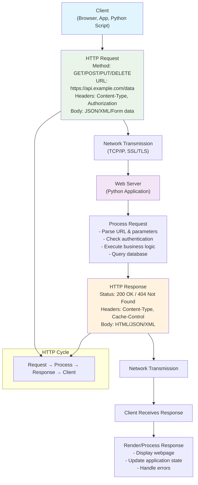
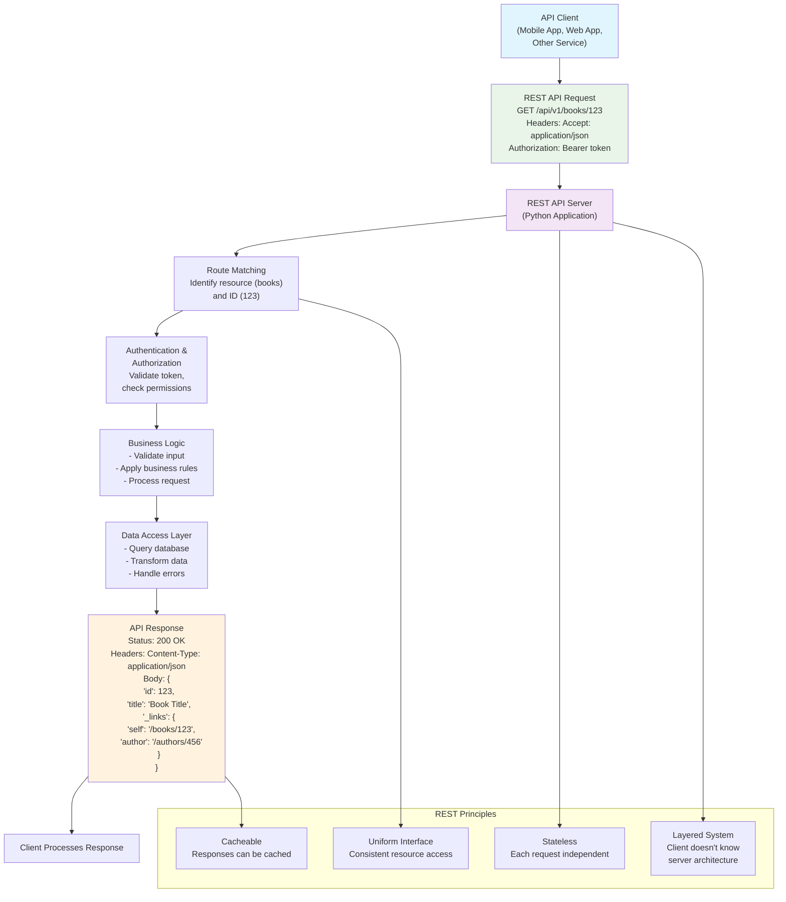

# Python for APIs, Web & Databases: Complete Practical Course
## Part 5 – Building Real-World Applications with Python

---

## Slide 1: Welcome to Python for APIs, Web & Databases

- Journey from Python basics to building real-world applications
- Learn how to connect Python to the world through APIs and web services
- Master web development with Flask and FastAPI frameworks
- Understand database fundamentals and SQL integration
- Build complete applications that can serve data over the internet

**Speaker Notes:**
Welcome to the practical world of Python application development! In this module, we'll transform Python from a scripting language into a powerful tool for building web applications, APIs, and database-driven systems. You'll learn how to make HTTP requests, create REST APIs, build web applications, and work with databases. By the end, you'll have the skills to build real-world applications that can serve users over the internet.

```python
# Quick warm-up: Python's web capabilities
print("Python can:")
print("1. Make HTTP requests to any API")
print("2. Serve web pages and REST APIs")
print("3. Connect to databases (SQLite, PostgreSQL, MySQL)")
print("4. Handle authentication and security")
print("5. Scale to thousands of users")

# Example: Simple web server in one line
import http.server
import socketserver

print("\nPython's built-in HTTP server:")
print("Run: python -m http.server 8000")
print("Then visit: http://localhost:8000")
```

---

## Slide 2: HTTP Fundamentals - The Language of the Web

- **HTTP (Hypertext Transfer Protocol)**: Foundation of data communication on the web
- **Request-Response model**: Client sends request, server sends response
- **HTTP Methods**: GET (retrieve), POST (create), PUT (update), DELETE (remove)
- **Status Codes**: 200 (OK), 404 (Not Found), 500 (Server Error)
- **Headers**: Metadata about request/response (Content-Type, Authorization)
- **Body**: Data being sent (JSON, XML, form data)

**Speaker Notes:**
HTTP is the protocol that powers the web. Every time you visit a website or use an app, HTTP requests are being made behind the scenes. Understanding HTTP is crucial for working with APIs and building web applications. Python provides excellent libraries for making HTTP requests and building HTTP servers.

```python
# Understanding HTTP components
print("HTTP Request Components:")
print("1. Method: GET, POST, PUT, DELETE")
print("2. URL: https://api.example.com/users")
print("3. Headers: Content-Type: application/json")
print("4. Body: {'name': 'John', 'age': 30}")

print("\nHTTP Response Components:")
print("1. Status Code: 200 OK, 404 Not Found")
print("2. Headers: Content-Type, Content-Length")
print("3. Body: Response data (HTML, JSON, etc.)")

# Simulating HTTP flow
class SimpleHTTP:
    def __init__(self):
        self.routes = {}
    
    def route(self, path, method="GET"):
        def decorator(func):
            self.routes[(path, method)] = func
            return func
        return decorator
    
    def handle_request(self, path, method="GET", body=None):
        handler = self.routes.get((path, method))
        if handler:
            return handler(body)
        return {"status": 404, "body": "Not Found"}

# Create a simple server simulation
server = SimpleHTTP()

@server.route("/users", "GET")
def get_users(body):
    return {
        "status": 200,
        "headers": {"Content-Type": "application/json"},
        "body": [{"id": 1, "name": "Alice"}, {"id": 2, "name": "Bob"}]
    }

@server.route("/users", "POST")
def create_user(body):
    return {
        "status": 201,
        "headers": {"Content-Type": "application/json"},
        "body": {"id": 3, "name": body.get("name", "New User")}
    }

# Test the server
print("\nSimulating HTTP requests:")
response1 = server.handle_request("/users", "GET")
print(f"GET /users: Status {response1['status']}, Body: {response1['body']}")

response2 = server.handle_request("/users", "POST", {"name": "Charlie"})
print(f"POST /users: Status {response2['status']}, Body: {response2['body']}")

response3 = server.handle_request("/products", "GET")
print(f"GET /products: Status {response3['status']}, Body: {response3['body']}")
```



---

## Slide 3: REST APIs - Architectural Style for Web Services

- **REST (Representational State Transfer)**: Architectural style for designing networked applications
- **Resources**: Everything is a resource (users, products, orders) identified by URLs
- **Stateless**: Each request contains all information needed to process it
- **HTTP Methods as Verbs**: GET (read), POST (create), PUT (update), DELETE (remove)
- **JSON as Data Format**: Lightweight, human-readable data interchange
- **HATEOAS**: Hypermedia as the Engine of Application State (links to related resources)

**Speaker Notes:**
REST is the most popular architectural style for building web APIs. It uses HTTP features in a standardized way: resources are identified by URLs, operations are performed using HTTP methods, and data is typically exchanged as JSON. RESTful APIs are predictable, scalable, and easy to consume from any programming language.

```python
# Designing a RESTful API for a bookstore
class BookstoreAPI:
    def __init__(self):
        self.books = [
            {"id": 1, "title": "Python Crash Course", "author": "Eric Matthes", "price": 39.99},
            {"id": 2, "title": "Fluent Python", "author": "Luciano Ramalho", "price": 49.99},
            {"id": 3, "title": "Automate the Boring Stuff", "author": "Al Sweigart", "price": 29.99}
        ]
        self.next_id = 4
    
    # GET /books - List all books
    def get_books(self):
        return {
            "books": self.books,
            "count": len(self.books),
            "_links": {
                "self": {"href": "/books", "method": "GET"},
                "create": {"href": "/books", "method": "POST"}
            }
        }
    
    # GET /books/{id} - Get a specific book
    def get_book(self, book_id):
        for book in self.books:
            if book["id"] == book_id:
                return {
                    "book": book,
                    "_links": {
                        "self": {"href": f"/books/{book_id}", "method": "GET"},
                        "update": {"href": f"/books/{book_id}", "method": "PUT"},
                        "delete": {"href": f"/books/{book_id}", "method": "DELETE"},
                        "all_books": {"href": "/books", "method": "GET"}
                    }
                }
        return {"error": "Book not found", "status": 404}
    
    # POST /books - Create a new book
    def create_book(self, book_data):
        new_book = {
            "id": self.next_id,
            "title": book_data.get("title", "Untitled"),
            "author": book_data.get("author", "Unknown"),
            "price": book_data.get("price", 0.0)
        }
        self.books.append(new_book)
        self.next_id += 1
        
        return {
            "message": "Book created successfully",
            "book": new_book,
            "status": 201,
            "_links": {
                "self": {"href": f"/books/{new_book['id']}", "method": "GET"},
                "all_books": {"href": "/books", "method": "GET"}
            }
        }
    
    # PUT /books/{id} - Update a book
    def update_book(self, book_id, book_data):
        for i, book in enumerate(self.books):
            if book["id"] == book_id:
                # Update only provided fields
                for key, value in book_data.items():
                    if key != "id":  # Don't allow ID changes
                        self.books[i][key] = value
                
                return {
                    "message": "Book updated successfully",
                    "book": self.books[i],
                    "_links": {
                        "self": {"href": f"/books/{book_id}", "method": "GET"},
                        "all_books": {"href": "/books", "method": "GET"}
                    }
                }
        return {"error": "Book not found", "status": 404}
    
    # DELETE /books/{id} - Delete a book
    def delete_book(self, book_id):
        for i, book in enumerate(self.books):
            if book["id"] == book_id:
                deleted_book = self.books.pop(i)
                return {
                    "message": "Book deleted successfully",
                    "book": deleted_book,
                    "_links": {
                        "all_books": {"href": "/books", "method": "GET"},
                        "create": {"href": "/books", "method": "POST"}
                    }
                }
        return {"error": "Book not found", "status": 404}

# Demonstrate REST API operations
print("RESTful Bookstore API Demonstration:")
api = BookstoreAPI()

print("\n1. GET /books - List all books:")
books_response = api.get_books()
print(f"   Found {books_response['count']} books")
print(f"   Links: {books_response['_links']}")

print("\n2. GET /books/2 - Get specific book:")
book_response = api.get_book(2)
print(f"   Book: {book_response.get('book', {}).get('title', 'Not found')}")
print(f"   Links: {book_response.get('_links', {})}")

print("\n3. POST /books - Create new book:")
new_book = api.create_book({
    "title": "Deep Learning with Python",
    "author": "François Chollet",
    "price": 59.99
})
print(f"   Created: {new_book['book']['title']}")
print(f"   Status: {new_book['status']}")

print("\n4. PUT /books/1 - Update book:")
update_response = api.update_book(1, {"price": 34.99, "title": "Python Crash Course 2nd Edition"})
print(f"   Updated: {update_response['book']['title']} for ${update_response['book']['price']}")

print("\n5. DELETE /books/3 - Delete book:")
delete_response = api.delete_book(3)
print(f"   Deleted: {delete_response['book']['title']}")

print("\n6. Final book list:")
final_books = api.get_books()
for book in final_books["books"]:
    print(f"   - {book['title']} by {book['author']} (${book['price']})")

# REST API best practices
print("\nREST API Best Practices:")
best_practices = [
    "Use nouns for resources (not verbs): /users not /getUsers",
    "Use HTTP methods correctly: GET for read, POST for create, etc.",
    "Return appropriate status codes: 200, 201, 400, 404, 500",
    "Use consistent naming: snake_case or camelCase (stick to one)",
    "Version your API: /api/v1/users or Accept: application/vnd.api.v1+json",
    "Provide filtering, sorting, pagination: /users?limit=10&offset=20",
    "Include hypermedia links (HATEOAS) for discoverability",
    "Use HTTPS for security",
    "Implement rate limiting to prevent abuse",
    "Document your API thoroughly (OpenAPI/Swagger)"
]

for i, practice in enumerate(best_practices, 1):
    print(f"   {i}. {practice}")
```



---

## Slide 4: Python requests Library - Making HTTP Requests

- **`requests` library**: The de facto standard for making HTTP requests in Python
- **Simple API**: `requests.get()`, `requests.post()`, `requests.put()`, `requests.delete()`
- **Response object**: Contains status code, headers, content, and JSON data
- **Session objects**: For persistent connections and cookie management
- **Authentication support**: Basic auth, OAuth, API keys, bearer tokens
- **Advanced features**: Timeouts, retries, streaming, file uploads

**Speaker Notes:**
The `requests` library makes HTTP simple and elegant in Python. With just a few lines of code, you can interact with any web API. It handles all the low-level details like connection pooling, SSL verification, and content encoding, letting you focus on your application logic.

```python
import requests
import json
from pprint import pprint

# Basic GET request
print("Basic GET request to JSONPlaceholder API:")
response = requests.get("https://jsonplaceholder.typicode.com/posts/1")
print(f"Status Code: {response.status_code}")
print(f"Headers: {dict(response.headers)}")
print(f"Content Type: {response.headers.get('content-type')}")
print(f"Response JSON: {response.json()}")

# GET with query parameters
print("\nGET with query parameters:")
params = {
    "userId": 1,
    "_limit": 3
}
response = requests.get("https://jsonplaceholder.typicode.com/posts", params=params)
posts = response.json()
print(f"Found {len(posts)} posts for user 1")
for post in posts:
    print(f"  - {post['title'][:50]}...")

# POST request with JSON data
print("\nPOST request to create a new post:")
new_post = {
    "title": "My Python Post",
    "body": "This is a post created using Python requests library",
    "userId": 1
}
response = requests.post(
    "https://jsonplaceholder.typicode.com/posts",
    json=new_post  # Automatically sets Content-Type to application/json
)
print(f"Status Code: {response.status_code} (201 Created expected)")
print(f"Created post ID: {response.json().get('id')}")

# PUT request to update
print("\nPUT request to update post:")
updated_post = new_post.copy()
updated_post["title"] = "Updated Python Post"
updated_post["body"] = "This post has been updated using PUT"

response = requests.put(
    "https://jsonplaceholder.typicode.com/posts/1",
    json=updated_post
)
print(f"Update status: {response.status_code}")
print(f"Updated title: {response.json().get('title')}")

# DELETE request
print("\nDELETE request:")
response = requests.delete("https://jsonplaceholder.typicode.com/posts/