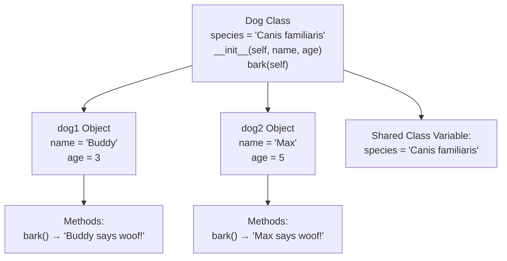
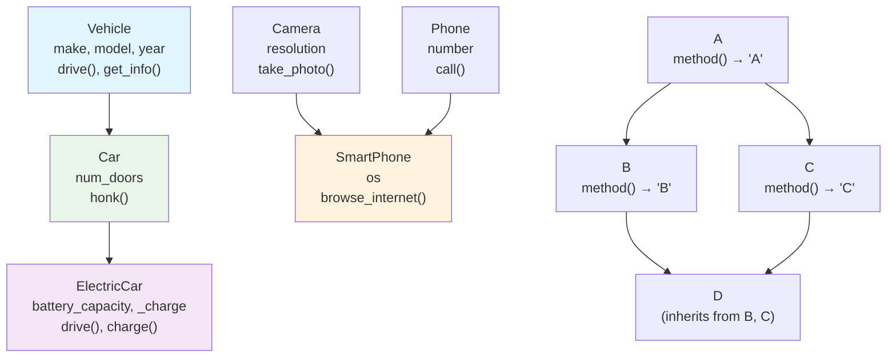
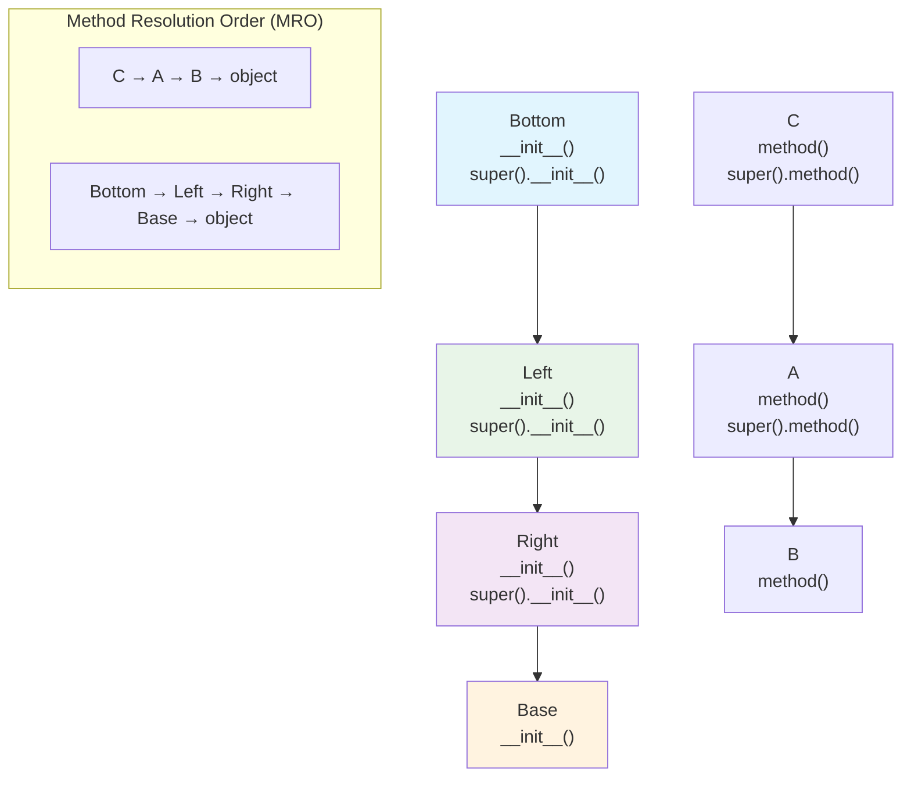
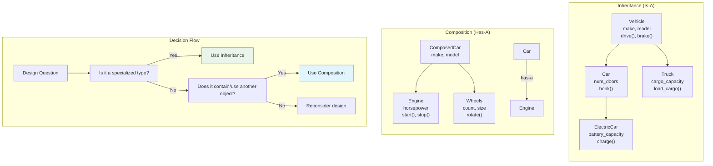
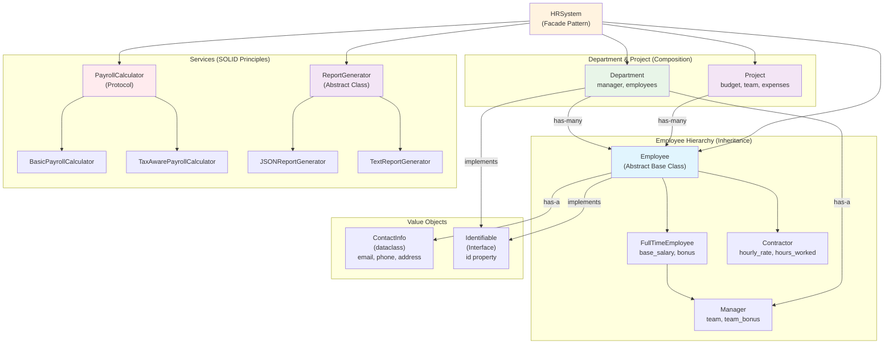

# Object-Oriented Programming in Python: Deep & Professional Course
## Part 3 – Object-Oriented Programming (DEEP & PROFESSIONAL)

---

## Slide 1: What OOP Really Is (Not Just Definitions)

- OOP is a **modeling paradigm**, not just syntax
- It's about organizing code around **real‑world concepts** (nouns) rather than actions (verbs)
- Core idea: bundle **data** (attributes) and **behavior** (methods) into cohesive units called objects
- Objects communicate via **messages** (method calls), not just function calls
- OOP emerged to manage complexity in large software systems (Simula, Smalltalk)

**Speaker Notes:**
Welcome to Object‑Oriented Programming. Many tutorials give you definitions—"classes are blueprints, objects are instances"—but miss the *why*. OOP isn't about memorizing keywords; it's a way of thinking. Imagine building a car: you don't think about "turn wheel, accelerate, brake" as separate functions. You think "Car object, with steering wheel, accelerator, brake pedal." That mental shift—from actions to things—is OOP. We'll explore this mindset slowly, with diagrams and metaphors, because understanding *why* OOP matters is more important than memorizing syntax.

```python
# Procedural thinking (what you might be used to)
def calculate_area(width, height):
    return width * height

def draw_rectangle(width, height, color):
    print(f"Drawing {color} rectangle {width}x{height}")

# OOP thinking (organizing around concepts)
class Rectangle:
    def __init__(self, width, height, color):
        self.width = width
        self.height = height
        self.color = color
    
    def area(self):
        return self.width * self.height
    
    def draw(self):
        print(f"Drawing {self.color} rectangle {self.width}x{self.height}")

# Now the rectangle is a "thing" with data and behavior together
rect = Rectangle(10, 5, "blue")
print(rect.area())
rect.draw()
```

---

## Slide 2: Classes and Objects (Mental Models)

- **Class**: A template, blueprint, or cookie cutter. Defines *what* an object will have (attributes) and *what* it can do (methods)
- **Object**: A concrete instance created from a class. Has actual data values and can perform actions
- Analogy: Class = architectural blueprint, Object = actual house built from that blueprint
- In Python, everything is an object (even classes themselves are objects of `type`)
- Creating an object is called **instantiation**

**Speaker Notes:**
Let's visualize this. Imagine you're a toy manufacturer. The **class** is the mold you design—it specifies the shape, color slots, and features. The **objects** are the actual toys produced from that mold, each with its own unique paint color, serial number, and position on the shelf. In code, the class defines the structure, and each object gets its own memory space for its data. Look at the Mermaid diagram below—it shows a Dog class blueprint creating multiple objects (dog1, dog2) with their own instance data but sharing a class variable. This visual representation helps cement the mental model of classes as templates and objects as instances.



*Visualization: The Dog class blueprint creates multiple objects (dog1, dog2) with their own instance data but shared class variable.*

```python
# Class definition (the blueprint)
class Dog:
    # Class attribute (shared by all dogs)
    species = "Canis familiaris"
    
    def __init__(self, name, age):
        # Instance attributes (unique to each dog)
        self.name = name
        self.age = age
    
    def bark(self):
        return f"{self.name} says woof!"

# Creating objects (instances)
dog1 = Dog("Buddy", 3)   # First object
dog2 = Dog("Max", 5)     # Second object

print(dog1.name)         # Buddy
print(dog2.name)         # Max
print(dog1.species)      # Canis familiaris (shared)
print(dog2.species)      # Canis familiaris (shared)

print(dog1.bark())       # Buddy says woof!
print(dog2.bark())       # Max says woof!

# Memory visualization (conceptual)
# Dog class blueprint
#   ├── dog1 object: name="Buddy", age=3
#   └── dog2 object: name="Max", age=5
```

---

## Slide 3: self Explained Clearly (Why It Exists)

- `self` is a reference to the **current instance** of the class
- It's Python's way of saying "this particular object"
- Why needed? Methods need to know which object's data to operate on
- When you call `obj.method()`, Python automatically passes `obj` as `self`
- `self` is a convention, not a keyword (you could use `this` or `me`, but don't)

**Speaker Notes:**
This is where many learners stumble. "Why do I have to write `self` everywhere?" Think of a classroom: the teacher says "Open your textbook to page 50." Who opens the book? Each student opens *their own* book. `self` is like pointing to yourself—"my book, my page." Without `self`, Python wouldn't know which student's book to open. When you call `dog1.bark()`, Python secretly does `Dog.bark(dog1)`. The `self` parameter receives `dog1`. Let's trace through this step by step.

```python
class Student:
    def __init__(self, name, grade):
        # self refers to the new object being created
        self.name = name
        self.grade = grade
    
    def introduce(self):
        # self allows access to this specific student's name
        return f"Hi, I'm {self.name} and I'm in grade {self.grade}"

# What really happens when we create an object and call a method
s1 = Student("Alice", 10)   # Python does: Student.__init__(s1, "Alice", 10)
s2 = Student("Bob", 11)     # Python does: Student.__init__(s2, "Bob", 11)

print(s1.introduce())       # Python does: Student.introduce(s1)
print(s2.introduce())       # Python does: Student.introduce(s2)

# Let's prove it by calling the method the "hidden" way
print(Student.introduce(s1))  # Same output! This is what Python does internally

# Common mistake: forgetting self
class BrokenStudent:
    def __init__(name, grade):  # Missing self!
        name = name             # This creates a local variable, not an attribute
        grade = grade
    
    def get_name():
        return name            # Error: name is not defined

# This will fail because Python tries to pass the instance as first argument
# b = BrokenStudent("Alice", 10)  # TypeError: __init__() takes 2 positional arguments but 3 were given
```

---

## Slide 4: Constructors and Object Lifecycle

- **Constructor**: Special method `__init__` that initializes a new object
- Called automatically when you create an instance: `obj = ClassName(...)`
- **Object lifecycle**: Creation → Usage → Garbage collection
- Other lifecycle methods: `__new__` (rarely used), `__del__` (destructor, use cautiously)
- Constructors can have parameters to set initial state

**Speaker Notes:**
Think of constructing a building. The architect's blueprint (class) says what the building should look like. The construction crew (constructor) actually builds it with specific materials. In Python, `__init__` is that construction crew. It doesn't create the object—Python does that first—but it sets up the initial state. We'll diagram the lifecycle: memory allocation, `__init__` call, object usage, and finally garbage collection when no references remain.

```python
class BankAccount:
    # Class attribute (shared)
    bank_name = "Python Bank"
    
    def __init__(self, account_holder, initial_balance=0):
        # Instance attributes (unique to each account)
        self.account_holder = account_holder
        self.balance = initial_balance
        self.account_number = self._generate_account_number()
        print(f"Account created for {account_holder} with #{self.account_number}")
    
    def _generate_account_number(self):
        # Simulate account number generation
        import random
        return f"ACC{random.randint(10000, 99999)}"
    
    def deposit(self, amount):
        self.balance += amount
        print(f"Deposited ${amount}. New balance: ${self.balance}")
    
    def withdraw(self, amount):
        if amount <= self.balance:
            self.balance -= amount
            print(f"Withdrew ${amount}. New balance: ${self.balance}")
        else:
            print("Insufficient funds!")
    
    # Destructor (rarely needed, but shown for completeness)
    def __del__(self):
        print(f"Account #{self.account_number} is being closed")

# Object lifecycle demonstration
print("=== Creating account ===")
account = BankAccount("Alice", 1000)  # __init__ is called here

print("\n=== Using account ===")
account.deposit(500)
account.withdraw(200)

print("\n=== End of scope ===")
# When 'account' goes out of scope or is deleted, __del__ may be called
# Note: __del__ timing is not guaranteed in Python due to garbage collection

# Multiple constructors? Python doesn't have them, but we can use class methods
class Person:
    def __init__(self, name, age):
        self.name = name
        self.age = age
    
    @classmethod
    def from_birth_year(cls, name, birth_year):
        from datetime import datetime
        current_year = datetime.now().year
        age = current_year - birth_year
        return cls(name, age)  # Calls __init__

# Alternative constructor
p1 = Person("Alice", 30)
p2 = Person.from_birth_year("Bob", 1995)
print(f"{p2.name} is {p2.age} years old")
```

---

## Slide 5: Instance Variables vs Class Variables

- **Instance variables**: Unique to each object, defined with `self.var = value` in `__init__` or methods
- **Class variables**: Shared by all instances, defined directly in class body
- Instance variables store object‑specific data; class variables store shared data
- Be careful: mutable class variables can lead to unexpected sharing
- Access: `obj.instance_var` vs `ClassName.class_var` or `obj.class_var`

**Speaker Notes:**
This is a critical distinction. Imagine a company: each employee (instance) has their own name and salary (instance variables). But all employees share the company name and holiday schedule (class variables). If you change a class variable, it affects all instances. We'll draw a diagram showing memory layout: class variables in a shared area, instance variables in each object's personal space. We'll also explore the common pitfall of mutable class variables.

```python
class Employee:
    # Class variables (shared across all employees)
    company = "TechCorp"
    location = "San Francisco"
    employee_count = 0  # Tracks total employees
    
    def __init__(self, name, position):
        # Instance variables (unique to each employee)
        self.name = name
        self.position = position
        self.employee_id = None
        # Update class variable
        Employee.employee_count += 1
        self.employee_id = Employee.employee_count
    
    def display_info(self):
        return f"{self.name} ({self.position}) at {self.company}, ID: {self.employee_id}"

# Creating employees
e1 = Employee("Alice", "Developer")
e2 = Employee("Bob", "Manager")

print(e1.display_info())  # Alice (Developer) at TechCorp, ID: 1
print(e2.display_info())  # Bob (Manager) at TechCorp, ID: 2

print(f"Total employees: {Employee.employee_count}")  # 2

# Changing a class variable affects all instances
Employee.company = "NewTech"
print(e1.company)  # NewTech
print(e2.company)  # NewTech

# Changing through an instance creates an instance variable (shadowing)
e1.company = "OldTech"  # Creates instance variable, doesn't change class variable
print(e1.company)  # OldTech (instance variable)
print(e2.company)  # NewTech (still class variable)
print(Employee.company)  # NewTech (class variable unchanged)

# DANGER: Mutable class variables
class Configuration:
    settings = {}  # Mutable class variable
    
    def __init__(self, name):
        self.name = name
        self.settings[name] = "default"  # Modifies the shared dictionary!

c1 = Configuration("app1")
c2 = Configuration("app2")
print(Configuration.settings)  # {'app1': 'default', 'app2': 'default'} (shared!)

# Better approach: initialize mutable attributes in __init__
class SafeConfiguration:
    def __init__(self, name):
        self.name = name
        self.settings = {}  # Instance variable, not shared
        self.settings[name] = "default"
```

---

## Slide 6: Methods and Behaviors

- **Methods**: Functions defined inside a class that operate on instances
- **Instance methods**: Most common, receive `self` as first parameter
- **Class methods**: Decorated with `@classmethod`, receive `cls` (class) as first parameter
- **Static methods**: Decorated with `@staticmethod`, receive no special first parameter
- Methods define object behavior—what objects can *do*

**Speaker Notes:**
Methods are where objects come alive. An object without methods is just a data container. Methods give objects behavior. Think of a car: data (color, model, speed) + methods (accelerate, brake, turn). We'll categorize methods by their purpose: accessor methods (getters), mutator methods (setters), utility methods, and special methods. We'll also explore when to use class methods vs static methods with clear examples.

```python
class BankAccount:
    # Class variable
    interest_rate = 0.05  # 5% annual interest
    
    def __init__(self, owner, balance=0):
        self.owner = owner
        self.balance = balance
        self.transactions = []
    
    # Instance method (operates on specific instance)
    def deposit(self, amount):
        self.balance += amount
        self.transactions.append(f"Deposit: +${amount}")
        return self.balance
    
    def withdraw(self, amount):
        if amount <= self.balance:
            self.balance -= amount
            self.transactions.append(f"Withdrawal: -${amount}")
            return self.balance
        else:
            raise ValueError("Insufficient funds")
    
    # Accessor method (getter)
    def get_balance(self):
        return self.balance
    
    # Mutator method (setter) with validation
    def set_owner(self, new_owner):
        if not new_owner:
            raise ValueError("Owner name cannot be empty")
        self.owner = new_owner
    
    # Utility method
    def print_statement(self):
        print(f"Account Statement for {self.owner}")
        print(f"Current Balance: ${self.balance}")
        print("Recent Transactions:")
        for txn in self.transactions[-5:]:  # Last 5 transactions
            print(f"  {txn}")
    
    # Class method (operates on class, not instance)
    @classmethod
    def set_interest_rate(cls, new_rate):
        cls.interest_rate = new_rate
        print(f"Interest rate changed to {new_rate*100}%")
    
    @classmethod
    def from_string(cls, account_str):
        # Alternative constructor: "Alice:1000" -> BankAccount("Alice", 1000)
        owner, balance = account_str.split(":")
        return cls(owner, float(balance))
    
    # Static method (no access to self or cls, just a utility)
    @staticmethod
    def calculate_interest(principal, years, rate=None):
        if rate is None:
            rate = BankAccount.interest_rate
        return principal * (1 + rate) ** years - principal

# Using different method types
account = BankAccount("Alice", 1000)

# Instance methods
account.deposit(500)
print(f"Balance: ${account.get_balance()}")

# Class method
BankAccount.set_interest_rate(0.06)  # Affects all accounts
print(f"Class interest rate: {BankAccount.interest_rate}")

# Alternative constructor via class method
new_account = BankAccount.from_string("Bob:2000")
print(f"New account for {new_account.owner} with ${new_account.balance}")

# Static method
interest = BankAccount.calculate_interest(1000, 2)  # 2 years
print(f"Interest on $1000 for 2 years: ${interest:.2f}")

# Method chaining (return self to enable)
class Calculator:
    def __init__(self, value=0):
        self.value = value
    
    def add(self, x):
        self.value += x
        return self  # Enables chaining
    
    def multiply(self, x):
        self.value *= x
        return self
    
    def get(self):
        return self.value

result = Calculator(5).add(3).multiply(2).add(10).get()
print(f"Chained calculation result: {result}")  # (5+3)*2+10 = 26
```

---

## Slide 7: Encapsulation (Truth About Python)

- **Encapsulation**: Bundling data and methods together, hiding internal details
- **Information hiding**: Restricting direct access to some components
- Python's philosophy: "We're all consenting adults" – no strict enforcement
- Convention: prefix with `_` for "protected", `__` for "private" (name mangling)
- Use properties (`@property`) for controlled access to attributes

**Speaker Notes:**
Many OOP languages have strict private/public modifiers. Python takes a different approach: trust developers to use interfaces properly. But that doesn't mean encapsulation is absent—it's achieved through conventions and properties. We'll explore why encapsulation matters (changing implementation without breaking users) and how Python implements it pragmatically. We'll also discuss the "Pythonic" way vs. Java/C++ way.

```python
# Naive approach (no encapsulation)
class BankAccountNaive:
    def __init__(self, balance):
        self.balance = balance  # Directly accessible

account = BankAccountNaive(1000)
account.balance = -500  # Oops! Negative balance allowed
print(f"Problem: balance can be set to {account.balance}")

# Better: Encapsulation with private attribute and getter/setter
class BankAccount:
    def __init__(self, balance):
        self._balance = balance  # Protected by convention
    
    def get_balance(self):
        return self._balance
    
    def set_balance(self, amount):
        if amount < 0:
            raise ValueError("Balance cannot be negative")
        self._balance = amount

account = BankAccount(1000)
print(f"Initial balance: {account.get_balance()}")
# account.set_balance(-500)  # Raises ValueError

# Pythonic way: using @property
class BankAccountPythonic:
    def __init__(self, balance):
        self._balance = balance  # Internal storage
    
    @property
    def balance(self):
        """Getter: allows reading as attribute"""
        return self._balance
    
    @balance.setter
    def balance(self, amount):
        """Setter: validates before setting"""
        if amount < 0:
            raise ValueError("Balance cannot be negative")
        self._balance = amount
    
    @balance.deleter
    def balance(self):
        """Deleter: controls deletion"""
        print("Cannot delete balance! Setting to zero.")
        self._balance = 0

account = BankAccountPythonic(1000)
print(f"Balance via property: {account.balance}")  # Calls getter
# account.balance = -500  # Raises ValueError
account.balance = 1500  # Valid
print(f"New balance: {account.balance}")

# Name mangling for "private" attributes
class SecretAccount:
    def __init__(self, password):
        self.__password = password  # Name mangled to _SecretAccount__password
    
    def check_password(self, attempt):
        return self.__password == attempt

acc = SecretAccount("secret123")
# print(acc.__password)  # AttributeError: 'SecretAccount' object has no attribute '__password'
print(f"Can't access directly: {acc.__password}")  # Error
print(f"But can access via mangled name: {acc._SecretAccount__password}")  # Works (but don't do this!)

# The Python philosophy in practice
class Temperature:
    def __init__(self, celsius):
        self._celsius = celsius  # Internal representation
    
    @property
    def celsius(self):
        return self._celsius
    
    @celsius.setter
    def celsius(self, value):
        if value < -273.15:
            raise ValueError("Temperature below absolute zero")
        self._celsius = value
    
    @property
    def fahrenheit(self):
        return self._celsius * 9/5 + 32
    
    @fahrenheit.setter
    def fahrenheit(self, value):
        self._celsius = (value - 32) * 5/9

temp = Temperature(25)
print(f"25°C = {temp.fahrenheit}°F")
temp.fahrenheit = 77
print(f"77°F = {temp.celsius}°C")
```
---

## Slide 8: Name Mangling and Access Conventions

- **Single underscore prefix (`_var`)**: "Protected" by convention. Signals "internal use only"
- **Double underscore prefix (`__var`)**: Triggers name mangling. Becomes `_ClassName__var`
- **Double underscore suffix (`var__`)**: Used for Python's magic methods (avoid for your own)
- **Single underscore (`_`)**: Used as throwaway variable or in internationalization
- **No enforcement**: Python trusts developers; these are conventions, not restrictions

**Speaker Notes:**
Python doesn't have true private variables like Java or C++. Instead, it uses naming conventions that say "hands off unless you know what you're doing." The single underscore is a gentle warning. The double underscore triggers name mangling—a mechanism that makes accidental overriding harder in inheritance. We'll explore when to use each convention and why Python's "consenting adults" philosophy leads to more maintainable code in practice.

```python
# Understanding naming conventions
class AccessDemo:
    def __init__(self):
        self.public = "Anyone can access"
        self._protected = "Should be treated as non-public"
        self.__private = "Name-mangled (not truly private)"
        self.__private_with_class__ = "Bad practice! Reserved for Python"
    
    def show_names(self):
        print(f"public: {self.public}")
        print(f"_protected: {self._protected}")
        print(f"__private: {self.__private}")
        print(f"Access via mangled name: {self._AccessDemo__private}")

demo = AccessDemo()

# Public access (fine)
print(demo.public)  # Anyone can access

# Protected access (discouraged but possible)
print(demo._protected)  # Should be treated as non-public

# Private access (fails due to name mangling)
# print(demo.__private)  # AttributeError: 'AccessDemo' object has no attribute '__private'

# But we can access via mangled name (don't do this in production!)
print(demo._AccessDemo__private)  # Name-mangled (not truly private)

# Name mangling in action
print("Mangled names in dir():")
for attr in dir(demo):
    if "private" in attr:
        print(f"  {attr}")

# Why name mangling matters in inheritance
class Parent:
    def __init__(self):
        self.__secret = "Parent's secret"  # Becomes _Parent__secret
    
    def get_secret(self):
        return self.__secret

class Child(Parent):
    def __init__(self):
        super().__init__()
        self.__secret = "Child's secret"  # Becomes _Child__secret
    
    def get_child_secret(self):
        return self.__secret

child = Child()
print(f"Parent secret: {child.get_secret()}")  # Parent's secret
print(f"Child secret: {child.get_child_secret()}")  # Child's secret
print(f"Both exist separately: {child._Parent__secret} vs {child._Child__secret}")

# Practical example: when to use each convention
class DatabaseConnection:
    def __init__(self, host, port):
        self.host = host  # Public: part of API
        self.port = port  # Public: part of API
        self._connection = None  # Protected: internal state
        self.__password = "secret"  # Private: sensitive data (mangled)
        self._connect()
    
    def _connect(self):
        """Protected method: internal implementation detail"""
        # Simulate connection
        self._connection = f"Connected to {self.host}:{self.port}"
        print("Connection established")
    
    def query(self, sql):
        """Public method: part of the API"""
        if not self._connection:
            self._connect()
        return f"Executing: {sql}"
    
    # Property for controlled access to "private" data
    @property
    def password(self):
        return "***"  # Never expose actual password
    
    @password.setter
    def password(self, value):
        if len(value) < 8:
            raise ValueError("Password too short")
        self.__password = value

# Best practices summary
print("\n=== Best Practices ===")
print("1. Use no prefix for public API methods/attributes")
print("2. Use _prefix for 'protected' (internal implementation)")
print("3. Use __prefix sparingly, mainly to avoid name clashes in inheritance")
print("4. Never use __suffix__ for your own attributes")
print("5. Use properties (@property) for controlled access to sensitive data")
```
---

## Slide 9: Inheritance (Single, Multiple)

- **Inheritance**: Mechanism for creating new classes from existing ones
- **Single inheritance**: One parent class (most common)
- **Multiple inheritance**: Multiple parent classes (Python supports this)
- **Method Resolution Order (MRO)**: Determines which parent's method is called
- **"Is-a" relationship**: Child class is a specialized version of parent
- **DRY principle**: Don't Repeat Yourself – reuse code through inheritance

**Speaker Notes:**
Inheritance is about specialization. Think of it as a family tree: a `Car` is a `Vehicle`, an `ElectricCar` is a `Car`. Each child class adds or modifies behavior. Single inheritance is straightforward. Multiple inheritance is powerful but tricky—Python's MRO (C3 linearization) solves the "diamond problem." Look at the Mermaid diagram below—it visualizes single inheritance (Vehicle → Car → ElectricCar), multiple inheritance (Camera + Phone → SmartPhone), and diamond inheritance (A → B, C → D). These diagrams help you see the relationships and understand how method resolution works in complex hierarchies.



*Visualization: Single inheritance (Vehicle → Car → ElectricCar), multiple inheritance (Camera + Phone → SmartPhone), and diamond inheritance (A → B, C → D).*

```python
# Single inheritance example
class Vehicle:
    def __init__(self, make, model, year):
        self.make = make
        self.model = model
        self.year = year
        self._mileage = 0
    
    def drive(self, miles):
        self._mileage += miles
        print(f"Driving {miles} miles. Total mileage: {self._mileage}")
    
    def get_info(self):
        return f"{self.year} {self.make} {self.model}"

class Car(Vehicle):  # Car inherits from Vehicle
    def __init__(self, make, model, year, num_doors):
        super().__init__(make, model, year)  # Call parent constructor
        self.num_doors = num_doors
    
    # Override parent method
    def get_info(self):
        base_info = super().get_info()
        return f"{base_info} with {self.num_doors} doors"
    
    # Add new method
    def honk(self):
        print("Beep beep!")

class ElectricCar(Car):  # Multi-level inheritance
    def __init__(self, make, model, year, num_doors, battery_capacity):
        super().__init__(make, model, year, num_doors)
        self.battery_capacity = battery_capacity  # kWh
        self._charge = 100  # percentage
    
    # Override with different behavior
    def drive(self, miles):
        # Electric cars consume battery
        battery_used = miles / 10  # Simplified calculation
        self._charge -= battery_used
        if self._charge < 0:
            print("Battery depleted! Need to recharge.")
            self._charge = 0
        else:
            super().drive(miles)  # Call Vehicle's drive method
            print(f"Battery remaining: {self._charge:.1f}%")
    
    def charge(self, percentage):
        self._charge = min(100, self._charge + percentage)
        print(f"Charged to {self._charge:.1f}%")

# Using the inheritance hierarchy
print("=== Single Inheritance Demo ===")
my_car = Car("Toyota", "Camry", 2023, 4)
print(my_car.get_info())  # 2023 Toyota Camry with 4 doors
my_car.drive(50)  # Driving 50 miles. Total mileage: 50
my_car.honk()     # Beep beep!

print("\n=== Multi-level Inheritance Demo ===")
tesla = ElectricCar("Tesla", "Model 3", 2024, 4, 75)
print(tesla.get_info())  # 2024 Tesla Model 3 with 4 doors
tesla.drive(30)  # Driving 30 miles. Total mileage: 30\nBattery remaining: 97.0%
tesla.charge(50) # Charged to 100.0%

# Multiple inheritance example
class Camera:
    def __init__(self, resolution):
        self.resolution = resolution
    
    def take_photo(self):
        return f"Photo taken at {self.resolution}"

class Phone:
    def __init__(self, number):
        self.number = number
    
    def call(self, contact):
        return f"Calling {contact} from {self.number}"

class SmartPhone(Camera, Phone):  # Multiple inheritance
    def __init__(self, resolution, number, os):
        # Need to call both parent constructors
        Camera.__init__(self, resolution)
        Phone.__init__(self, number)
        self.os = os
    
    def browse_internet(self):
        return f"Browsing on {self.os}"

# Using multiple inheritance
print("\n=== Multiple Inheritance Demo ===")
iphone = SmartPhone("12MP", "555-1234", "iOS")
print(iphone.take_photo())      # Photo taken at 12MP
print(iphone.call("Mom"))       # Calling Mom from 555-1234
print(iphone.browse_internet()) # Browsing on iOS

# Method Resolution Order (MRO)
print("\n=== Method Resolution Order ===")
print("SmartPhone MRO:", [cls.__name__ for cls in SmartPhone.__mro__])
# Output: ['SmartPhone', 'Camera', 'Phone', 'object']

# Diamond problem and MRO
class A:
    def method(self):
        return "A"

class B(A):
    def method(self):
        return "B"

class C(A):
    def method(self):
        return "C"

class D(B, C):  # Diamond inheritance
    pass

d = D()
print(f"D().method() returns: {d.method()}")  # B (due to MRO)
print("D MRO:", [cls.__name__ for cls in D.__mro__])
# Output: ['D', 'B', 'C', 'A', 'object']

# When NOT to use inheritance
print("\n=== Inheritance Guidelines ===")
print("1. Use inheritance for 'is-a' relationships (Car IS-A Vehicle)")
print("2. Avoid inheritance for 'has-a' relationships (Car HAS-A Engine → use composition)")
print("3. Keep inheritance hierarchies shallow (2-3 levels max)")
print("4. Prefer composition over inheritance for code reuse")
print("5. Use multiple inheritance cautiously, with clear interfaces")
```
---

## Slide 10: super() Explained Step-by-Step

- **`super()`**: Returns a proxy object that delegates method calls to parent class
- **Purpose**: Call parent class methods without naming the parent explicitly
- **Works with**: Single inheritance, multiple inheritance, cooperative multiple inheritance
- **Two forms**: `super()` (no arguments) and `super(Class, self)` (explicit)
- **MRO aware**: Follows Method Resolution Order in multiple inheritance
- **Cooperative design**: Enables mixins and flexible class hierarchies

**Speaker Notes:**
`super()` is often misunderstood. It's not just "call the parent method"—it's "call the next method in the MRO chain." This distinction matters in multiple inheritance. Look at the Mermaid diagram below—it shows how `super()` follows the Method Resolution Order chain. In diamond inheritance (Bottom → Left → Right → Base), each `super()` calls the next class. In cooperative design (C → A → B), A's `super()` calls B. We'll trace through examples to see how `super()` enables cooperative design patterns where multiple parents contribute to a method. Understanding `super()` is key to writing maintainable inheritance hierarchies.



*Visualization: super() follows MRO chain. In diamond inheritance (Bottom → Left → Right → Base), each super() calls next class. In cooperative design (C → A → B), A's super() calls B.*

```python
# Basic super() usage
class Parent:
    def __init__(self, name):
        self.name = name
        print(f"Parent.__init__ called with {name}")
    
    def greet(self):
        return f"Hello from Parent, {self.name}"

class Child(Parent):
    def __init__(self, name, age):
        # Call Parent's __init__
        super().__init__(name)  # Equivalent to Parent.__init__(self, name)
        self.age = age
        print(f"Child.__init__ called with age {age}")
    
    def greet(self):
        # Extend parent's method
        parent_greeting = super().greet()
        return f"{parent_greeting}. I'm {self.age} years old."

child = Child("Alice", 10)
# Output:
# Parent.__init__ called with Alice
# Child.__init__ called with age 10
print(child.greet())  # Hello from Parent, Alice. I'm 10 years old.

# super() in multiple inheritance (cooperative design)
class A:
    def method(self):
        print("A.method")
        super().method()  # Calls next in MRO, even if A doesn't know who's next

class B:
    def method(self):
        print("B.method")
        # No super().method() here - chain stops unless another class adds it

class C(A, B):
    def method(self):
        print("C.method")
        super().method()  # Calls A.method (next in MRO)

print("\n=== Cooperative Multiple Inheritance ===")
print("C MRO:", [cls.__name__ for cls in C.__mro__])
# Output: ['C', 'A', 'B', 'object']

c = C()
c.method()
# Output:
# C.method
# A.method
# B.method  # Because A's super() called B.method (next in MRO after A)

# What happens without cooperative design
class NonCooperativeA:
    def method(self):
        print("NonCooperativeA.method")
        # No super() call - chain breaks

class NonCooperativeB:
    def method(self):
        print("NonCooperativeB.method")

class NonCooperativeC(NonCooperativeA, NonCooperativeB):
    def method(self):
        print("NonCooperativeC.method")
        super().method()

nc = NonCooperativeC()
print("\n=== Non-cooperative inheritance ===")
nc.method()  # Only calls NonCooperativeA.method, chain stops

# super() with arguments (legacy Python 2 style, still works)
class LegacyStyle:
    def __init__(self, value):
        self.value = value

class ModernStyle(LegacyStyle):
    def __init__(self, value, extra):
        # Python 2 style: super(ModernStyle, self).__init__(value)
        # Python 3 style: super().__init__(value)
        super(ModernStyle, self).__init__(value)  # Explicit but unnecessary in Python 3
        self.extra = extra

# Practical example: building a logging hierarchy
class Loggable:
    def __init__(self, *args, **kwargs):
        super().__init__(*args, **kwargs)  # Pass to next in MRO
        self.log_events = []
    
    def log(self, message):
        timestamp = "2024-01-01 10:00:00"  # Simplified
        self.log_events.append(f"{timestamp}: {message}")
        print(f"[LOG] {message}")

class Serializable:
    def __init__(self, *args, **kwargs):
        super().__init__(*args, **kwargs)
        self.serialized_data = {}
    
    def to_dict(self):
        return {k: v for k, v in self.__dict__.items()
                if not k.startswith('_')}

class User(Loggable, Serializable):
    def __init__(self, username, email):
        # MRO: User -> Loggable -> Serializable -> object
        super().__init__()  # Calls Loggable.__init__
        self.username = username
        self.email = email
        self.log(f"User {username} created")

print("\n=== Practical super() example ===")
user = User("alice", "alice@example.com")
print(f"Username: {user.username}")
print(f"Log events: {user.log_events}")
print(f"Serialized: {user.to_dict()}")

# Common super() mistakes
print("\n=== Common super() Mistakes ===")

# 1. Forgetting super() in __init__
class BrokenChild(Parent):
    def __init__(self, name, age):
        # Missing super().__init__(name)
        self.age = age  # Parent's name never set!

# 2. Incorrect argument passing
class AnotherChild(Parent):
    def __init__(self, name, age):
        super().__init__(name)  # Correct
        # super().__init__(name, age)  # Wrong: Parent.__init__ takes only name

# 3. Using super() outside instance methods
class StaticUse:
    @classmethod
    def create(cls):
        # super() works in class methods too!
        print("Creating instance")
        return cls()

class Derived(StaticUse):
    @classmethod
    def create(cls):
        print("Derived create")
        return super().create()  # Calls StaticUse.create()

# 4. Diamond inheritance with super()
print("\n=== Diamond Inheritance with super() ===")
class Base:
    def __init__(self):
        print("Base.__init__")

class Left(Base):
    def __init__(self):
        print("Left.__init__")
        super().__init__()

class Right(Base):
    def __init__(self):
        print("Right.__init__")
        super().__init__()

class Bottom(Left, Right):
    def __init__(self):
        print("Bottom.__init__")
        super().__init__()

print("Bottom MRO:", [cls.__name__ for cls in Bottom.__mro__])
b = Bottom()
# Output:
# Bottom.__init__
# Left.__init__
# Right.__init__
# Base.__init__
# Each super() calls the next class in MRO

print("\n=== super() Best Practices ===")
print("1. Always call super().__init__() in child __init__ methods")
print("2. Use super() for method overriding to maintain chain")
print("3. In multiple inheritance, design classes cooperatively")
print("4. Understand MRO to predict super() behavior")
print("5. Use super().__init__(*args, **kwargs) to forward arguments")
```
---

## Slide 11: Method Overriding

- **Method overriding**: Child class provides its own implementation of a method defined in parent
- **Purpose**: Customize or extend parent behavior while maintaining interface
- **Rules**: Same method name, same parameters (signature should match)
- **`super()` usage**: Call parent implementation within overridden method
- **Complete vs partial override**: Replace entirely vs extend with additional logic
- **Liskov Substitution Principle**: Overridden methods should maintain behavioral contracts

**Speaker Notes:**
Overriding is how polymorphism works. When a child class overrides a method, it says "I'll handle this my way, but I still respect the contract." We need to understand when to override completely vs when to extend using `super()`. We'll also explore the subtle difference between overriding (same method) and overloading (same name, different parameters—not supported in Python).

```python
# Basic method overriding
class Animal:
    def speak(self):
        return "Some generic animal sound"
    
    def move(self):
        return "Moving somehow"

class Dog(Animal):
    # Complete override: replace parent implementation
    def speak(self):
        return "Woof!"
    
    # Partial override: extend parent behavior
    def move(self):
        # Call parent's move, then add dog-specific behavior
        parent_move = super().move()
        return f"{parent_move} on four legs"

class Cat(Animal):
    def speak(self):
        return "Meow!"
    
    # No override of move() - inherits Animal.move()

print("=== Basic Overriding ===")
dog = Dog()
cat = Cat()
print(f"Dog speaks: {dog.speak()}")  # Woof!
print(f"Dog moves: {dog.move()}")    # Moving somehow on four legs
print(f"Cat speaks: {cat.speak()}")  # Meow!
print(f"Cat moves: {cat.move()}")    # Moving somehow (inherited)

# Overriding with different method types
class PaymentProcessor:
    def process_payment(self, amount):
        raise NotImplementedError("Subclasses must implement")
    
    def validate(self, amount):
        return amount > 0

class CreditCardProcessor(PaymentProcessor):
    # Override abstract method
    def process_payment(self, amount):
        if not self.validate(amount):
            return "Invalid amount"
        return f"Processing ${amount} via credit card"
    
    # Override with extension
    def validate(self, amount):
        # Call parent validation first
        is_valid = super().validate(amount)
        # Add credit card specific validation
        return is_valid and amount <= 10000  # Credit limit

class PayPalProcessor(PaymentProcessor):
    def process_payment(self, amount):
        if not self.validate(amount):
            return "Invalid amount"
        return f"Processing ${amount} via PayPal"
    
    # No override of validate() - uses parent's

print("\n=== Payment Processing Example ===")
cc = CreditCardProcessor()
paypal = PayPalProcessor()
print(cc.process_payment(5000))      # Processing $5000 via credit card
print(cc.process_payment(15000))     # Invalid amount (exceeds credit limit)
print(paypal.process_payment(-100))  # Invalid amount (parent validation)

# Overriding special methods (dunder methods)
class CustomList(list):
    # Override __getitem__ to add logging
    def __getitem__(self, index):
        print(f"Accessing index {index}")
        return super().__getitem__(index)
    
    # Override __add__ to customize concatenation
    def __add__(self, other):
        print(f"Concatenating with {type(other).__name__}")
        result = super().__add__(other)
        return CustomList(result)  # Return CustomList, not plain list

print("\n=== Overriding Special Methods ===")
my_list = CustomList([1, 2, 3])
print(my_list[1])  # Accessing index 1\n2
new_list = my_list + [4, 5]  # Concatenating with list
print(new_list)    # [1, 2, 3, 4, 5]
print(type(new_list))  # <class '__main__.CustomList'>

# Method overriding in multiple inheritance
class Logger:
    def log(self, message):
        print(f"[LOG] {message}")

class Database:
    def save(self):
        print("Saving to database")
        return "saved"

class UserModel(Logger, Database):
    def save(self):
        # Override but call both parents via super()
        self.log("Starting save operation")
        result = super().save()  # Calls Database.save() (next in MRO)
        self.log("Save completed")
        return result

print("\n=== Overriding in Multiple Inheritance ===")
user = UserModel()
print(user.save())
# Output:
# [LOG] Starting save operation
# Saving to database
# [LOG] Save completed
# saved

# Common overriding patterns
print("\n=== Common Overriding Patterns ===")

# 1. Template Method Pattern
class ReportGenerator:
    def generate(self):
        """Template method: defines skeleton"""
        self._fetch_data()
        self._process_data()
        return self._format_report()
    
    def _fetch_data(self):
        raise NotImplementedError
    
    def _process_data(self):
        raise NotImplementedError
    
    def _format_report(self):
        raise NotImplementedError

class SalesReport(ReportGenerator):
    def _fetch_data(self):
        print("Fetching sales data from database")
    
    def _process_data(self):
        print("Calculating totals and averages")
    
    def _format_report(self):
        return "Sales Report: $1,000,000 revenue"

# 2. Hook methods
class GameCharacter:
    def take_damage(self, amount):
        self.health -= amount
        self._on_damage_taken(amount)  # Hook method
    
    def _on_damage_taken(self, amount):
        pass  # Default: do nothing

class Hero(GameCharacter):
    def __init__(self):
        self.health = 100
    
    def _on_damage_taken(self, amount):
        # Override hook
        if self.health < 30:
            print("Warning: Health critical!")

# 3. Validation overriding
class FormField:
    def validate(self, value):
        return True  # Default: always valid

class EmailField(FormField):
    def validate(self, value):
        # Extend parent validation
        if not super().validate(value):
            return False
        # Add email-specific validation
        import re
        return bool(re.match(r"[^@]+@[^@]+\.[^@]+", value))

# Overriding best practices and pitfalls
print("\n=== Overriding Best Practices ===")
print("1. Maintain method signature (same parameters)")
print("2. Use super() to extend, not replace, when possible")
print("3. Document overridden methods (mention what changed)")
print("4. Follow Liskov Substitution Principle")
print("5. Test overridden methods thoroughly")

# Liskov Substitution Principle example
class Rectangle:
    def __init__(self, width, height):
        self.width = width
        self.height = height
    
    def area(self):
        return self.width * self.height
    
    def set_dimensions(self, width, height):
        self.width = width
        self.height = height

class Square(Rectangle):
    def __init__(self, side):
        super().__init__(side, side)
    
    # Violates LSP: changes behavior unexpectedly
    def set_dimensions(self, width, height):
        if width != height:
            raise ValueError("Square must have equal sides")
        super().set_dimensions(width, height)

print("\n=== Liskov Principle Violation ===")
rect = Rectangle(5, 10)
rect.set_dimensions(3, 7)  # Works
print(f"Rectangle area: {rect.area()}")

square = Square(5)
# square.set_dimensions(3, 7)  # Raises ValueError - violates LSP
print("Square violates LSP: can't substitute for Rectangle in all cases")
```
---

## Slide 12: Polymorphism (Runtime Behavior)

- **Polymorphism**: "Many forms" – ability to present the same interface for different underlying types
- **Types**: Subtype polymorphism (inheritance), ad-hoc polymorphism (operator overloading), parametric polymorphism (generics)
- **Python approach**: Duck typing – "If it walks like a duck and quacks like a duck, it's a duck"
- **Runtime binding**: Method calls resolved at runtime based on object's actual type
- **Interface-based design**: Code works with any object that implements required methods

**Speaker Notes:**
Polymorphism is the heart of OOP's flexibility. It allows us to write code that works with general types, while runtime determines which specific implementation to use. Python takes this further with duck typing: we don't care about an object's class, only about its behavior. We'll explore how polymorphism enables flexible, maintainable systems and how Python's dynamic nature makes polymorphism more powerful than in statically-typed languages.

```python
# Classic polymorphism through inheritance
class Shape:
    def area(self):
        raise NotImplementedError("Subclasses must implement")

class Circle(Shape):
    def __init__(self, radius):
        self.radius = radius
    
    def area(self):
        return 3.14159 * self.radius ** 2

class Rectangle(Shape):
    def __init__(self, width, height):
        self.width = width
        self.height = height
    
    def area(self):
        return self.width * self.height

class Triangle(Shape):
    def __init__(self, base, height):
        self.base = base
        self.height = height
    
    def area(self):
        return 0.5 * self.base * self.height

# Polymorphic function: works with any Shape
def print_area(shape):
    # Don't care about concrete type, only that it has area() method
    print(f"Area: {shape.area():.2f}")

print("=== Classic Polymorphism ===")
shapes = [Circle(5), Rectangle(4, 6), Triangle(3, 8)]
for shape in shapes:
    print_area(shape)
# Output:
# Area: 78.54
# Area: 24.00
# Area: 12.00

# Duck typing: no inheritance required
class Duck:
    def quack(self):
        return "Quack!"

class Person:
    def quack(self):
        return "I'm pretending to be a duck!"

class Robot:
    def quack(self):
        return "BEEP QUACK BEEP"

def make_it_quack(thing):
    # Doesn't check type, just calls quack()
    print(thing.quack())

print("\n=== Duck Typing ===")
make_it_quack(Duck())   # Quack!
make_it_quack(Person()) # I'm pretending to be a duck!
make_it_quack(Robot())  # BEEP QUACK BEEP

# Polymorphism with built-in types
print("\n=== Polymorphism with Built-ins ===")
items = ["hello", [1, 2, 3], {"a": 1, "b": 2}]
for item in items:
    print(f"Length of {type(item).__name__}: {len(item)}")
    # All support len() despite different types

# Operator polymorphism (ad-hoc polymorphism)
class Vector:
    def __init__(self, x, y):
        self.x = x
        self.y = y
    
    # Operator overloading enables polymorphic behavior
    def __add__(self, other):
        return Vector(self.x + other.x, self.y + other.y)
    
    def __mul__(self, scalar):
        return Vector(self.x * scalar, self.y * scalar)
    
    def __str__(self):
        return f"Vector({self.x}, {self.y})"

v1 = Vector(2, 3)
v2 = Vector(4, 5)
print(f"v1 + v2 = {v1 + v2}")  # Vector(6, 8)
print(f"v1 * 3 = {v1 * 3}")    # Vector(6, 9)

# The same + operator works differently for different types
print(f"String addition: {'hello' + ' world'}")  # hello world
print(f"List addition: {[1, 2] + [3, 4]}")       # [1, 2, 3, 4]
print(f"Number addition: {5 + 3}")               # 8

# Polymorphism in real-world APIs
print("\n=== Real-World Polymorphism ===")

# File-like objects
import io

def process_file_like(obj):
    """Works with any file-like object (real file, StringIO, BytesIO)"""
    content = obj.read()
    return f"Processed {len(content)} bytes"

# Different types, same interface
real_file = open("/tmp/test.txt", "w")
real_file.write("Hello World")
real_file.close()

real_file = open("/tmp/test.txt", "r")
string_io = io.StringIO("Hello from StringIO")
bytes_io = io.BytesIO(b"Hello from BytesIO")

for file_obj in [real_file, string_io, bytes_io]:
    try:
        print(process_file_like(file_obj))
    except Exception as e:
        print(f"Error: {e}")
    finally:
        if hasattr(file_obj, 'close'):
            file_obj.close()

# Abstract Base Classes for explicit interface definition
from collections.abc import Sized, Iterable, Container

def process_collection(collection):
    """Works with any Sized, Iterable, Container"""
    print(f"Size: {len(collection)}")
    print("Contents:")
    for item in collection:
        print(f"  - {item}")
    
    if isinstance(collection, Container):
        print(f"Contains 'hello'? {'hello' in collection}")

print("\n=== ABC Polymorphism ===")
process_collection([1, 2, 3])
process_collection({"a": 1, "b": 2})
process_collection("hello")

# Polymorphism and the Liskov Substitution Principle
class Bird:
    def fly(self):
        return "Flying"

class Sparrow(Bird):
    def fly(self):
        return "Sparrow flying"

class Penguin(Bird):
    def fly(self):
        # Penguins can't fly! This violates LSP
        raise NotImplementedError("Penguins can't fly")

def make_bird_fly(bird):
    # This function expects any Bird to be able to fly
    return bird.fly()

print("\n=== LSP and Polymorphism ===")
print(make_bird_fly(Sparrow()))  # Sparrow flying
# print(make_bird_fly(Penguin()))  # Raises NotImplementedError - violates LSP

# Better design: separate interfaces
class FlyingBird:
    def fly(self):
        raise NotImplementedError

class SwimmingBird:
    def swim(self):
        raise NotImplementedError

class GoodSparrow(FlyingBird):
    def fly(self):
        return "Sparrow flying"

class GoodPenguin(SwimmingBird):
    def swim(self):
        return "Penguin swimming"

# Now we have proper polymorphism without violations
def make_flying_bird_fly(bird):
    return bird.fly()

def make_swimming_bird_swim(bird):
    return bird.swim()

print("\n=== Proper Interface Segregation ===")
print(make_flying_bird_fly(GoodSparrow()))  # Sparrow flying
print(make_swimming_bird_swim(GoodPenguin()))  # Penguin swimming

# Polymorphism best practices
print("\n=== Polymorphism Best Practices ===")
print("1. Design to interfaces, not implementations")
print("2. Use duck typing when appropriate")
print("3. Follow Liskov Substitution Principle")
print("4. Use ABCs for explicit interface contracts")
print("5. Test polymorphic behavior with different implementations")
print("6. Document expected interface (methods, attributes)")
print("7. Use type hints for clarity (but maintain duck typing flexibility)")

# Type hints with polymorphism
from typing import List, Union

def calculate_total_area(shapes: List[Shape]) -> float:
    """Polymorphic function with type hints"""
    return sum(shape.area() for shape in shapes)

# Union types for multiple possible interfaces
def process_quackable(obj: Union[Duck, Person, Robot]) -> str:
    return obj.quack()

# Structural typing (Python 3.8+)
from typing import Protocol

class Quackable(Protocol):
    def quack(self) -> str: ...

def make_quack(thing: Quackable) -> str:
    return thing.quack()

# Now any object with quack() method satisfies Quackable protocol
print("\n=== Protocol-Based Polymorphism ===")
print(make_quack(Duck()))   # Works
print(make_quack(Person())) # Works
print(make_quack(Robot()))  # Works
```
---

## Slide 13: Abstraction Using abc Module

- **Abstraction**: Hiding complex implementation details, exposing only essential features
- **Abstract Base Classes (ABCs)**: Classes that cannot be instantiated, define interface for subclasses
- **`abc` module**: Python's standard module for creating ABCs (`ABC`, `abstractmethod`)
- **Purpose**: Enforce interface contracts, provide common infrastructure
- **Use cases**: Framework design, API contracts, plugin systems
- **vs duck typing**: ABCs provide explicit contracts; duck typing relies on implicit agreements

**Speaker Notes:**
Abstraction is about managing complexity. Think of a car: you don't need to know how the engine works to drive it. ABCs formalize this in code: they say "subclasses must implement these methods." We'll explore when to use ABCs vs duck typing, how to create custom ABCs, and how Python's `collections.abc` module provides ready-made abstractions for common patterns.

```python
from abc import ABC, abstractmethod
import math

# Basic ABC example
class Shape(ABC):  # Inherit from ABC
    @abstractmethod
    def area(self):
        """Calculate area. Must be implemented by subclasses."""
        pass
    
    @abstractmethod
    def perimeter(self):
        """Calculate perimeter. Must be implemented by subclasses."""
        pass
    
    # Concrete method (provided by ABC)
    def describe(self):
        return f"A shape with area {self.area():.2f} and perimeter {self.perimeter():.2f}"

class Circle(Shape):
    def __init__(self, radius):
        self.radius = radius
    
    def area(self):
        return math.pi * self.radius ** 2
    
    def perimeter(self):
        return 2 * math.pi * self.radius

class Rectangle(Shape):
    def __init__(self, width, height):
        self.width = width
        self.height = height
    
    def area(self):
        return self.width * self.height
    
    def perimeter(self):
        return 2 * (self.width + self.height)

print("=== Abstract Base Classes ===")
circle = Circle(5)
rectangle = Rectangle(4, 6)

print(circle.describe())      # A shape with area 78.54 and perimeter 31.42
print(rectangle.describe())   # A shape with area 24.00 and perimeter 20.00

# Can't instantiate abstract class
try:
    shape = Shape()  # TypeError: Can't instantiate abstract class Shape
except TypeError as e:
    print(f"Cannot instantiate ABC: {e}")

# ABCs with properties
class Vehicle(ABC):
    def __init__(self, make, model):
        self.make = make
        self.model = model
    
    @property
    @abstractmethod
    def fuel_type(self):
        """Abstract property"""
        pass
    
    @abstractmethod
    def start_engine(self):
        pass
    
    # Concrete method using abstract property
    def fuel_info(self):
        return f"This {self.make} {self.model} runs on {self.fuel_type}"

class ElectricCar(Vehicle):
    @property
    def fuel_type(self):
        return "electricity"
    
    def start_engine(self):
        return "Silent electric motor started"

class GasCar(Vehicle):
    @property
    def fuel_type(self):
        return "gasoline"
    
    def start_engine(self):
        return "Vroom! Gas engine started"

print("\n=== ABCs with Properties ===")
tesla = ElectricCar("Tesla", "Model 3")
ford = GasCar("Ford", "Mustang")

print(tesla.fuel_info())      # This Tesla Model 3 runs on electricity
print(tesla.start_engine())   # Silent electric motor started
print(ford.fuel_info())       # This Ford Mustang runs on gasoline
print(ford.start_engine())    # Vroom! Gas engine started

# Multiple inheritance with ABCs
class Serializable(ABC):
    @abstractmethod
    def to_dict(self):
        pass
    
    @classmethod
    @abstractmethod
    def from_dict(cls, data):
        pass

class Loggable:
    def log(self, message):
        print(f"[LOG] {message}")

class User(Serializable, Loggable):
    def __init__(self, username, email):
        self.username = username
        self.email = email
    
    def to_dict(self):
        return {
            "username": self.username,
            "email": self.email
        }
    
    @classmethod
    def from_dict(cls, data):
        return cls(data["username"], data["email"])

print("\n=== Multiple Inheritance with ABCs ===")
user = User("alice", "alice@example.com")
user.log("User created")
user_dict = user.to_dict()
print(f"Serialized: {user_dict}")

new_user = User.from_dict(user_dict)
print(f"Deserialized: {new_user.username}")

# Using collections.abc for common patterns
from collections.abc import Sequence, MutableSequence, Mapping

class Playlist(MutableSequence):
    """Custom list-like class that must implement MutableSequence interface"""
    def __init__(self, songs=None):
        self._songs = list(songs) if songs else []
    
    # Required abstract methods
    def __getitem__(self, index):
        return self._songs[index]
    
    def __setitem__(self, index, value):
        self._songs[index] = value
    
    def __delitem__(self, index):
        del self._songs[index]
    
    def __len__(self):
        return len(self._songs)
    
    def insert(self, index, value):
        self._songs.insert(index, value)
    
    # Additional methods
    def shuffle(self):
        import random
        random.shuffle(self._songs)
    
    def __str__(self):
        return f"Playlist with {len(self)} songs"

print("\n=== Using collections.abc ===")
playlist = Playlist(["Song1", "Song2", "Song3"])
print(playlist)  # Playlist with 3 songs
playlist.append("Song4")
print(f"Length: {len(playlist)}")  # 4
playlist.shuffle()
print(f"After shuffle: {list(playlist)}")

# Check if class implements interface
print(f"Is Sequence: {isinstance(playlist, Sequence)}")  # True
print(f"Is MutableSequence: {isinstance(playlist, MutableSequence)}")  # True
print(f"Is Mapping: {isinstance(playlist, Mapping)}")  # False

# ABCs for plugin architectures
class Plugin(ABC):
    @abstractmethod
    def execute(self, data):
        pass
    
    @property
    @abstractmethod
    def name(self):
        pass

class UppercasePlugin(Plugin):
    @property
    def name(self):
        return "Uppercase Plugin"
    
    def execute(self, data):
        return data.upper()

class ReversePlugin(Plugin):
    @property
    def name(self):
        return "Reverse Plugin"
    
    def execute(self, data):
        return data[::-1]

class PluginManager:
    def __init__(self):
        self.plugins = []
    
    def register(self, plugin):
        if not isinstance(plugin, Plugin):
            raise TypeError("Plugin must implement Plugin ABC")
        self.plugins.append(plugin)
    
    def process(self, data):
        results = []
        for plugin in self.plugins:
            results.append(f"{plugin.name}: {plugin.execute(data)}")
        return results

print("\n=== Plugin Architecture with ABCs ===")
manager = PluginManager()
manager.register(UppercasePlugin())
manager.register(ReversePlugin())

results = manager.process("hello world")
for result in results:
    print(result)
# Output:
# Uppercase Plugin: HELLO WORLD
# Reverse Plugin: dlrow olleh

# ABCs vs Duck Typing: When to use which
print("\n=== ABCs vs Duck Typing ===")
print("Use ABCs when:")
print("  1. You need to enforce a contract")
print("  2. Building a framework or library")
print("  3. Multiple implementations share common infrastructure")
print("  4. You want clear documentation of expected interface")
print()
print("Use Duck Typing when:")
print("  1. Flexibility is more important than strict contracts")
print("  2. Working with existing code you can't change")
print("  3. Simple interfaces (1-2 methods)")
print("  4. Python's 'consenting adults' philosophy fits")

# Registering virtual subclasses
class ThirdPartyShape:
    """A class we can't modify, but want to treat as a Shape"""
    def area(self):
        return 100
    
    def perimeter(self):
        return 40

# Register it as a virtual subclass
Shape.register(ThirdPartyShape)

print("\n=== Virtual Subclasses ===")
third_party = ThirdPartyShape()
print(f"Isinstance of Shape: {isinstance(third_party, Shape)}")  # True
print(f"Subclass of Shape: {issubclass(ThirdPartyShape, Shape)}")  # True

# But it doesn't have describe() method (not inherited)
try:
    print(third_party.describe())
except AttributeError as e:
    print(f"Virtual subclass limitation: {e}")

# Best practices for ABCs
print("\n=== ABC Best Practices ===")
print("1. Use @abstractmethod for methods that must be implemented")
print("2. Provide useful concrete methods in ABC when possible")
print("3. Document the purpose of each abstract method")
print("4. Use ABCs for public APIs, duck typing for internal code")
print("5. Consider using Protocol (Python 3.8+) for structural subtyping")
print("6. Test that subclasses properly implement all abstract methods")
print("7. Use register() for adapting third-party classes")

# Real-world example: data validation framework
class Validator(ABC):
    @abstractmethod
    def validate(self, value):
        """Return True if valid, False or raise exception otherwise"""
        pass
    
    @property
    @abstractmethod
    def error_message(self):
        pass

class EmailValidator(Validator):
    @property
    def error_message(self):
        return "Invalid email address"
    
    def validate(self, value):
        import re
        return bool(re.match(r"[^@]+@[^@]+\.[^@]+", value))

class RangeValidator(Validator):
    def __init__(self, min_val, max_val):
        self.min = min_val
        self.max = max_val
    
    @property
    def error_message(self):
        return f"Value must be between {self.min} and {self.max}"
    
    def validate(self, value):
        return self.min <= value <= self.max

print("\n=== Real-World: Validation Framework ===")
validators = [EmailValidator(), RangeValidator(0, 100)]

test_cases = [
    ("test@example.com", True),
    ("invalid-email", False),
    (50, True),
    (150, False)
]

for value, expected in test_cases:
    for validator in validators:
        if isinstance(value, str) and isinstance(validator, EmailValidator):
            result = validator.validate(value)
            print(f"{validator.__class__.__name__}({value!r}): {result}")
        elif isinstance(value, int) and isinstance(validator, RangeValidator):
            result = validator.validate(value)
            print(f"{validator.__class__.__name__}({value}): {result}")
```
---

## Slide 14: Abstract Base Classes and Interfaces

- **Interfaces**: Pure abstract classes with no implementation (Java-style)
- **Python approach**: ABCs can have both abstract and concrete methods
- **`collections.abc`**: Predefined ABCs for common patterns (Sequence, Mapping, etc.)
- **Protocols** (Python 3.8+): Structural subtyping for implicit interfaces
- **Interface segregation**: Multiple small interfaces vs one large interface
- **Adapter pattern**: Using ABCs to adapt incompatible interfaces

**Speaker Notes:**
In Python, the line between abstract classes and interfaces is blurry. ABCs can serve both roles. We'll compare Python's approach with languages like Java, explore the rich `collections.abc` module, and introduce Protocols for structural typing. Understanding these concepts helps design flexible, maintainable systems where components can be swapped without breaking the system.

```python
from abc import ABC, abstractmethod
from collections.abc import Sequence, Iterable, Sized
from typing import Protocol, runtime_checkable

# Interface-like ABC (no concrete methods)
class Drawable(ABC):
    @abstractmethod
    def draw(self):
        """Draw the object on screen"""
        pass
    
    @abstractmethod
    def bounding_box(self):
        """Return (x, y, width, height)"""
        pass

class Circle(Drawable):
    def __init__(self, x, y, radius):
        self.x = x
        self.y = y
        self.radius = radius
    
    def draw(self):
        print(f"Drawing circle at ({self.x}, {self.y}) with radius {self.radius}")
    
    def bounding_box(self):
        return (self.x - self.radius, self.y - self.radius,
                self.radius * 2, self.radius * 2)

class Rectangle(Drawable):
    def __init__(self, x, y, width, height):
        self.x = x
        self.y = y
        self.width = width
        self.height = height
    
    def draw(self):
        print(f"Drawing rectangle at ({self.x}, {self.y}) {self.width}x{self.height}")
    
    def bounding_box(self):
        return (self.x, self.y, self.width, self.height)

print("=== Interface-like ABCs ===")
shapes = [Circle(10, 20, 5), Rectangle(30, 40, 15, 10)]
for shape in shapes:
    shape.draw()
    print(f"  Bounding box: {shape.bounding_box()}")

# Using collections.abc ABCs
class CustomList(Sequence):
    """Minimal implementation of Sequence ABC"""
    def __init__(self, items):
        self._items = list(items)
    
    def __getitem__(self, index):
        return self._items[index]
    
    def __len__(self):
        return len(self._items)
    
    # __contains__, index, count are provided automatically!

print("\n=== collections.abc ABCs ===")
my_list = CustomList([1, 2, 3, 4, 5])
print(f"Length: {len(my_list)}")           # 5
print(f"First item: {my_list[0]}")         # 1
print(f"Contains 3: {3 in my_list}")       # True (inherited from Sequence)
print(f"Index of 4: {my_list.index(4)}")   # 3 (inherited from Sequence)

# Multiple small interfaces (Interface Segregation Principle)
class Readable(ABC):
    @abstractmethod
    def read(self):
        pass

class Writable(ABC):
    @abstractmethod
    def write(self, data):
        pass

class ReadWriteFile(Readable, Writable):
    def __init__(self, filename):
        self.filename = filename
    
    def read(self):
        return f"Reading from {self.filename}"
    
    def write(self, data):
        return f"Writing '{data}' to {self.filename}"

class ReadOnlyFile(Readable):
    def __init__(self, filename):
        self.filename = filename
    
    def read(self):
        return f"Reading from {self.filename}"

print("\n=== Interface Segregation ===")
rw_file = ReadWriteFile("data.txt")
print(rw_file.read())      # Reading from data.txt
print(rw_file.write("test")) # Writing 'test' to data.txt

ro_file = ReadOnlyFile("config.txt")
print(ro_file.read())      # Reading from config.txt
# ro_file.write("test")    # AttributeError - correctly doesn't have write

# Protocols (Python 3.8+) for structural typing
@runtime_checkable
class SupportsClose(Protocol):
    def close(self) -> None: ...

@runtime_checkable
class SupportsRead(Protocol):
    def read(self) -> str: ...

class FileHandler:
    def __init__(self, filename):
        self.filename = filename
    
    def read(self):
        return f"Content of {self.filename}"
    
    def close(self):
        print(f"Closing {self.filename}")

class NetworkConnection:
    def read(self):
        return "Data from network"
    
    def close(self):
        print("Closing network connection")

class DatabaseConnection:
    def close(self):
        print("Closing database")
    # No read method!

def handle_resource(resource: SupportsClose):
    """Accepts any object with close() method"""
    try:
        if hasattr(resource, 'read'):
            print(f"Reading: {resource.read()}")
    finally:
        resource.close()

print("\n=== Protocols for Structural Typing ===")
file = FileHandler("test.txt")
net = NetworkConnection()
db = DatabaseConnection()

print(f"File is SupportsClose: {isinstance(file, SupportsClose)}")  # True
print(f"File is SupportsRead: {isinstance(file, SupportsRead)}")    # True
print(f"DB is SupportsClose: {isinstance(db, SupportsClose)}")      # True
print(f"DB is SupportsRead: {isinstance(db, SupportsRead)}")        # False

handle_resource(file)  # Reading: Content of test.txt\nClosing test.txt
handle_resource(net)   # Reading: Data from network\nClosing network connection
handle_resource(db)    # Closing database

# Adapter pattern using ABCs
class LegacySystem:
    """Old system with incompatible interface"""
    def fetch_data(self):
        return "Legacy data"
    
    def terminate(self):
        print("Legacy system terminated")

class ModernSystem:
    """New system with standard interface"""
    def get_data(self):
        return "Modern data"
    
    def shutdown(self):
        print("Modern system shutdown")

class SystemAdapter(ABC):
    @abstractmethod
    def get_data(self):
        pass
    
    @abstractmethod
    def shutdown(self):
        pass

class LegacyAdapter(SystemAdapter):
    def __init__(self, legacy_system):
        self.legacy = legacy_system
    
    def get_data(self):
        # Adapt legacy method to modern interface
        return self.legacy.fetch_data()
    
    def shutdown(self):
        self.legacy.terminate()

class ModernAdapter(SystemAdapter):
    def __init__(self, modern_system):
        self.modern = modern_system
    
    def get_data(self):
        return self.modern.get_data()
    
    def shutdown(self):
        self.modern.shutdown()

print("\n=== Adapter Pattern with ABCs ===")
def process_system(system: SystemAdapter):
    print(f"Data: {system.get_data()}")
    system.shutdown()

legacy = LegacySystem()
modern = ModernSystem()

process_system(LegacyAdapter(legacy))  # Data: Legacy data\nLegacy system terminated
process_system(ModernAdapter(modern))  # Data: Modern data\nModern system shutdown

# Mixins with ABCs
class JSONSerializable(ABC):
    @abstractmethod
    def to_json(self):
        pass
    
    @classmethod
    @abstractmethod
    def from_json(cls, json_data):
        pass

class LoggableMixin:
    def log(self, message):
        print(f"[{self.__class__.__name__}] {message}")

class UserModel(JSONSerializable, LoggableMixin):
    def __init__(self, username, email):
        self.username = username
        self.email = email
    
    def to_json(self):
        return {"username": self.username, "email": self.email}
    
    @classmethod
    def from_json(cls, json_data):
        return cls(json_data["username"], json_data["email"])

print("\n=== Mixins with ABCs ===")
user = UserModel("bob", "bob@example.com")
user.log("User created")
json_data = user.to_json()
print(f"JSON: {json_data}")

new_user = UserModel.from_json(json_data)
new_user.log("User loaded from JSON")

# Factory pattern using ABC registration
class Animal(ABC):
    _registry = {}  # Class variable for registry
    
    @abstractmethod
    def speak(self):
        pass
    
    @classmethod
    def register(cls, name):
        def decorator(subclass):
            cls._registry[name] = subclass
            return subclass
        return decorator
    
    @classmethod
    def create(cls, name, *args, **kwargs):
        if name not in cls._registry:
            raise ValueError(f"Unknown animal type: {name}")
        return cls._registry[name](*args, **kwargs)

@Animal.register("dog")
class Dog(Animal):
    def speak(self):
        return "Woof!"

@Animal.register("cat")
class Cat(Animal):
    def speak(self):
        return "Meow!"

@Animal.register("cow")
class Cow(Animal):
    def speak(self):
        return "Moo!"

print("\n=== Factory Pattern with ABC Registration ===")
animals = ["dog", "cat", "cow"]
for animal_type in animals:
    animal = Animal.create(animal_type)
    print(f"{animal_type}: {animal.speak()}")

# Best practices for ABCs and interfaces
print("\n=== Best Practices ===")
print("1. Use ABCs for explicit contracts in public APIs")
print("2. Use Protocols for structural typing (Python 3.8+)")
print("3. Keep interfaces small and focused (Interface Segregation)")
print("4. Use mixins for cross-cutting concerns (logging, serialization)")
print("5. Document expected behavior of abstract methods")
print("6. Provide useful default implementations when possible")
print("7. Use adapter pattern to integrate incompatible systems")
print("8. Consider performance: ABCs add minimal overhead, Protocols are runtime-checked")

# Real-world example: plugin system with interfaces
class PluginInterface(ABC):
    @property
    @abstractmethod
    def name(self) -> str:
        pass
    
    @abstractmethod
    def initialize(self, config: dict) -> None:
        pass
    
    @abstractmethod
    def execute(self, data: any) -> any:
        pass
    
    @abstractmethod
    def cleanup(self) -> None:
        pass

class AnalyticsPlugin(PluginInterface):
    @property
    def name(self):
        return "Analytics Plugin"
    
    def initialize(self, config):
        self.threshold = config.get("threshold", 0.5)
        print(f"{self.name} initialized with threshold {self.threshold}")
    
    def execute(self, data):
        # Simulate analytics
        score = sum(ord(c) for c in str(data)) % 100 / 100
        return {"score": score, "passed": score > self.threshold}
    
    def cleanup(self):
        print(f"{self.name} cleaned up")

print("\n=== Real-World Plugin System ===")
plugin = AnalyticsPlugin()
plugin.initialize({"threshold": 0.7})
result = plugin.execute("test data")
print(f"Result: {result}")
plugin.cleanup()
```
---

## Slide 15: Composition vs Inheritance (Real-World Modeling)

- **Composition**: Building complex objects by combining simpler ones ("has-a" relationship)
- **Inheritance**: Creating specialized versions of existing classes ("is-a" relationship)
- **Guideline**: "Favor composition over inheritance" (Gang of Four)
- **Benefits of composition**: More flexible, avoids deep hierarchies, easier to test
- **Benefits of inheritance**: Code reuse, polymorphism, natural modeling of taxonomies
- **Hybrid approach**: Use inheritance for interface/type hierarchy, composition for implementation

**Speaker Notes:**
This is one of the most important design decisions in OOP. Inheritance creates tight coupling between parent and child; composition creates loose coupling between components. We'll explore real-world examples: a car has an engine (composition), but an electric car is a car (inheritance). Understanding when to use each leads to more maintainable, flexible designs.



*Visualization: Inheritance creates "is-a" hierarchies (Vehicle → Car → ElectricCar). Composition creates "has-a" relationships (Car has Engine, Wheels). Decision flow helps choose the right approach.*

```python
# Inheritance example: "is-a" relationship
class Vehicle:
    def __init__(self, make, model):
        self.make = make
        self.model = model
        self.speed = 0
    
    def accelerate(self, amount):
        self.speed += amount
        print(f"{self.make} {self.model} accelerating to {self.speed} km/h")
    
    def brake(self, amount):
        self.speed = max(0, self.speed - amount)
        print(f"{self.make} {self.model} braking to {self.speed} km/h")

class Car(Vehicle):  # Car IS-A Vehicle
    def __init__(self, make, model, num_doors):
        super().__init__(make, model)
        self.num_doors = num_doors
    
    def honk(self):
        print("Beep beep!")

class Truck(Vehicle):  # Truck IS-A Vehicle
    def __init__(self, make, model, cargo_capacity):
        super().__init__(make, model)
        self.cargo_capacity = cargo_capacity
    
    def load_cargo(self, weight):
        print(f"Loading {weight} kg of cargo")

print("=== Inheritance (Is-A Relationship) ===")
car = Car("Toyota", "Camry", 4)
car.accelerate(50)  # Toyota Camry accelerating to 50 km/h
car.honk()          # Beep beep!

truck = Truck("Ford", "F-150", 1000)
truck.load_cargo(500)  # Loading 500 kg of cargo

# Composition example: "has-a" relationship
class Engine:
    def __init__(self, horsepower):
        self.horsepower = horsepower
        self.running = False
    
    def start(self):
        self.running = True
        print(f"Engine ({self.horsepower} HP) started")
    
    def stop(self):
        self.running = False
        print("Engine stopped")
    
    def get_power(self):
        return self.horsepower if self.running else 0

class Wheels:
    def __init__(self, count, size):
        self.count = count
        self.size = size
    
    def rotate(self, speed):
        print(f"{self.count} wheels rotating at {speed} RPM")
    
    def get_info(self):
        return f"{self.count} wheels, {self.size}-inch"

class ComposedCar:
    def __init__(self, make, model, engine_hp, wheel_count=4, wheel_size=17):
        self.make = make
        self.model = model
        # Composition: Car HAS-A Engine and HAS-A Wheels
        self.engine = Engine(engine_hp)
        self.wheels = Wheels(wheel_count, wheel_size)
        self.speed = 0
    
    def start(self):
        self.engine.start()
    
    def drive(self, throttle):
        if not self.engine.running:
            print("Start the engine first!")
            return
        
        power = self.engine.get_power()
        self.speed = power * throttle / 100
        self.wheels.rotate(self.speed * 10)
        print(f"{self.make} {self.model} driving at {self.speed:.1f} km/h")
    
    def stop(self):
        self.engine.stop()
        self.speed = 0
        print("Car stopped")

print("\n=== Composition (Has-A Relationship) ===")
my_car = ComposedCar("BMW", "M3", 450)
my_car.start()      # Engine (450 HP) started
my_car.drive(50)    # 4 wheels rotating at 225.0 RPM\nBMW M3 driving at 225.0 km/h
my_car.stop()       # Engine stopped\nCar stopped

# The problem with deep inheritance hierarchies
class Animal:
    def eat(self):
        print("Eating")

class Mammal(Animal):
    def breathe(self):
        print("Breathing air")

class Dog(Mammal):
    def bark(self):
        print("Woof!")

class Bird(Animal):
    def fly(self):
        print("Flying")

class Penguin(Bird):
    # Penguins can't fly! This is a problem
    def fly(self):
        raise NotImplementedError("Penguins can't fly")

print("\n=== Problem: Deep Inheritance ===")
dog = Dog()
dog.eat()      # Eating
dog.breathe()  # Breathing air
dog.bark()     # Woof!

penguin = Penguin()
penguin.eat()  # Eating
# penguin.fly()  # Raises NotImplementedError - violates LSP

# Better: Composition with traits/mixins
class Eater:
    def eat(self):
        print("Eating")

class AirBreather:
    def breathe(self):
        print("Breathing air")

class Swimmer:
    def swim(self):
        print("Swimming")

class Flyer:
    def fly(self):
        print("Flying")

class Barking:
    def bark(self):
        print("Woof!")

class DogComposed:
    def __init__(self):
        self.eater = Eater()
        self.breather = AirBreather()
        self.barker = Barking()
    
    def eat(self):
        self.eater.eat()
    
    def breathe(self):
        self.breather.breathe()
    
    def bark(self):
        self.barker.bark()

class PenguinComposed:
    def __init__(self):
        self.eater = Eater()
        self.breather = AirBreather()
        self.swimmer = Swimmer()
    
    def eat(self):
        self.eater.eat()
    
    def breathe(self):
        self.breather.breathe()
    
    def swim(self):
        self.swimmer.swim()

print("\n=== Composition with Traits ===")
dog2 = DogComposed()
dog2.eat()     # Eating
dog2.bark()    # Woof!

penguin2 = PenguinComposed()
penguin2.eat()  # Eating
penguin2.swim() # Swimming
# No fly method - correctly omitted

# Real-world example: Payment processing system
print("\n=== Real-World: Payment System ===")

# Bad: Inheritance hierarchy
class PaymentMethod:
    def process(self, amount):
        raise NotImplementedError

class CreditCardPayment(PaymentMethod):
    def process(self, amount):
        print(f"Processing ${amount} via credit card")

class PayPalPayment(PaymentMethod):
    def process(self, amount):
        print(f"Processing ${amount} via PayPal")

# Problem: What if we need both credit card AND PayPal?
# Can't inherit from both!

# Better: Composition with strategy pattern
class PaymentProcessor:
    def __init__(self, payment_strategy):
        self.strategy = payment_strategy
    
    def process_payment(self, amount):
        return self.strategy.process(amount)
    
    def set_strategy(self, new_strategy):
        self.strategy = new_strategy

class CreditCardStrategy:
    def process(self, amount):
        return f"Charging ${amount} to credit card"

class PayPalStrategy:
    def process(self, amount):
        return f"Charging ${amount} via PayPal"

class CryptoStrategy:
    def process(self, amount):
        return f"Charging ${amount} in cryptocurrency"

# Now we can switch strategies at runtime
processor = PaymentProcessor(CreditCardStrategy())
print(processor.process_payment(100))  # Charging $100 to credit card

processor.set_strategy(PayPalStrategy())
print(processor.process_payment(200))  # Charging $200 via PayPal

processor.set_strategy(CryptoStrategy())
print(processor.process_payment(300))  # Charging $300 in cryptocurrency

# Hybrid approach: Inheritance for type, composition for behavior
class VehicleBase:
    """Base class for type hierarchy"""
    def __init__(self, make, model):
        self.make = make
        self.model = model
    
    def get_info(self):
        return f"{self.make} {self.model}"

class ElectricVehicle(VehicleBase):
    def __init__(self, make, model, battery_capacity):
        super().__init__(make, model)
        # Composition: has a battery
        self.battery = Battery(battery_capacity)
    
    def charge(self):
        return self.battery.charge()

class Battery:
    def __init__(self, capacity):
        self.capacity = capacity
        self.charge_level = 0
    
    def charge(self):
        self.charge_level = 100
        return f"Battery charged to {self.charge_level}%"
    
    def get_range(self):
        return self.capacity * self.charge_level / 100

print("\n=== Hybrid Approach ===")
tesla = ElectricVehicle("Tesla", "Model 3", 75)
print(tesla.get_info())  # Tesla Model 3
print(tesla.charge())    # Battery charged to 100%

# When to use inheritance vs composition
print("\n=== Decision Guidelines ===")
print("Use Inheritance when:")
print("  1. Modeling 'is-a' relationships (Dog IS-A Animal)")
print("  2. You need polymorphism (treat different types uniformly)")
print("  3. The hierarchy is stable and unlikely to change")
print("  4. You're extending framework classes")
print()
print("Use Composition when:")
print("  1. Modeling 'has-a' relationships (Car HAS-A Engine)")
print("  2. You need flexibility to change behavior at runtime")
print("  3. You want to reuse code without creating deep hierarchies")
print("  4. Different objects share capabilities but not type")
print()
print("Use Both when:")
print("  1. You need type hierarchy AND flexible behavior")
print("  2. Building on frameworks that use inheritance")
print("  3. Creating plugin systems with common base class")

# Design patterns using composition
print("\n=== Design Patterns with Composition ===")
print("1. Strategy Pattern: Swap algorithms at runtime")
print("2. Decorator Pattern: Add behavior dynamically")
print("3. Observer Pattern: One-to-many dependency")
print("4. Factory Pattern: Create objects without specifying exact class")

# Example: Decorator pattern with composition
class Coffee:
    def cost(self):
        return 5
    
    def description(self):
        return "Simple coffee"

class MilkDecorator:
    def __init__(self, coffee):
        self._coffee = coffee
    
    def cost(self):
        return self._coffee.cost() + 2
    
    def description(self):
        return self._coffee.description() + " with milk"

class SugarDecorator:
    def __init__(self, coffee):
        self._coffee = coffee
    
    def cost(self):
        return self._coffee.cost() + 1
    
    def description(self):
        return self._coffee.description() + " with sugar"

print("\n=== Decorator Pattern Example ===")
coffee = Coffee()
print(f"{coffee.description()}: ${coffee.cost()}")  # Simple coffee: $5

coffee_with_milk = MilkDecorator(coffee)
print(f"{coffee_with_milk.description()}: ${coffee_with_milk.cost()}")  # Simple coffee with milk: $7

coffee_with_milk_and_sugar = SugarDecorator(coffee_with_milk)
print(f"{coffee_with_milk_and_sugar.description()}: ${coffee_with_milk_and_sugar.cost()}")  # Simple coffee with milk with sugar: $8

print("\n=== Key Takeaway ===")
print("Composition gives you flexibility; inheritance gives you structure.")
print("The best designs often use both: inheritance for type hierarchies,")
print("composition for behavior and implementation details.")
```
---

## Slide 16: Magic/Dunder Methods (__init__, __str__, etc.)

- **Dunder methods**: Double underscore methods (`__method__`) that enable operator overloading and special behaviors
- **Constructor**: `__init__` initializes new instances
- **String representation**: `__str__` for user-friendly output, `__repr__` for developer/debugging
- **Operator overloading**: `__add__`, `__sub__`, `__mul__`, etc. for mathematical operators
- **Container emulation**: `__len__`, `__getitem__`, `__setitem__` for list/dict-like behavior
- **Context managers**: `__enter__`, `__exit__` for `with` statement support
- **Callable objects**: `__call__` makes instances callable like functions

**Speaker Notes:**
Dunder methods are Python's secret sauce. They're how Python makes objects behave like built-in types. When you use `len(obj)`, Python calls `obj.__len__()`. When you print an object, Python calls `obj.__str__()`. Understanding dunder methods unlocks the ability to create intuitive, Pythonic classes that integrate seamlessly with the language.

```python
# Basic dunder methods
class Book:
    def __init__(self, title, author, pages):
        self.title = title
        self.author = author
        self.pages = pages
        self.current_page = 1
    
    # String representation
    def __str__(self):
        return f'"{self.title}" by {self.author}'
    
    # Developer representation (should be unambiguous)
    def __repr__(self):
        return f'Book("{self.title}", "{self.author}", {self.pages})'
    
    # Length of book (in pages)
    def __len__(self):
        return self.pages
    
    # Make book callable to turn pages
    def __call__(self, pages_to_turn):
        self.current_page += pages_to_turn
        if self.current_page > self.pages:
            self.current_page = self.pages
        elif self.current_page < 1:
            self.current_page = 1
        return f"Now on page {self.current_page}"
    
    # Rich comparison methods
    def __eq__(self, other):
        if not isinstance(other, Book):
            return False
        return (self.title == other.title and
                self.author == other.author and
                self.pages == other.pages)
    
    def __lt__(self, other):
        # Compare by number of pages
        return self.pages < other.pages
    
    # Formatting for f-strings
    def __format__(self, format_spec):
        if format_spec == "short":
            return f"{self.title} ({self.pages} pages)"
        elif format_spec == "long":
            return f'Book: "{self.title}" by {self.author}, {self.pages} pages'
        else:
            return str(self)

print("=== Basic Dunder Methods ===")
book1 = Book("Python Crash Course", "Eric Matthes", 560)
book2 = Book("Fluent Python", "Luciano Ramalho", 792)

print(str(book1))      # "Python Crash Course" by Eric Matthes
print(repr(book1))     # Book("Python Crash Course", "Eric Matthes", 560)
print(len(book1))      # 560
print(book1(50))       # Now on page 51 (callable)
print(f"{book1:short}") # Python Crash Course (560 pages)
print(f"{book1:long}")  # Book: "Python Crash Course" by Eric Matthes, 560 pages

print(f"book1 == book2: {book1 == book2}")  # False
print(f"book1 < book2: {book1 < book2}")    # True (560 < 792)

# Operator overloading
class Vector:
    def __init__(self, x, y):
        self.x = x
        self.y = y
    
    def __add__(self, other):
        return Vector(self.x + other.x, self.y + other.y)
    
    def __sub__(self, other):
        return Vector(self.x - other.x, self.y - other.y)
    
    def __mul__(self, scalar):
        return Vector(self.x * scalar, self.y * scalar)
    
    def __rmul__(self, scalar):
        # Right multiplication (scalar * vector)
        return self.__mul__(scalar)
    
    def __truediv__(self, scalar):
        return Vector(self.x / scalar, self.y / scalar)
    
    def __neg__(self):
        return Vector(-self.x, -self.y)
    
    def __abs__(self):
        # Magnitude
        return (self.x ** 2 + self.y ** 2) ** 0.5
    
    def __str__(self):
        return f"Vector({self.x}, {self.y})"
    
    def __repr__(self):
        return f"Vector({self.x}, {self.y})"

print("\n=== Operator Overloading ===")
v1 = Vector(2, 3)
v2 = Vector(4, 5)

print(f"v1 + v2 = {v1 + v2}")      # Vector(6, 8)
print(f"v1 - v2 = {v1 - v2}")      # Vector(-2, -2)
print(f"v1 * 3 = {v1 * 3}")        # Vector(6, 9)
print(f"3 * v1 = {3 * v1}")        # Vector(6, 9) (uses __rmul__)
print(f"v1 / 2 = {v1 / 2}")        # Vector(1.0, 1.5)
print(f"-v1 = {-v1}")              # Vector(-2, -3)
print(f"|v1| = {abs(v1):.2f}")     # 3.61

# Container emulation
class Playlist:
    def __init__(self, songs=None):
        self._songs = list(songs) if songs else []
    
    def __getitem__(self, index):
        # Supports indexing and slicing
        if isinstance(index, slice):
            return self._songs[index]
        return self._songs[index]
    
    def __setitem__(self, index, value):
        self._songs[index] = value
    
    def __delitem__(self, index):
        del self._songs[index]
    
    def __len__(self):
        return len(self._songs)
    
    def __contains__(self, song):
        return song in self._songs
    
    def __iter__(self):
        return iter(self._songs)
    
    def append(self, song):
        self._songs.append(song)
    
    def __str__(self):
        return f"Playlist with {len(self)} songs"

print("\n=== Container Emulation ===")
playlist = Playlist(["Song1", "Song2", "Song3", "Song4"])
playlist.append("Song5")

print(f"Length: {len(playlist)}")              # 5
print(f"First song: {playlist[0]}")            # Song1
print(f"Last two: {playlist[-2:]}")            # ['Song4', 'Song5']
print(f"Contains 'Song3': {'Song3' in playlist}")  # True

# Iteration works automatically
print("All songs:")
for song in playlist:
    print(f"  - {song}")

# Context managers
class DatabaseConnection:
    def __init__(self, host, port):
        self.host = host
        self.port = port
        self.connection = None
    
    def __enter__(self):
        # Called when entering 'with' block
        print(f"Connecting to {self.host}:{self.port}")
        self.connection = f"Connection to {self.host}:{self.port}"
        return self
    
    def __exit__(self, exc_type, exc_val, exc_tb):
        # Called when exiting 'with' block
        print(f"Closing connection to {self.host}:{self.port}")
        self.connection = None
        # Return False to propagate exceptions, True to suppress
        return False
    
    def query(self, sql):
        if not self.connection:
            raise RuntimeError("Not connected")
        return f"Executing: {sql}"

print("\n=== Context Managers ===")
with DatabaseConnection("localhost", 5432) as db:
    result = db.query("SELECT * FROM users")
    print(result)
# Automatically closes connection when exiting block

# Attribute access methods
class Config:
    def __init__(self):
        self._data = {}
    
    def __getattr__(self, name):
        """Called when attribute not found"""
        if name in self._data:
            return self._data[name]
        raise AttributeError(f"'Config' object has no attribute '{name}'")
    
    def __setattr__(self, name, value):
        """Called when setting any attribute"""
        if name == "_data":
            # Allow _data to be set normally
            super().__setattr__(name, value)
        else:
            self._data[name] = value
    
    def __delattr__(self, name):
        """Called when deleting attribute"""
        if name in self._data:
            del self._data[name]
        else:
            super().__delattr__(name)

print("\n=== Attribute Access Methods ===")
config = Config()
config.host = "localhost"  # Calls __setattr__
config.port = 8080
print(f"Host: {config.host}")  # Calls __getattr__
print(f"Port: {config.port}")
# print(config.nonexistent)  # Raises AttributeError

# Callable objects for stateful functions
class Counter:
    def __init__(self):
        self.count = 0
    
    def __call__(self):
        self.count += 1
        return self.count
    
    def reset(self):
        self.count = 0

print("\n=== Callable Objects ===")
counter = Counter()
print(counter())  # 1
print(counter())  # 2
print(counter())  # 3
counter.reset()
print(counter())  # 1

# Numeric type emulation
class Fraction:
    def __init__(self, numerator, denominator):
        self.n = numerator
        self.d = denominator
    
    def __add__(self, other):
        if isinstance(other, Fraction):
            # a/b + c/d = (ad + bc)/bd
            n = self.n * other.d + other.n * self.d
            d = self.d * other.d
            return Fraction(n, d).simplify()
        return NotImplemented
    
    def __mul__(self, other):
        if isinstance(other, Fraction):
            return Fraction(self.n * other.n, self.d * other.d).simplify()
        return NotImplemented
    
    def __float__(self):
        return self.n / self.d
    
    def simplify(self):
        # Simple GCD implementation
        a, b = self.n, self.d
        while b:
            a, b = b, a % b
        gcd = a
        return Fraction(self.n // gcd, self.d // gcd)
    
    def __str__(self):
        return f"{self.n}/{self.d}"

print("\n=== Numeric Type Emulation ===")
f1 = Fraction(1, 2)
f2 = Fraction(1, 3)
print(f"{f1} + {f2} = {f1 + f2}")  # 1/2 + 1/3 = 5/6
print(f"{f1} * {f2} = {f1 * f2}")  # 1/2 * 1/3 = 1/6
print(f"float({f1}) = {float(f1)}")  # 0.5

# Common dunder methods cheat sheet
print("\n=== Dunder Methods Cheat Sheet ===")
print("Initialization: __new__, __init__, __del__")
print("String representation: __str__, __repr__, __format__")
print("Containers: __len__, __getitem__, __setitem__, __delitem__, __contains__, __iter__")
print("Attributes: __getattr__, __setattr__, __delattr__, __getattribute__, __dir__")
print("Callables: __call__")
print("Context managers: __enter__, __exit__")
print("Comparisons: __eq__, __ne__, __lt__, __le__, __gt__, __ge__")
print("Arithmetic: __add__, __sub__, __mul__, __truediv__, __floordiv__, __mod__, __pow__")
print("Unary: __neg__, __pos__, __abs__, __invert__")
print("Type conversion: __int__, __float__, __bool__, __complex__")
print("Right-side operations: __radd__, __rsub__, etc.")
print("In-place operations: __iadd__, __isub__, etc.")

# Best practices
print("\n=== Dunder Method Best Practices ===")
print("1. Implement __repr__ for debugging (should be unambiguous)")
print("2. __str__ should be user-friendly, __repr__ should be developer-friendly")
print("3. Return NotImplemented for unsupported operations")
print("4. Follow Python's conventions (e.g., __len__ returns int >= 0)")
print("5. Use __slots__ for memory optimization in classes with many instances")
print("6. Be careful with __getattr__ and __setattr__ - they affect all attribute access")
print("7. Test dunder methods thoroughly - they're called implicitly by Python")
```
---

## Slide 17: SOLID Principles in Python

- **SOLID**: Five design principles for maintainable, scalable object-oriented software
- **S - Single Responsibility**: A class should have only one reason to change
- **O - Open/Closed**: Classes should be open for extension but closed for modification
- **L - Liskov Substitution**: Subtypes must be substitutable for their base types
- **I - Interface Segregation**: Many client-specific interfaces are better than one general interface
- **D - Dependency Inversion**: Depend on abstractions, not concretions
- **Python adaptation**: These principles apply differently in Python's dynamic, duck-typed world

**Speaker Notes:**
SOLID principles are often taught in Java/C++ contexts, but they're equally valuable in Python—just applied differently. Python's dynamic nature and duck typing change how we implement these principles. We'll explore each principle with Python-specific examples, showing how to apply them pragmatically without over-engineering.

```python
# S - Single Responsibility Principle (SRP)
# Bad: Class with multiple responsibilities
class UserManagerBad:
    def __init__(self, username):
        self.username = username
    
    def authenticate(self, password):
        # Authentication logic
        return password == "secret"
    
    def save_to_database(self):
        # Database logic
        print(f"Saving {self.username} to database")
    
    def send_welcome_email(self):
        # Email logic
        print(f"Sending welcome email to {self.username}")
    
    def generate_report(self):
        # Reporting logic
        return f"Report for {self.username}"

# Good: Separate classes for each responsibility
class User:
    def __init__(self, username):
        self.username = username

class Authenticator:
    def authenticate(self, user, password):
        return password == "secret"

class UserRepository:
    def save(self, user):
        print(f"Saving {user.username} to database")

class EmailService:
    def send_welcome(self, user):
        print(f"Sending welcome email to {user.username}")

class ReportGenerator:
    def generate(self, user):
        return f"Report for {user.username}"

print("=== Single Responsibility Principle ===")
user = User("alice")
auth = Authenticator()
repo = UserRepository()
email = EmailService()
report = ReportGenerator()

if auth.authenticate(user, "secret"):
    repo.save(user)
    email.send_welcome(user)
    print(report.generate(user))

# O - Open/Closed Principle (OCP)
# Bad: Modifying existing class to add new features
class ShapeProcessorBad:
    def calculate_area(self, shape_type, *args):
        if shape_type == "circle":
            radius = args[0]
            return 3.14159 * radius ** 2
        elif shape_type == "rectangle":
            width, height = args
            return width * height
        # Adding new shape requires modifying this method

# Good: Open for extension, closed for modification
from abc import ABC, abstractmethod

class Shape(ABC):
    @abstractmethod
    def area(self):
        pass

class Circle(Shape):
    def __init__(self, radius):
        self.radius = radius
    
    def area(self):
        return 3.14159 * self.radius ** 2

class Rectangle(Shape):
    def __init__(self, width, height):
        self.width = width
        self.height = height
    
    def area(self):
        return self.width * self.height

class Triangle(Shape):  # New shape added without modifying existing code
    def __init__(self, base, height):
        self.base = base
        self.height = height
    
    def area(self):
        return 0.5 * self.base * self.height

class ShapeProcessor:
    def calculate_total_area(self, shapes):
        return sum(shape.area() for shape in shapes)

print("\n=== Open/Closed Principle ===")
shapes = [Circle(5), Rectangle(4, 6), Triangle(3, 8)]
processor = ShapeProcessor()
print(f"Total area: {processor.calculate_total_area(shapes):.2f}")

# L - Liskov Substitution Principle (LSP)
# Bad: Subclass violates parent's contract
class Bird:
    def fly(self):
        return "Flying"

class Penguin(Bird):  # Violates LSP: penguins can't fly
    def fly(self):
        raise NotImplementedError("Penguins can't fly")

def make_bird_fly(bird):
    # This function expects any Bird to fly
    return bird.fly()

# Good: Proper hierarchy that respects LSP
class BirdBase:
    def move(self):
        raise NotImplementedError

class FlyingBird(BirdBase):
    def move(self):
        return "Flying"

class SwimmingBird(BirdBase):
    def move(self):
        return "Swimming"

class Sparrow(FlyingBird):
    pass  # Can fly

class PenguinGood(SwimmingBird):
    pass  # Can swim

def make_bird_move(bird):
    return bird.move()

print("\n=== Liskov Substitution Principle ===")
print(make_bird_move(Sparrow()))      # Flying
print(make_bird_move(PenguinGood()))  # Swimming

# I - Interface Segregation Principle (ISP)
# Bad: One large interface forcing clients to implement unused methods
class WorkerBad(ABC):
    @abstractmethod
    def work(self):
        pass
    
    @abstractmethod
    def eat(self):
        pass
    
    @abstractmethod
    def sleep(self):
        pass

class RobotBad(WorkerBad):  # Robot doesn't eat or sleep!
    def work(self):
        return "Working"
    
    def eat(self):
        raise NotImplementedError("Robots don't eat")
    
    def sleep(self):
        raise NotImplementedError("Robots don't sleep")

# Good: Separate, focused interfaces
class Workable(ABC):
    @abstractmethod
    def work(self):
        pass

class Eatable(ABC):
    @abstractmethod
    def eat(self):
        pass

class Sleepable(ABC):
    @abstractmethod
    def sleep(self):
        pass

class Human(Workable, Eatable, Sleepable):
    def work(self):
        return "Human working"
    
    def eat(self):
        return "Human eating"
    
    def sleep(self):
        return "Human sleeping"

class Robot(Workable):
    def work(self):
        return "Robot working"

print("\n=== Interface Segregation Principle ===")
human = Human()
robot = Robot()

print(human.work())  # Human working
print(human.eat())   # Human eating
print(robot.work())  # Robot working
# robot.eat() would be AttributeError - correctly not implemented

# D - Dependency Inversion Principle (DIP)
# Bad: High-level module depends on low-level module
class MySQLDatabase:
    def save(self, data):
        print(f"Saving {data} to MySQL")

class ReportGeneratorBad:
    def __init__(self):
        self.db = MySQLDatabase()  # Direct dependency on concrete class
    
    def generate_report(self, data):
        # Process data
        report = f"Report: {data}"
        self.db.save(report)
        return report

# Good: Depend on abstractions
class Database(ABC):
    @abstractmethod
    def save(self, data):
        pass

class MySQLDatabaseGood(Database):
    def save(self, data):
        print(f"Saving {data} to MySQL")

class PostgreSQLDatabase(Database):
    def save(self, data):
        print(f"Saving {data} to PostgreSQL")

class ReportGeneratorGood:
    def __init__(self, database: Database):  # Depend on abstraction
        self.db = database
    
    def generate_report(self, data):
        report = f"Report: {data}"
        self.db.save(report)
        return report

print("\n=== Dependency Inversion Principle ===")
mysql_db = MySQLDatabaseGood()
postgres_db = PostgreSQLDatabase()

report1 = ReportGeneratorGood(mysql_db)
print(report1.generate_report("Sales Data"))

report2 = ReportGeneratorGood(postgres_db)
print(report2.generate_report("User Data"))

# Real-world SOLID example: Payment processing
print("\n=== Real-World SOLID Example: Payment System ===")

# Interfaces (ISP)
class PaymentMethod(ABC):
    @abstractmethod
    def process(self, amount):
        pass

class Refundable(ABC):
    @abstractmethod
    def refund(self, amount):
        pass

# Concrete implementations (SRP)
class CreditCardPayment(PaymentMethod, Refundable):
    def process(self, amount):
        return f"Processing ${amount} via credit card"
    
    def refund(self, amount):
        return f"Refunding ${amount} to credit card"

class PayPalPayment(PaymentMethod):
    def process(self, amount):
        return f"Processing ${amount} via PayPal"
    # PayPal doesn't support refunds in this example

# Payment processor (OCP, DIP)
class PaymentProcessor:
    def __init__(self, payment_method: PaymentMethod):
        self.payment_method = payment_method
    
    def execute_payment(self, amount):
        return self.payment_method.process(amount)
    
    # Can be extended without modification (OCP)
    def execute_with_logging(self, amount):
        print(f"[LOG] Starting payment of ${amount}")
        result = self.payment_method.process(amount)
        print(f"[LOG] Payment completed: {result}")
        return result

# Usage
cc_payment = CreditCardPayment()
paypal_payment = PayPalPayment()

processor1 = PaymentProcessor(cc_payment)
processor2 = PaymentProcessor(paypal_payment)

print(processor1.execute_payment(100))  # Processing $100 via credit card
print(processor2.execute_payment(200))  # Processing $200 via PayPal

# LSP in action: using subtypes interchangeably
def process_multiple_payments(processor, amounts):
    results = []
    for amount in amounts:
        results.append(processor.execute_payment(amount))
    return results

print("\n=== LSP in Action ===")
amounts = [50, 75, 100]
print(process_multiple_payments(processor1, amounts))

# SOLID principles in Pythonic way
print("\n=== SOLID Principles Pythonic Adaptation ===")
print("1. SRP: Use small, focused classes and functions")
print("2. OCP: Use ABCs, protocols, and duck typing for extension")
print("3. LSP: Ensure subclasses don't break superclass contracts")
print("4. ISP: Use multiple small ABCs or protocols")
print("5. DIP: Pass dependencies as parameters (dependency injection)")

# Practical tips for applying SOLID in Python
print("\n=== Practical SOLID Tips for Python ===")
print("• Use dependency injection (pass dependencies to __init__)")
print("• Leverage Python's duck typing for flexibility")
print("• Use @dataclass for simple data containers (SRP)")
print("• Consider using function composition for simple cases")
print("• Don't over-engineer - apply SOLID when complexity warrants it")
print("• Use type hints to document interfaces and dependencies")
print("• Test with different implementations to ensure LSP compliance")

# When NOT to apply SOLID strictly
print("\n=== When to Relax SOLID in Python ===")
print("1. Simple scripts or one-off utilities")
print("2. Prototypes or proof-of-concepts")
print("3. Internal tools with limited scope")
print("4. When Pythonic simplicity is more valuable than strict adherence")
print("5. When the overhead outweighs the benefits")

# Example: Simple script where SOLID would be overkill
def simple_data_processor(data):
    """Simple function - no need for SOLID here"""
    processed = [item.upper() for item in data]
    print(f"Processed {len(processed)} items")
    return processed

print("\n=== Simple Case (No SOLID Needed) ===")
data = ["apple", "banana", "cherry"]
print(simple_data_processor(data))
```
---

## Slide 18: Common OOP Mistakes

- **God objects**: Classes that do too much, violating Single Responsibility Principle
- **Deep inheritance hierarchies**: Hard to understand, maintain, and test
- **Misusing inheritance for code reuse**: Using "is-a" when "has-a" is appropriate
- **Over-engineering**: Applying patterns where simple code would suffice
- **Ignoring Python conventions**: Not using dunder methods, properties, or context managers
- **Mutable default arguments**: `def __init__(self, items=[])` - shared across instances!
- **Circular dependencies**: Classes that import each other, causing import errors
- **Premature optimization**: Adding complexity before profiling shows it's needed

**Speaker Notes:**
We learn from mistakes—both our own and others'. In this slide, we'll examine common OOP anti-patterns that plague Python codebases. Understanding these pitfalls helps you avoid them and write cleaner, more maintainable code. We'll also discuss how Python's unique features (like mutable defaults) create specific traps for OOP developers.

```python
# 1. God Object (doing too much)
class GodObject:
    """A class that does everything - DON'T DO THIS!"""
    def __init__(self):
        self.data = []
        self.config = {}
        self.connection = None
    
    def load_data(self):
        # Data loading logic
        pass
    
    def process_data(self):
        # Data processing logic
        pass
    
    def save_to_database(self):
        # Database logic
        pass
    
    def send_email(self):
        # Email logic
        pass
    
    def generate_report(self):
        # Reporting logic
        pass
    
    def backup_files(self):
        # File system logic
        pass

print("=== 1. God Object Anti-pattern ===")
print("Problem: One class with multiple unrelated responsibilities")
print("Solution: Split into focused classes (SRP)")

# 2. Deep inheritance hierarchy
class Animal:
    pass

class Mammal(Animal):
    pass

class Carnivore(Mammal):
    pass

class Canine(Carnivore):
    pass

class Dog(Canine):
    pass

class Labrador(Dog):
    pass

class YellowLabrador(Labrador):
    pass

print("\n=== 2. Deep Inheritance Hierarchy ===")
print("Problem: Too many levels make code hard to understand and maintain")
print("Solution: Favor composition, keep hierarchy shallow (2-3 levels max)")

# 3. Misusing inheritance for code reuse
class FileReader:
    def read_file(self, filename):
        with open(filename, 'r') as f:
            return f.read()

class ReportGenerator(FileReader):  # WRONG: ReportGenerator IS-NOT-A FileReader
    def generate_report(self, filename):
        content = self.read_file(filename)
        return f"Report: {content}"

print("\n=== 3. Wrong Inheritance for Code Reuse ===")
print("Problem: Inheritance used just to reuse methods, not for 'is-a' relationship")
print("Solution: Use composition instead")

class ReportGeneratorGood:
    def __init__(self, file_reader):
        self.file_reader = file_reader  # Composition
    
    def generate_report(self, filename):
        content = self.file_reader.read_file(filename)
        return f"Report: {content}"

# 4. Mutable default arguments (CLASSIC Python trap!)
class ShoppingCartBad:
    def __init__(self, items=[]):  # DANGER: mutable default!
        self.items = items
    
    def add_item(self, item):
        self.items.append(item)

print("\n=== 4. Mutable Default Arguments ===")
cart1 = ShoppingCartBad()
cart1.add_item("apple")
cart2 = ShoppingCartBad()
print(f"Cart1 items: {cart1.items}")  # ['apple']
print(f"Cart2 items: {cart2.items}")  # ['apple'] - OOPS! Shared list!

class ShoppingCartGood:
    def __init__(self, items=None):
        self.items = items if items is not None else []  # Safe
    
    def add_item(self, item):
        self.items.append(item)

cart3 = ShoppingCartGood()
cart3.add_item("banana")
cart4 = ShoppingCartGood()
print(f"Cart3 items: {cart3.items}")  # ['banana']
print(f"Cart4 items: {cart4.items}")  # [] - Correct!

# 5. Ignoring Python conventions
class NonPythonicClass:
    def __init__(self, value):
        self._value = value
    
    def get_value(self):  # Not using @property
        return self._value
    
    def set_value(self, new_value):  # Not using @property.setter
        self._value = new_value
    
    def string_representation(self):  # Not using __str__
        return f"Value: {self._value}"

class PythonicClass:
    def __init__(self, value):
        self._value = value
    
    @property
    def value(self):
        return self._value
    
    @value.setter
    def value(self, new_value):
        self._value = new_value
    
    def __str__(self):
        return f"Value: {self._value}"

print("\n=== 5. Ignoring Python Conventions ===")
print("Problem: Not using Python's built-in features makes code less intuitive")
print("Solution: Use properties, dunder methods, context managers")

# 6. Circular dependencies
# file_a.py
# from file_b import ClassB
# class ClassA:
#     def method(self):
#         b = ClassB()

# file_b.py
# from file_a import ClassA  # Circular import!
# class ClassB:
#     def method(self):
#         a = ClassA()

print("\n=== 6. Circular Dependencies ===")
print("Problem: Module A imports B, B imports A → ImportError or infinite recursion")
print("Solution: Refactor to remove cycle, use dependency injection, or import locally")

# 7. Overusing class variables
class ConfigurationBad:
    settings = {}  # Class variable
    
    def __init__(self, app_name):
        self.app_name = app_name
        self.settings[app_name] = {}  # Modifies shared dict!

config1 = ConfigurationBad("app1")
config2 = ConfigurationBad("app2")
print("\n=== 7. Overusing Class Variables ===")
print(f"Shared settings: {ConfigurationBad.settings}")  # Both apps see each other's settings

class ConfigurationGood:
    def __init__(self, app_name):
        self.app_name = app_name
        self.settings = {}  # Instance variable
        self.settings[app_name] = {}

# 8. Not using context managers for resources
class FileProcessorBad:
    def process(self, filename):
        file = open(filename, 'r')  # Might leak file handle if exception occurs
        data = file.read()
        # What if exception happens here?
        file.close()  # Might not be called
        return data

class FileProcessorGood:
    def process(self, filename):
        with open(filename, 'r') as file:  # Automatically closes
            data = file.read()
        return data

print("\n=== 8. Not Using Context Managers ===")
print("Problem: Resource leaks (files, sockets, database connections)")
print("Solution: Always use 'with' statement for resources")

# 9. Violating encapsulation
class BankAccountBad:
    def __init__(self, balance):
        self.balance = balance  # Public attribute

account = BankAccountBad(1000)
account.balance = -500  # Oops! Negative balance allowed

class BankAccountGood:
    def __init__(self, balance):
        self._balance = balance  # Protected
    
    @property
    def balance(self):
        return self._balance
    
    @balance.setter
    def balance(self, amount):
        if amount < 0:
            raise ValueError("Balance cannot be negative")
        self._balance = amount

print("\n=== 9. Violating Encapsulation ===")
print("Problem: Direct attribute access allows invalid states")
print("Solution: Use properties with validation")

# 10. Not considering thread safety in mutable objects
class CounterBad:
    def __init__(self):
        self.value = 0
    
    def increment(self):
        self.value += 1  # Not thread-safe!

print("\n=== 10. Thread Safety Issues ===")
print("Problem: In multi-threaded code, mutable objects can cause race conditions")
print("Solution: Use threading.Lock, queue.Queue, or immutable objects")

# 11. Creating unnecessary classes
def calculate_total(items):
    """Simple function - doesn't need a class"""
    return sum(items)

# Bad: Creating a class for simple functionality
class Calculator:
    def __init__(self):
        pass
    
    def calculate_total(self, items):
        return sum(items)

print("\n=== 11. Unnecessary Classes ===")
print("Problem: Creating classes when functions would suffice")
print("Solution: Use functions for stateless operations")

# 12. Not using dataclasses for data containers
class PointOld:
    def __init__(self, x, y):
        self.x = x
        self.y = y
    
    def __eq__(self, other):
        if not isinstance(other, PointOld):
            return False
        return self.x == other.x and self.y == other.y
    
    def __repr__(self):
        return f"PointOld({self.x}, {self.y})"

from dataclasses import dataclass

@dataclass
class PointNew:
    x: float
    y: float
    # __init__, __eq__, __repr__ generated automatically!

print("\n=== 12. Not Using Dataclasses ===")
print("Problem: Boilerplate code for simple data containers")
print("Solution: Use @dataclass decorator (Python 3.7+)")

# 13. Over-engineering with patterns
class SimpleDataProcessor:
    def process(self, data):
        return [x * 2 for x in data]

# vs over-engineered version with unnecessary patterns
from abc import ABC, abstractmethod

class DataProcessorStrategy(ABC):
    @abstractmethod
    def process(self, data):
        pass

class DoublingStrategy(DataProcessorStrategy):
    def process(self, data):
        return [x * 2 for x in data]

class DataProcessorFactory:
    @staticmethod
    def create_processor(strategy_type):
        if strategy_type == "double":
            return DoublingStrategy()
        raise ValueError("Unknown strategy")

print("\n=== 13. Over-engineering ===")
print("Problem: Applying design patterns where simple code would work")
print("Solution: Start simple, refactor when complexity warrants patterns")

# How to avoid these mistakes
print("\n=== How to Avoid Common OOP Mistakes ===")
print("1. Write tests first (TDD helps design better interfaces)")
print("2. Code reviews - fresh eyes catch problems")
print("3. Refactor regularly - don't let bad design accumulate")
print("4. Learn from existing codebases (Django, Flask, requests)")
print("5. Use linters (pylint, flake8) and type checkers (mypy)")
print("6. Profile before optimizing")
print("7. Keep learning - read books like 'Fluent Python' and 'Clean Code'")

# Self-check questions
print("\n=== Self-Check Questions ===")
print("1. Does my class have a single, clear responsibility?")
print("2. Can I explain the inheritance hierarchy in one sentence?")
print("3. Am I using inheritance for 'is-a' or just code reuse?")
print("4. Are there any mutable default arguments?")
print("5. Am I following Python conventions (properties, dunder methods)?")
print("6. Could this be a simple function instead of a class?")
print("7. Is the code testable in isolation?")
print("8. Would another developer understand this design quickly?")

print("\n=== Remember ===")
print("Good OOP design emerges from practice, reflection, and learning from mistakes.")
print("Every developer makes these errors - the key is recognizing and fixing them.")
```
---

## Slide 19: Best Practices and Design Thinking

- **Design before coding**: Think about relationships, responsibilities, and interfaces first
- **Keep it simple**: Start with the simplest solution that works, refactor as needed
- **Test-driven design**: Write tests first to clarify interface expectations
- **Code to interfaces**: Design for flexibility by depending on abstractions
- **Embrace Pythonicity**: Use Python's features (duck typing, properties, context managers)
- **Document intent**: Use docstrings and type hints to communicate design decisions
- **Refactor mercilessly**: Continuously improve design as understanding deepens
- **Learn from others**: Study well-designed Python libraries (Django, requests, Flask)

**Speaker Notes:**
Good OOP isn't about following rules blindly—it's about thinking like a designer. We need to consider how objects collaborate, how changes will affect the system, and how to make code understandable. This slide synthesizes everything we've learned into practical guidelines for designing robust, maintainable object-oriented systems in Python.

```python
# 1. Design before coding: Think about relationships
print("=== 1. Design Before Coding ===")
print("Ask yourself:")
print("  • What are the core entities (nouns)?")
print("  • What are their responsibilities?")
print("  • How do they relate (inheritance, composition, association)?")
print("  • What messages do they send to each other?")

# Example: Designing a library system
print("\nLibrary System Design:")
print("  Entities: Book, Member, Librarian, Loan, Shelf")
print("  Relationships:")
print("    • Member HAS-A list of Loans (composition)")
print("    • Book IS-A Item (inheritance)")
print("    • Librarian MANAGES Books (association)")
print("    • Shelf CONTAINS Books (aggregation)")

# 2. Keep it simple: YAGNI (You Ain't Gonna Need It)
print("\n=== 2. Keep It Simple (YAGNI) ===")

# Start simple
class SimpleUser:
    def __init__(self, username, email):
        self.username = username
        self.email = email
    
    def get_info(self):
        return f"{self.username} ({self.email})"

# Only add complexity when needed
class UserWithValidation(SimpleUser):
    def __init__(self, username, email):
        if not self._validate_email(email):
            raise ValueError("Invalid email")
        if not self._validate_username(username):
            raise ValueError("Invalid username")
        super().__init__(username, email)
    
    @staticmethod
    def _validate_email(email):
        return "@" in email
    
    @staticmethod
    def _validate_username(username):
        return len(username) >= 3

print("Start with SimpleUser, evolve to UserWithValidation only when validation is needed")

# 3. Test-driven design
print("\n=== 3. Test-Driven Design ===")
print("Write tests first to clarify interface expectations:")

# Imagine writing tests first:
"""
def test_user_creation():
    user = User("alice", "alice@example.com")
    assert user.username == "alice"
    assert user.email == "alice@example.com"

def test_user_invalid_email():
    with pytest.raises(ValueError):
        User("bob", "invalid-email")
"""

print("Tests force you to think about:")
print("  • What parameters are required?")
print("  • What validation is needed?")
print("  • What methods should exist?")
print("  • What should happen in error cases?")

# 4. Code to interfaces, not implementations
from abc import ABC, abstractmethod
from typing import Protocol

print("\n=== 4. Code to Interfaces ===")

class NotificationSender(Protocol):
    """Protocol defining notification interface"""
    def send(self, message: str, recipient: str) -> bool:
        ...

class EmailSender:
    def send(self, message: str, recipient: str) -> bool:
        print(f"Sending email to {recipient}: {message}")
        return True

class SMSSender:
    def send(self, message: str, recipient: str) -> bool:
        print(f"Sending SMS to {recipient}: {message}")
        return True

class NotificationService:
    def __init__(self, sender: NotificationSender):
        self.sender = sender
    
    def notify_user(self, user_id: str, message: str):
        # Doesn't care about implementation, just interface
        return self.sender.send(message, user_id)

print("NotificationService works with ANY sender implementing the Protocol")
print("Easy to swap EmailSender for SMSSender or MockSender for testing")

# 5. Embrace Pythonicity
print("\n=== 5. Embrace Pythonicity ===")

# Pythonic vs Non-Pythonic comparison
class NonPythonicData:
    def __init__(self, values):
        self._values = values
    
    def get_values(self):
        return self._values
    
    def set_value(self, index, value):
        self._values[index] = value
    
    def get_length(self):
        return len(self._values)

class PythonicData:
    def __init__(self, values):
        self._values = list(values)
    
    @property
    def values(self):
        return self._values.copy()  # Return copy to protect internal state
    
    def __getitem__(self, index):
        return self._values[index]
    
    def __setitem__(self, index, value):
        self._values[index] = value
    
    def __len__(self):
        return len(self._values)
    
    def __iter__(self):
        return iter(self._values)
    
    def __contains__(self, item):
        return item in self._values

print("Pythonic code uses:")
print("  • Properties instead of getters/setters")
print("  • Dunder methods for intuitive behavior")
print("  • Context managers for resource handling")
print("  • Generators and iterators for lazy evaluation")

# 6. Document intent
print("\n=== 6. Document Intent ===")

class DocumentedClass:
    """
    A class that demonstrates good documentation practices.
    
    This class manages user sessions with timeout functionality.
    It follows the Singleton pattern to ensure only one session manager exists.
    
    Attributes:
        timeout_seconds: How long before session expires (in seconds)
        active_sessions: Dictionary of session_id -> user_data
    
    Example:
        >>> manager = DocumentedClass.get_instance()
        >>> session_id = manager.create_session(user_id="alice")
        >>> user = manager.get_user(session_id)
    """
    
    _instance = None
    
    def __init__(self, timeout_seconds=3600):
        """Initialize session manager with timeout.
        
        Args:
            timeout_seconds: Session timeout in seconds (default: 1 hour)
        
        Raises:
            ValueError: If timeout_seconds is not positive
        """
        if timeout_seconds <= 0:
            raise ValueError("Timeout must be positive")
        self.timeout_seconds = timeout_seconds
        self.active_sessions = {}
    
    @classmethod
    def get_instance(cls):
        """Get singleton instance of session manager."""
        if cls._instance is None:
            cls._instance = cls()
        return cls._instance
    
    def create_session(self, user_id: str) -> str:
        """Create a new session for user.
        
        Args:
            user_id: Unique identifier for user
        
        Returns:
            Session ID string
        
        Raises:
            RuntimeError: If user already has active session
        """
        # Implementation here
        return "session_id"

print("Good documentation includes:")
print("  • Class-level docstring explaining purpose and patterns")
print("  • Method docstrings with Args, Returns, Raises")
print("  • Type hints for clarity")
print("  • Examples showing usage")

# 7. Refactor mercilessly
print("\n=== 7. Refactor Mercilessly ===")

# Before refactoring
class OrderProcessorOld:
    def process_order(self, order_data):
        # 50 lines of mixed responsibilities
        self.validate_order(order_data)
        self.calculate_totals(order_data)
        self.check_inventory(order_data)
        self.charge_customer(order_data)
        self.update_inventory(order_data)
        self.send_confirmation(order_data)
        self.log_transaction(order_data)
        return "Order processed"

# After refactoring
class OrderValidator:
    def validate(self, order_data): ...

class PaymentProcessor:
    def charge(self, order_data): ...

class InventoryManager:
    def update(self, order_data): ...

class NotificationService:
    def send_confirmation(self, order_data): ...

class OrderProcessorNew:
    def __init__(self, validator, payment, inventory, notifier):
        self.validator = validator
        self.payment = payment
        self.inventory = inventory
        self.notifier = notifier
    
    def process_order(self, order_data):
        self.validator.validate(order_data)
        self.payment.charge(order_data)
        self.inventory.update(order_data)
        self.notifier.send_confirmation(order_data)
        return "Order processed"

print("Refactoring improves:")
print("  • Single Responsibility (each class does one thing)")
print("  • Testability (components can be tested independently)")
print("  • Flexibility (easy to swap implementations)")
print("  • Maintainability (changes are isolated)")

# 8. Learn from others
print("\n=== 8. Learn From Others ===")
print("Study well-designed Python projects:")

print("\nDjango (Web Framework):")
print("  • Model-View-Template pattern")
print("  • ORM with querysets (lazy evaluation)")
print("  • Middleware for cross-cutting concerns")
print("  • Class-based views with mixins")

print("\nRequests (HTTP Library):")
print("  • Simple, intuitive API")
print("  • Session objects for connection pooling")
print("  • Response objects with convenient methods")
print("  • Clean separation of transport and logic")

print("\nSQLAlchemy (ORM):")
print("  • Dual API (Core and ORM)")
print("  • Declarative base classes")
print("  • Lazy loading relationships")
print("  • Unit of Work pattern")

# Design thinking process
print("\n=== Design Thinking Process ===")
print("1. Understand the problem domain")
print("2. Identify key entities and their relationships")
print("3. Define responsibilities for each entity")
print("4. Design interfaces (what messages are sent)")
print("5. Implement simplest solution")
print("6. Test and get feedback")
print("7. Refactor based on learnings")
print("8. Repeat as understanding deepens")

# Practical checklist for code reviews
print("\n=== OOP Code Review Checklist ===")
print("✓ Does each class have a single, clear responsibility?")
print("✓ Are inheritance hierarchies shallow and meaningful?")
print("✓ Is composition used where appropriate?")
print("✓ Are interfaces well-defined and documented?")
print("✓ Does the code follow Python conventions?")
print("✓ Are there appropriate abstractions?")
print("✓ Is the code testable?")
print("✓ Would another developer understand it quickly?")

# The Zen of Python applied to OOP
print("\n=== Zen of Python for OOP ===")
print("Beautiful is better than ugly.")
print("Simple is better than complex.")
print("Complex is better than complicated.")
print("Flat is better than nested.")
print("Sparse is better than dense.")
print("Readability counts.")
print("If the implementation is hard to explain, it's a bad idea.")

print("\n=== Final Thought ===")
print("Object-oriented design is a skill developed over time.")
print("The best designers are those who:")
print("  • Think deeply about problems before coding")
print("  • Continuously refactor as understanding improves")
print("  • Learn from both successes and failures")
print("  • Balance principles with practical constraints")
print("  • Write code for humans, not just computers")
```
---

## Slide 20: Real-World Modeling Example (Employee / System)

- **Comprehensive example**: Modeling a corporate HR system with employees, departments, and projects
- **Applied concepts**: Inheritance, composition, polymorphism, encapsulation, SOLID principles
- **Design decisions**: When to use abstract classes vs interfaces, composition vs inheritance
- **Real-world constraints**: Performance, extensibility, maintainability
- **Testing considerations**: Mocking dependencies, unit testing OOP systems
- **Evolution path**: How the design would evolve as requirements change

**Speaker Notes:**
Let's put everything together! We'll design a realistic HR system that demonstrates professional OOP design. We'll start with basic requirements and evolve the design, explaining each decision. This example shows how OOP principles work in concert to create maintainable, extensible systems. Pay attention to the trade-offs and design rationale.



*Visualization: Complete HR system architecture showing inheritance hierarchy (Employee types), composition relationships (Department has Employees, Projects), SOLID-based services, and value objects. The HRSystem acts as a facade coordinating all components.*

```python
from abc import ABC, abstractmethod
from dataclasses import dataclass
from datetime import date
from typing import List, Optional, Protocol
import json

# ========== Core Domain Models ==========

@dataclass
class ContactInfo:
    """Value object - immutable data container"""
    email: str
    phone: str
    address: str

class Identifiable(ABC):
    """Interface for entities with ID"""
    @property
    @abstractmethod
    def id(self) -> str:
        pass

# ========== Employee Hierarchy ==========

class Employee(Identifiable, ABC):
    """Abstract base class for all employees"""
    
    def __init__(self, employee_id: str, name: str, contact: ContactInfo,
                 hire_date: date, base_salary: float):
        self._employee_id = employee_id
        self._name = name
        self._contact = contact  # Composition
        self._hire_date = hire_date
        self._base_salary = base_salary
        self._projects: List[Project] = []
    
    @property
    def id(self) -> str:
        return self._employee_id
    
    @property
    def name(self) -> str:
        return self._name
    
    @property
    def contact(self) -> ContactInfo:
        return self._contact
    
    @abstractmethod
    def calculate_salary(self) -> float:
        """Template method - subclasses must implement"""
        pass
    
    def years_of_service(self) -> int:
        today = date.today()
        return today.year - self._hire_date.year
    
    def assign_project(self, project: 'Project'):
        self._projects.append(project)
    
    def get_projects(self) -> List['Project']:
        return self._projects.copy()  # Return copy for encapsulation
    
    def __str__(self) -> str:
        return f"{self.__class__.__name__}: {self._name} (ID: {self._employee_id})"

class FullTimeEmployee(Employee):
    """Concrete employee type with benefits"""
    
    def __init__(self, employee_id: str, name: str, contact: ContactInfo,
                 hire_date: date, base_salary: float, bonus_percentage: float = 0.1):
        super().__init__(employee_id, name, contact, hire_date, base_salary)
        self._bonus_percentage = bonus_percentage
    
    def calculate_salary(self) -> float:
        # Base salary + years of service bonus + performance bonus
        service_bonus = self.years_of_service() * 1000
        performance_bonus = self._base_salary * self._bonus_percentage
        return self._base_salary + service_bonus + performance_bonus
    
    def take_vacation(self, days: int) -> str:
        return f"{self._name} is taking {days} days of vacation"

class Contractor(Employee):
    """Contractor with hourly rate"""
    
    def __init__(self, employee_id: str, name: str, contact: ContactInfo,
                 hire_date: date, hourly_rate: float, hours_worked: float = 0):
        # Contractors don't have base salary, use 0
        super().__init__(employee_id, name, contact, hire_date, 0)
        self._hourly_rate = hourly_rate
        self._hours_worked = hours_worked
    
    def calculate_salary(self) -> float:
        return self._hourly_rate * self._hours_worked
    
    def log_hours(self, hours: float):
        self._hours_worked += hours
    
    def reset_hours(self):
        self._hours_worked = 0

class Manager(FullTimeEmployee):
    """Manager with team responsibility"""
    
    def __init__(self, employee_id: str, name: str, contact: ContactInfo,
                 hire_date: date, base_salary: float,
                 team: Optional[List[Employee]] = None):
        super().__init__(employee_id, name, contact, hire_date, base_salary, 0.15)
        self._team = team if team else []
    
    def add_team_member(self, employee: Employee):
        self._team.append(employee)
    
    def get_team_size(self) -> int:
        return len(self._team)
    
    def calculate_salary(self) -> float:
        # Manager salary = base calculation + team size bonus
        base_salary = super().calculate_salary()
        team_bonus = len(self._team) * 500
        return base_salary + team_bonus

# ========== Department and Project ==========

class Department(Identifiable):
    """Department containing employees"""
    
    def __init__(self, dept_id: str, name: str, manager: Manager):
        self._dept_id = dept_id
        self._name = name
        self._manager = manager  # Association
        self._employees: List[Employee] = [manager]
    
    @property
    def id(self) -> str:
        return self._dept_id
    
    def add_employee(self, employee: Employee):
        self._employees.append(employee)
    
    def calculate_payroll(self) -> float:
        return sum(emp.calculate_salary() for emp in self._employees)
    
    def get_employee_count(self) -> int:
        return len(self._employees)
    
    def __str__(self) -> str:
        return f"Department: {self._name} (Manager: {self._manager.name})"

class Project:
    """Project that employees work on"""
    
    def __init__(self, project_id: str, name: str, budget: float):
        self._project_id = project_id
        self._name = name
        self._budget = budget
        self._team: List[Employee] = []
        self._expenses: float = 0
    
    def assign_employee(self, employee: Employee):
        self._team.append(employee)
        employee.assign_project(self)
    
    def add_expense(self, amount: float):
        self._expenses += amount
    
    def remaining_budget(self) -> float:
        return self._budget - self._expenses
    
    def is_over_budget(self) -> bool:
        return self.remaining_budget() < 0

# ========== Services (SOLID Principles) ==========

class PayrollCalculator(Protocol):
    """Interface for payroll calculation (Dependency Inversion)"""
    def calculate(self, employees: List[Employee]) -> float:
        ...

class BasicPayrollCalculator:
    """Basic payroll calculation"""
    def calculate(self, employees: List[Employee]) -> float:
        return sum(emp.calculate_salary() for emp in employees)

class TaxAwarePayrollCalculator:
    """Payroll calculator with tax deduction"""
    def __init__(self, tax_rate: float = 0.2):
        self.tax_rate = tax_rate
    
    def calculate(self, employees: List[Employee]) -> float:
        total = sum(emp.calculate_salary() for emp in employees)
        return total * (1 - self.tax_rate)

class ReportGenerator(ABC):
    """Abstract report generator (Open/Closed Principle)"""
    @abstractmethod
    def generate(self, data: any) -> str:
        pass

class JSONReportGenerator(ReportGenerator):
    def generate(self, data: any) -> str:
        return json.dumps(data, indent=2, default=str)

class TextReportGenerator(ReportGenerator):
    def generate(self, data: any) -> str:
        if isinstance(data, Department):
            return f"Department Report: {data._name}, Employees: {data.get_employee_count()}"
        return str(data)

# ========== HR System (Facade) ==========

class HRSystem:
    """Main system coordinating all components (Facade Pattern)"""
    
    def __init__(self):
        self._departments: List[Department] = []
        self._projects: List[Project] = []
        self._payroll_calculator: PayrollCalculator = BasicPayrollCalculator()
        self._report_generator: ReportGenerator = JSONReportGenerator()
    
    def set_payroll_calculator(self, calculator: PayrollCalculator):
        self._payroll_calculator = calculator
    
    def set_report_generator(self, generator: ReportGenerator):
        self._report_generator = generator
    
    def add_department(self, department: Department):
        self._departments.append(department)
    
    def add_project(self, project: Project):
        self._projects.append(project)
    
    def calculate_company_payroll(self) -> float:
        all_employees = []
        for dept in self._departments:
            # In real system, we'd get employees from department
            pass  # Simplified
        return self._payroll_calculator.calculate(all_employees)
    
    def generate_department_report(self, department: Department) -> str:
        return self._report_generator.generate(department)
    
    def find_employee(self, employee_id: str) -> Optional[Employee]:
        for dept in self._departments:
            # Simplified search
            pass
        return None

# ========== Usage Example ==========

print("=== Real-World HR System Example ===")

# Create employees
alice_contact = ContactInfo("alice@company.com", "555-0101", "123 Main St")
alice = Manager("EMP001", "Alice Smith", alice_contact, date(2020, 1, 15), 80000)

bob_contact = ContactInfo("bob@company.com", "555-0102", "456 Oak St")
bob = FullTimeEmployee("EMP002", "Bob Johnson", bob_contact, date(2021, 3, 20), 60000)

charlie_contact = ContactInfo("charlie@contractor.com", "555-0103", "789 Pine St")
charlie = Contractor("CONT001", "Charlie Brown", charlie_contact, date(2022, 6, 1), 75)
charlie.log_hours(160)  # Log a month's work

# Create department
engineering = Department("DEPT001", "Engineering", alice)
engineering.add_employee(bob)
engineering.add_employee(charlie)

# Create project
website_redesign = Project("PROJ001", "Website Redesign", 50000)
website_redesign.assign_employee(bob)
website_redesign.assign_employee(charlie)
website_redesign.add_expense(15000)

# Create HR system
hr_system = HRSystem()
hr_system.add_department(engineering)
hr_system.add_project(website_redesign)

# Demonstrate polymorphism
employees: List[Employee] = [alice, bob, charlie]
print("\n=== Employee Salaries (Polymorphism) ===")
for emp in employees:
    salary = emp.calculate_salary()
    print(f"{emp.name}: ${salary:,.2f} ({emp.__class__.__name__})")

# Department payroll
print(f"\n=== Department Payroll ===")
print(f"{engineering._name} payroll: ${engineering.calculate_payroll():,.2f}")

# Project status
print(f"\n=== Project Status ===")
print(f"{website_redesign._name}:")
print(f"  Budget: ${website_redesign._budget:,.2f}")
print(f"  Expenses: ${website_redesign._expenses:,.2f}")
print(f"  Remaining: ${website_redesign.remaining_budget():,.2f}")
print(f"  Over budget: {website_redesign.is_over_budget()}")

# Report generation
print(f"\n=== Report Generation ===")
hr_system.set_report_generator(JSONReportGenerator())
report = hr_system.generate_department_report(engineering)
print(f"JSON Report (first 200 chars): {report[:200]}...")

hr_system.set_report_generator(TextReportGenerator())
report = hr_system.generate_department_report(engineering)
print(f"Text Report: {report}")

# Demonstrate SOLID principles
print(f"\n=== SOLID Principles in Action ===")
print("1. Single Responsibility:")
print("   • Employee handles employee data")
print("   • Department handles department logic")
print("   • Project handles project management")
print("   • Services handle cross-cutting concerns")

print("\n2. Open/Closed:")
print("   • ReportGenerator can be extended (JSON, Text, HTML)")
print("   • PayrollCalculator can be extended (Basic, TaxAware)")

print("\n3. Liskov Substitution:")
print("   • All Employees can be used interchangeably")
print("   • Manager can substitute FullTimeEmployee")

print("\n4. Interface Segregation:")
print("   • Identifiable interface for ID")
print("   • PayrollCalculator protocol for payroll")

print("\n5. Dependency Inversion:")
print("   • HRSystem depends on PayrollCalculator abstraction")
print("   • Not on concrete implementations")

# Design evolution discussion
print(f"\n=== How This Design Would Evolve ===")
print("Phase 1: Add persistence (DatabaseRepository)")
print("Phase 2: Add authentication (AuthService)")
print("Phase 3: Add notifications (NotificationService)")
print("Phase 4: Add analytics (AnalyticsEngine)")
print("Phase 5: Add API layer (REST API)")

print(f"\n=== Key Design Decisions ===")
print("1. Used ABC for Employee to enforce calculate_salary()")
print("2. Used composition for ContactInfo (Employee HAS-A ContactInfo)")
print("3. Used Protocol for PayrollCalculator (structural typing)")
print("4. Used Facade pattern for HRSystem (simplifies complex system)")
print("5. Used @dataclass for ContactInfo (simple data container)")

print(f"\n=== Testing Strategy ===")
print("1. Unit test each class in isolation")
print("2. Mock dependencies (PayrollCalculator, ReportGenerator)")
print("3. Test polymorphism with different Employee subtypes")
print("4. Integration test HRSystem with real components")
print("5. Property-based testing for salary calculations")

print(f"\n=== Production Considerations ===")
print("• Add error handling and logging")
print("• Add caching for frequently accessed data")
print("• Add validation for all inputs")
print("• Implement proper serialization/deserialization")
print("• Add monitoring and metrics")

print(f"\n=== Congratulations! ===")
print("You've designed a professional OOP system that:")
print("• Models real-world relationships accurately")
print("• Follows SOLID principles")
print("• Is extensible and maintainable")
print("• Demonstrates Pythonic OOP design")
print("• Can evolve with changing requirements")

print(f"\nThis example synthesizes all 20 slides of OOP concepts!")
print("From basic classes to advanced design patterns.")
print("Remember: Good design emerges from practice and reflection.")
```
*End of Part 3 – Object-Oriented Programming (DEEP & PROFESSIONAL)*